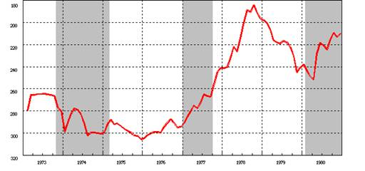
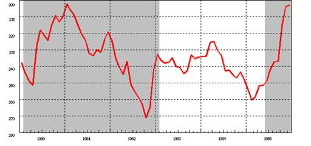
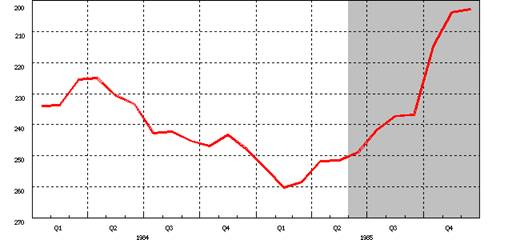
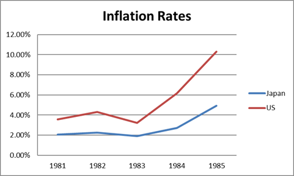
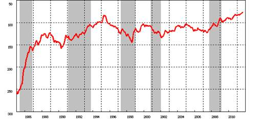
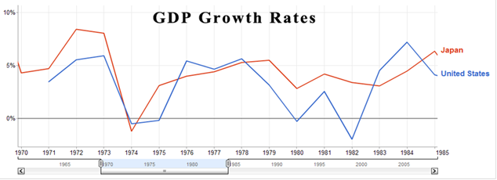

Session 8) 

**Should Disney hedge its yen royalty cash flow? Why or why not?**

First up – a look at the past. Since the Bank of Japan began collecting its post-Bretton Woods FOREX data, we see that there were huge fluctuations in the JPY/USD exchange rate. The JPY appreciated from 304 in January 1976 to 188 in August 1978, topping a 60% change. (Bank of Japan (http://www.stat-search.boj.or.jp/index_en.html)).

 

What about the nearer-term? Big swings are still part of the game in the early 1980s. We may expect that if history serves as any example, Disney should expect to go on a rollercoaster ride. 

Put as simply as possible: If our director of finance, Rolf, expects the yen will depreciate, hedging would protect his company’s yen-denominated income. If not, hedging would merely bear unnecessary costs. He should compare the cost of hedging to possible losses tied to yen depreciation. If the hedge cost is lower than depreciation cost, then Rolf should hedge.

Royalties from Japan contribute a huge share of Disney’s income (over JPY8 billion in fiscal 1984), and they are expected to grow a further 10% to 20% yoy for the next few years, since tourists will begin visiting Disneyland Japan from overseas. 

But it’s not that simple. Investors, analysts, essentially everyone related, don’t like volatility. Investors seem to prefer steady and predictable returns, especially if they’re investing in a large-sized company like Disney. If they want risk, they can go to a hopeless fledging like Xerox. Or IBM.

Let’s take another look at just this last year in FOREX.

It’s clear that there is risk there. The JPY depreciated rapidly this past year.

Last of all, let’s consider the recent interplay between the Japanese and US economies – this might explain why we’re seeing such FOREX volatility. Some factors in the story resemble the relationship between China and the US economies today. In the 1970s Japanese exports were very successful. They were working to keep the yen at a low value to ensure exports stay strong, which should help ensure GDP growth. Oil costs occasionally devalued the yen, but overall, pressure pushed it higher. Weakening deregulation coupled with higher US interest rates sent money in search of higher returns to the US. This decreased the demand for JPY and increased the demand for USD, contributing to a further devaluation of the JPY. 

We also see that inflation is much faster in the US than in Japan, which suggests that the dollar should be depreciating. ( 1981-1985 rates obtained from http://www.rateinflation.com)

In 1985, finance officials had had enough. That year, they signed the Plaza Accord, which said the one-way flow couldn’t be maintained, and the dollar was overvalued. We suspect that this was prefaced by a lot of excited and internationally-famed debates, as we see with the CNY/USD debate. People probably saw this coming well in advance. If effectively everyone agreed the USD is overvalued, then we would expect it to depreciate.

The economic environment suggests the JPY may start to appreciate. On the other hand, seeing the volatility, we should probably hedge. We can cut out all the exchange and interest rate risks, which would protect our financial statements from being blindsided. This way, management can focus on how to best animate mice, and not on the FOREX market. 

Disney should hedge either some or all of its JPY8 billion royalties. We prefer the latter. Disney should also do it for the long term, but bid/ask spreads diverge quickly as time goes on. 

The most attractive option available is the ten-year bullet loan worth JPY15 billion (using a FOREX rate of JPY248/USD1, this is equal to USD60.5 million). It offers us the longest term protection we can get; this is good. Currently, the market doesn’t offer much short-term solutions to our problem. Disney is also interested in reducing its short-term debt. 

A bullet loan like this requires a large share, if not all, of the principle and interest due at the end of the loan. That’s pretty risky, but its relatively less when considered against our exposure to FOREX. 

Alternatively, we could pay to play with Goldman Sachs. The solutions it offered were very cutting-edge and creative, but on the flipside, it’s believed that the market wouldn’t receive the suggested issues well.

Last of all, to be courteous and satisfy our curiosity, let’s take a look at what happens in the future…

 

 **Hedging can bring benefit**

​        Disney can lower its interest rate risk exposure

​        This would protect its financial results from sudden changes in the exchange rate

​        Cash flows can remain steady 

**But it can also bring harm**

​    Of course, the yen could also strengthen

​    There are costs attached to hedging

​    Some look at hedging like gambling, which is embarrassing for a company’s image

*(Exhibit 4 shows US CPI is rising faster than Japan CPI which is better for Yen)*

Image taken from Google, which sources from World Bank.

There is a relation between GDP growth and inflation. When economies grow, inflation heats up. However, inflation follows alongside. There is also a positive relation between inflation and interest rates. High growth in Japan suggests high interest rates.

Solutions:

Disney should hedge for more than 5 years – a 10 year period would be best.