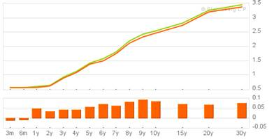
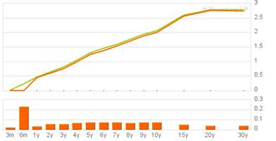

**Q1: Which financial markets products (securities, forex, and derivatives) does your own bank offer you? What are the fees? What are the conditions?**

Wells Fargo has an entire division offering securities to its clients. Wells Fargo provides all sorts of services. They can originate, underwrite, and finance equities, high-grade debt and loan syndications. Many people it their team can work in advisory roles for you if you run a company looking to conduct an M&A or securitize assets for instance.

Wells Fargo offers access to a number of products. You can purchase fixed income products, all types of corporate debt, ABSs, municipal bonds, money market securities, government securities and more. The list seems entirely exhaustive. The bank also helps people invest in equities, for which they offer advisors and research products.

The bank can facilitate cross border needs as well. They offer cross border lending, trade financing, foreign exchange and more. 

Access to most of the fixed income products is reserved for companies and institutions. They don’t tell about prices for these services. But you can call to find out! For personal services as well, all prices are found by contacting local offices.

**Q2: What are the interest rates in pounds, euros, and dollars?**

 US

Pound

Euro

 

**What have been the latest related decisions by the central banks and why? How does it impact your life?**

The European Central Bank has adopted new measures to prevent the financial crisis from spreading. Politicians are giving more back to banks, offering recapitalization. This has had a positive impact on the market, and in turn reduced demand for safe-haven assets like bonds. That lowered yields.

If things continue along such a course, government bond yields should continue to move down.

As interest rates go down, more money should enter into the market. When more money is available, people spend money, businesses productivity climbs, and employment with it. I might get a job!

Also, the interest rates I pay for my government loan are fixed. If rates continue to fall, my loan deal becomes less competitive. 

For the sake of argument though, I will pretend that I have millions of dollars invested in the stock and bond markets. If interest rates gradually fall, stock markets, according to historical evidences that may not hold today, should rise. This bears negative relationship to the bond market.

And what if I wanted to use some of those millions of dollars to purchase a home? With a general improvement in the economy, I could expect people’s financial positions to improve. This would mean that more people would begin signing lower rate mortgages and gobbling up the currently plentiful supply of cheap homes in the US. Such supplies won’t last forever, and I would be induced to buy my home before their prices recommence their seemingly infinite upward climb.

Now again, if interest rates fall, we should see people induced to consume more. Why not spend today? It comes at such a small sacrifice for future consumption. Businesses however, look at such low rates and say “why not invest today, we can beat competition to the punch and realize new revenues.” 

They hire, money goes into the pockets of construction workers, who then buy groceries, store owners in turn spend more on their electricity, and the money continues to work through the economy. That initial wage paid to a worker multiplies through the economy until it has ballooned into a larger amount of spending, (that larger amount today wouldn’t be as large as it would have been in the past since reserve requirement ratios are high to protect from banking crises – a tangent that need not be further explored). 

Following a drop in interest rates and a magically correlated economic boom, things begin to change. More money is in the economy chasing the same amount of goods. Adam Smith’s not so eloquently defined relationship between supply and demand tell us that prices should climb. We eventually expect that inflation will become a problem. How to curb? Raise interest rates again, hopefully before asset price bubbles (such as real estate) have formed. Interest rates go up (likely by an amount close to what the Taylor Rule predicts), people suspend consumption and lend in seek of greater interest rates. Business spending dries up. The economy cools down again.

At this point, the chief of the central bank, if still in office, realizes that his/her job is to maintain an impossible perpetual loop. Saddened, he quits and I get his job.