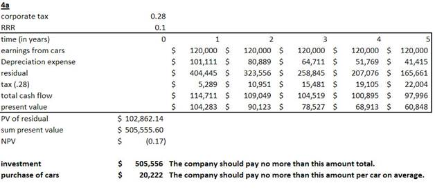
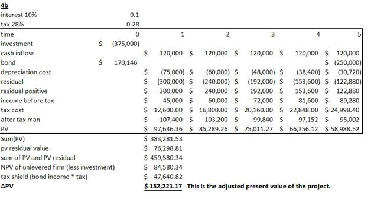

# Assignment

## Part 1

### Exercise 1

The cost of equity capital describes the cost associated with raising new funds from e.g. existing shareholders for new investments. Under CAPM the required rate is a function of risk free rate, the market premium and the beta, whereby the beta is a measure of risk contribution. The individual beta describes the volatility / risk contribution of the particular company to the overall beta of the market portfolio. The main points are debt/equity ratio, average interest on debt, tax rate and beta. In practice you have to consider that betas change with leverage, that beta for private companies are not readily available, that not enough data to estimate beta is available and that beta might change over time.

### Exercise 2  

|                          |          |             |                                        |        |
| ------------------------ | -------- | ----------- | -------------------------------------- | ------ |
| **Data Given**           |          |             | **CAPM Output**                        |        |
| Beta                     | 1,1      |             | Cost of equity                         | 13,6%  |
| Debt/Equity              | 0,4      |             |                                        |        |
| Rm                       | 13%      |             | **Annual YTM ( semi annual YTM \* 2)** |        |
| Rf                       | 7%       |             | Cost of debt                           | 9,28%  |
| Bond maturity            | 20 years |             |                                        |        |
| Coupon rate              | 9%       |             | Weight equity                          | 0,7143 |
| semi  annual compounding |          | Weight Debt | 0,2857                                 |        |
| current price            | 97,5     |             |                                        |        |
| Corporate tax            | 28%      |             |                                        |        |
| Tax shield               | 72%      |             | Cost of capital                        | 11,6%  |

a.    The annual company’s cost of debt is 9,28%

b.    The company’s cost of equity is 13,6%

c.    The cost of capital is 11,6%

### Exercise  3 

|                       |            |        |        |        |          |         |
| --------------------- | ---------- | ------ | ------ | ------ | -------- | ------- |
|                       |            |        |        |        |          |         |
| Cash  Flow table      |            |        |        |        |          |         |
|                       | Year 0     | Year 1 | Year 2 | Year 3 | Year 4   | Year 5  |
| Investment            | -925       |        |        |        |          | 90      |
| Depreciation          |            | -185   | -148   | -118,4 | -94,72   | -75,78  |
| Book  Value           |            | 740    | 592    | 473,6  | 378,88   | 303,104 |
| Taxable  loss on sale |            |        |        |        | -213,104 |         |
| Saved  costs          |            | 360    | 360    | 360    | 360      | 360     |
|                       |            |        |        |        |          |         |
| Net  working capital  | 125        |        |        |        |          |         |
| Before  Taxes         | -800       | 175    | 212    | 241,6  | 265,28   | 161,12  |
| Taxes                 |            | -49    | -59,36 | -67,65 | -74,28   | -45,11  |
| After  Taxes          | -800       | 126    | 152,64 | 173,95 | 191,00   | 116,01  |
| Back in  depreciation |            | -185   | -148   | -118,4 | -94,72   | -75,78  |
| Cash  flow            | -800       | 311,00 | 300,64 | 292,35 | 285,72   | 191,78  |
| **IRR**               | **23,10%** |        |        |        |          |         |

The IRR for the project is 23,10%

### Exercise 4

a)    Company A has a cost of equity of 22% and therefore will actually lose money. It has to discount PV with 22% and therefore will lose € 1,1 million 

b)   Company B has a cost of equity of 18%, this means that it needs to discount its investments at 18%. It will therefore have an NPV of € 1.1 million. The company should make the investment.

### Exercise 5  

|                          |                    |                   |                     |             |
| ------------------------ | ------------------ | ----------------- | ------------------- | ----------- |
|                          |                    |                   |                     |             |
| Capital Structure        | Market Debt        | 111 600 000       | Weight              | 27%         |
|                          | Equity Outstanding | 306 000 000       | Weight              | 73%         |
|                          |                    |                   |                     |             |
|                          |                    |                   |                     |             |
|                          |                    |                   |                     |             |
| Beta                     | 1,2                |                   | Price Per share     | 34          |
| Market Risk Premium      | 10%                |                   | Number of Shares    | 9 000 000   |
| T-Bills                  | 5%                 |                   | Market Value Equity | 306 000 000 |
| Cost Of equity           | 17%                |                   |                     |             |
|                          |                    |                   | Bonds Oustanding    | 1 200 000   |
| Bond Maturity (Years)    | 15                 |                   | Bond Price          | 93          |
| Semi-annualy  compounded |                    | Market Debt Value | 111 600 000         |             |
| Coupon Rate              | 5%                 |                   |                     |             |
| Current Value            | 93                 |                   | Equity + Debt       | 417 600 000 |
| YTM                      | 9,38%              |                   | Equity Weight       | 73%         |
| Tax shield               | 72,00%             |                   | Debt Weight         | 27%         |
|                          |                    |                   |                     |             |
| WACC                     | 14,26%             |                   |                     |             |

a)    The company market value capital structure is the equity + debtè $ 417,600,000.00

b)   The company should use the WACC of 14,26% to discount the project cash flows.

## PART 2     

### Exercise 1  

|                                                              |                            |        |        |                                                              |
| ------------------------------------------------------------ | -------------------------- | ------ | ------ | ------------------------------------------------------------ |
|                                                              | A                          | B      | C      | Implications                                                 |
| Payback                                                      | 2                          | 1      | 1      | According to the Payback rule,   B or C would be selected because we recoup    our investment sooner than A. |
| IRR                                                          | 0,00%                      | 39,72% | 61,80% | Following the IRR rule we would    select project C because it has the   highest rate of return. |
| Incremental   IRR                                            | Not considered   (Neg NPV) | <10%   | >10%   | If the Discount Rate of the company  is    <10% then select Project B; if it is   >10% select project C. Since the    company's discount rate is 10% we are    indifferent between B or C. |
| PI                                                           | 0,854                      | 1.219  | 1.528  | We should choose project C because   it has the Highest PI, A cannot be   considered because its PI is <1 |
| NPV                                                          | -21,90                     | 43,75  | 52,78  | According to the NPV rule,    C would be selected because it   has the highest NPV. |
|                                                              |                            |        |        |                                                              |
| The company should go for project C  because it has the best PI, NPV, IRR and the smallest Payback Period. |                            |        |        |                                                              |
| In addition, the incremental IRR  showed than the company isn't indifferent with project B or C at the |                            |        |        |                                                              |
| company's discount rate of 10%                               |                            |        |        |                                                              |

### Exercise 2

a)

|                              | Year 0     | Year 1 | Year 2 | Year 3 | Year 4 |
| ---------------------------- | ---------- | ------ | ------ | ------ | ------ |
| Machine  new                 | -32        | 8      | 8      | 8      | 8      |
| Op.  Cost                    | 9          |        |        |        |        |
| Depreciation                 |            | -8     | -8     | -8     | -8     |
| taxable  profit of 8 million | -3,12      |        |        |        |        |
| Net  Working Capital         | -0,5       |        |        |        | 0,5    |
| EBITDA                       | -26,62     | 0      | 0      | 0      | 0      |
| tax  rate 39%                |            | 0      | 0      | 0      | 0      |
| Net  Income                  | -26,62     | 0      | 0      | 0      | 0      |
| Net  Cash                    | -26,62     | 8      | 8      | 8      | 8,5    |
| **NPV**                      | **-4,842** |        |        |        |        |
| **Rate**                     | **0,18**   |        |        |        |        |
| **IRR**                      | **8,41%**  |        |        |        |        |

B.) How is it possible that the decision to replace the old machine has a positive NPV:

\-     If the required rate of return of the company is below 8,41 % the NPV will turn positive. Then the company would take advantage of the sale and the new purchase because of the tax advantage of the depreciation of the new machine. The depreciation is a non-cash expense but it will reduce taxes paid which is a cash outflow

### Exercise  3 

|                                      |         |         |         |          |         |            |      |
| ------------------------------------ | ------- | ------- | ------- | -------- | ------- | ---------- | ---- |
|                                      | Year0   | Year 1  | Year 2  | Year 3   | Year 4  |            |      |
| Investment                           | -720000 |         |         |          |         |            |      |
| Depreciation                         |         | -144000 | -115200 | -92160   | 368640  |            |      |
| Book  Value                          |         | 576000  | 460800  | 368640   | 0       |            |      |
| Sales                                |         | 190     | 190     | 190      | 190     |            |      |
| Sales  (-10%)                        |         | 171     | 171     | 171      | 171     |            |      |
| Sales  (+10)                         |         | 209     | 209     | 209      | 209     |            |      |
| Price                                |         | 21000   | 21000   | 21000    | 21000   |            |      |
| Revenue                              |         | 3990000 | 3990000 | 3990000  | 3990000 |            |      |
| Revenue  (-10)                       |         | 3591000 | 3591000 | 3591000  | 3591000 |            |      |
| Revenue  (+10)                       |         | 4389000 | 4389000 | 4389000  | 4389000 |            |      |
|                                      |         |         |         |          |         |            |      |
| Variable  Cost                       |         | 2850000 | 2850000 | 2850000  | 2850000 |            |      |
| Variable  Cost (-10)                 |         | 2565000 | 2565000 | 2565000  | 2565000 |            |      |
| Variable  Cost (+10)                 |         | 3135000 | 3135000 | 3135000  | 3135000 |            |      |
|                                      |         |         |         |          |         |            |      |
| Fixed  cost                          |         | 225000  | 225000  | 225000   | 225000  |            |      |
| Fixed  cost (-10)                    |         | 202500  | 202500  | 202500   | 202500  |            |      |
| Fixed  cost (+10)                    |         | 247500  | 247500  | 247500   | 247500  |            |      |
|                                      |         |         |         |          |         |            |      |
| Base  Case                           |         | 771000  | 799800  | 822840   | 1283640 |            |      |
| Worst  Case                          |         | 64500   | 93300   | 116340   | 577140  |            |      |
| Best  Case                           |         | 1477500 | 1506300 | 1529340  | 1990140 |            |      |
|                                      |         |         |         |          |         |            |      |
| **After  Tax rate 28%**              |         |         |         |          |         |            |      |
| Base  Case                           |         | 555120  | 575856  | 592444,8 | 924221  |            |      |
| Worst  Case                          |         | 46440   | 67176   | 83764,8  | 415541  |            |      |
| Best  Case                           |         | 1063800 | 1084536 | 1101125  | 1432901 |            |      |
|                                      |         |         |         |          |         |            |      |
| **+  Depreciation (Net Cash flows)** |         |         |         |          |         | **NPV**    |      |
| Base  Case                           | -720000 | 699120  | 691056  | 684604,8 | 555581  | $1 178 262 |      |
| Worst  Case                          | -720000 | 190440  | 182376  | 175924,8 | 46900,8 | -$274 008  |      |
| Best  Case                           | -720000 | 1207800 | 1199736 | 1193285  | 1064261 | $2 630 532 |      |
|                                      |         |         |         |          |         |            |      |
| **Sensitivity**                      |         |         |         |          |         | **NPV**    |      |
| Base  Case                           | -720000 | 699120  | 691056  | 684604,8 | 555581  | $1 178 262 |      |
| base  case (-10 fix)                 | -720000 | 715320  | 707256  | 700804,8 | 571781  | $1 224 513 |      |
| Base  Case(+10 fix)                  | -720000 | 682920  | 674856  | 668404,8 | 539381  | $1 132 011 |      |
|                                      |         |         |         |          |         |            |      |
| **Break-even  analysis**             |         |         |         |          |         |            |      |
| Base  Fixed costs                    | 225000  |         |         |          |         |            |      |
| Contribution  Margin                 | 6000    |         |         |          |         |            |      |
| Acc  Break Even                      | 37,5    |         |         |          |         |            |      |
| Break-Even  rounded                  | 38      |         |         |          |         |            |      |
|                                      |         |         |         |          |         |            |      |

### Exercise 4

### Exercise 5

a)    Value of unlevered firm = (75000*0,72)/0,18=300000

b)   APV = NPV + T.B = (75000*0,72)/0,18+ 16000*0,28 = 344800

c)    Rc = Ro + B/S(1-ta)(ro-rb)= 0,18 + 16000/(344800-160000)*0,72*0,08 = 0,22987

d)   LCF/Rs = (75000-16000)*(1-0,28)/0,22987= 184800