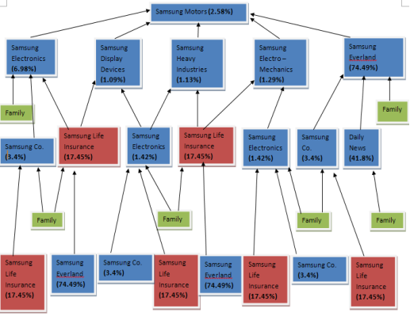

# Samsung Case Study

## What are the benefits and disadvantages of the Korean *Chaebol* structure? In particular, what governance issues can arise due to its structure?

*‘Chaebol*’ refers to a South Korean form of business conglomerate. They are multinationals that own numerous international enterprises. The term is often used in a context similar to that of the English word "conglomerate."

Some *chaebol* are one large corporation, while others have broken up into loosely connected groups of separate companies sharing a common name. Even in the latter case, each is almost always owned, controlled, or managed by the same family group.

Some of the characteristics of ‘*Chaebol’* structure are:

- *Chaebol* are largely controlled by their founding families and centralized in ownership.
- *Chaebol* often formed subsidiaries to produce components for exports.
- *Chaebol* are prohibited from owning private banks, partly in order to increase the government's leverage over the banks in areas such as credit allocation. In 1990, government regulations made it difficult for a *Chaebol* to develop an exclusive banking relationship. 
- The model of C*haebol* relies a lot on a complex system of interlocking ownership. The owner of the *Chaebol*, with the help of family members, family-owned charity and senior managers from subsidiaries, only has to control three of four public companies, who themselves control other companies that control subsidiaries. 

The following are the advantages and shortcomings of *Chaebols* as given in the paper ‘Advantages And Shortcomings Of Korean Chaebols’ by Hong Y. Park, Geon-Cheol Shin and Korea Sung Hahn Suh published in the International Business & Economics Research Journal – January 2008 Volume 7, #1:

Advantages:

1.    Easy diversification in businesses with established reputation, and recognition of Chaebols’ brand name. 

2.    Scope economies by synergy effects. 

3.    Scale economies by large size. 

4.    Improvements in decision making by having cumulated knowledge and experiences of many companies in a chaebol. 

5.    Improvements in capturing new business opportunities with vast knowledge in many fields of business.

Shortcomings: 

1.    Lack of business transparency 

2.    High risks of businesses due to the CEO’s autocratic decision-making 

3.    Increase in exit costs by losing timely exit of unprofitable businesses 

4.    Increase in management costs due to the bureaucratic organization 

5.    Inefficient resource allocation 

6.    Lack of the timely decision making and adaptation 

7.    Delay of development in core capabilities 

In addition to the shortcomings listed in the paper by *Park et al*, we list the following shortcomings of *Chaebols* from the case:

1.    With the growth of *Chaebols* in Korea, enterprises tended to expand their businesses rapidly without careful appraisal of investment projects.

2.    Firms became heavily leveraged and borrowed from informal credit markets as they were usually pressed for working capital. This structural weakness put the Korean economy on the verge of a financial crisis in the early 1970’s and then again in the 1980’s. 

3.    Business groups pooled any funds available to subsidiaries to supplement outside funding of new projects. Operations of these internal finance markets were not necessarily based on efficiency in resource allocation but were often driven by the interests and concerns of the controlling families. 

4.    The *Chaebols* did not have a well-planned globalization strategy. They held on to the management strategy that they had been practicing over the last thirty years: growth in size ignoring profitability; financial structure with the high debt-to-equity ratio and cross debt guarantee among affiliated companies. 

One of the problems in chaebols is the lack of business transparency. However, the unique problem due to asymmetric information is a governance problem, since the top managers or CEOs in chaebols tend to be both owners and managers. They are different from the hired managers with a small stake in the company. Managers with a relatively large ownership stake in diversified Korean chaebols often engage in expropriating the minority shareholders; the lack of transparency magnifies this expropriation. *(Park et al, 2008)*

The highly autocratic decision-making in chaebols is dubbed as ‘imperialistic management’ in the popular Korean press. This kind of management has adverse effects on corporate performance since managers do not fully take advantage of the knowledge and experiences of employees. However, the flip side of imperialistic management is that it may result in strong commitment to their favourite projects. This has led to successes in Korean chaebols’ telecommunication businesses because the CEOs’ showed a lot of commitment of huge financial capital to research and development in semiconductor and telecommunication products. *(Park et al, 2008)* 

Chaebols’ cross-subsidies often serve to prolong the lives of unprofitable businesses and delay their exits. These practices can be burdensome to the whole chaebol group. The costs caused by delayed exits led to collapses of several chaebols during the 1997 Korean economic crisis such as Daewoo and Ssangyong. *(Park et al, 2008)* 

Due to the more bureaucratic nature of large organizations, there is an increase in management costs. Politics also plays a role in large bureaucratic organizations, and political decision making can result in inefficient resource allocation. *(Park et al, 2008)* 

**Source:**

Hong Y. Park, Geon-Cheol Shin and Korea Sung Hahn Suh (2008), ‘Advantages And Shortcomings Of Korean Chaebols’, International Business & Economics Research Journal, January 2008, Volume 7, Number 1.

## Analyze the capital structure of Samsung Electronics. Compare it with the capital structure of a company in the similar line of business (primarily manufacture of chips) from another developed country and comment on the differences.

When we examine popular ratios to compare the chip maker Intel (domiciled in the US) and Samsung Electronics (domiciled in South Korea), we see that the two capital structures are vastly different. These ratios will reveal the relative magnitude of financing sources. Our ratio analysis begins with the financial leverage ratio (total assets / common equity capital). Intel, standing at 8.72, registers leagues below Samsung’s 47.04, and highlighting the latter’s relatively small common equity. 

The next consideration is the total liabilities to total equity ratio. Capital intensive industries, such as airplane or auto producers, have numbers approaching 2, whereas PC companies often register around 0.5. Intel, 0.5, confirms that trend, and is dwarfed by Samsung’s 2.96.

We can fit debt to equity capital ratios, for which there are two, between the previous to measures. The first, total debt to common equity, reveals a great rift between the companies. Intel is at a comfortable 0.23 while Samsung is at a nerving 17.42. When we examine only long term debt, Intel’s ratio nearly halves while Samsung’s stays just as tall. This shows that about half of Intel’s debt is short term, whereas nearly all of Samsung’s is long term. At this point we ask: is Samsung solvent? We continue to examine the ratios to find out.

Samsung appears up to its neck in debt. We need to examine the interest coverage ratio to know if it can keep this up. First, we see Intel’s EBIT covers its interest by 395 times, and Samsung, by only 0.45. This should raise bright red flags for lenders. The current assets to current liabilities ratio reflects the immediate barrowing ability and cash flows of a company, with 2 generally reflecting sound payback ability. Intel is healthy at 2.64, Samsung unhealthy at 1.33.

Perhaps the companies are both performing very well, and we needn’t worry about anything. Return on assets can inform us on this. Intel, 0.24, is generating solid returns on its investments, whereas Samsung Electronics, the bread winner for Samsung Group, is bringing home a meagre 0.02. 

Samsung, when compared to Intel, looks highly leveraged, strangely capital intensive (how can it be more capital intensive than Intel?), hopelessly indebted and not earning enough returns on its investments to escape the downward spiral. But Samsung Electronics is turning good profit for the Group, and is on its way to becoming a global leader in electronics. These numbers just don’t add up to its promising future (for more comparison ratios, and their sources, see attachment).

We should also look beyond merely the financial statements to see what environmental factors might be distorting the picture. As mentioned in the case, 1997 is a dark year for South Korea, in the midst of the Asian Financial Crisis. The local Won currency is devaluing; aggravating its foreign debt problems by exploding the value of its payments and making it harder to obtain foreign lending. Domestic sources of lending are also tight, and the government recently pulled the plug on industrial support programs. In short, the economic surroundings are fragile.

Furthermore, immediately prior to this financial statement’s release, Samsung Electronics had just completed an acquisition for AST Research, picking up the remaining 51% discounted shares to bolster its competitive technologies, (as indicated by its EDGAR filing).

Intel meanwhile has a healthy lead over its second rival, AMD, and is gaining market share (a trend that won’t reverse for several years. With the lion’s share of processor sales, it’s no surprise the financial statements are strong. Really, we’re comparing an industrial leader on the upswing with one that’s down for the count. 

The capital structure weighs too heavily to debt, and it’s not clear that debt is effectively increasing net income. The leverage may be magnifying profits, but the company’s high barrowings have increased the risks of failure, limited its ability to barrow to pursue new opportunities, and is probably scaring off creditors. 

## Examine Ownership Structure

Note: The bolded numbers in the various boxes represent the percentage of ownership by the Lee family of the respective firms. For example, the Lee family owns 17.45% of Samsung Life Insurance and 74.49% of Samsung Everland. The “Family” boxes, on the other hand, represent the percentage of direct ownership by the Lee family of the different companies. These numbers are obtained from the “owner family” column in exhibit 3a. For instance, the Lee family directly owns 15% of Samsung Life Insurance, 67.30% of Samsung Everland, and around 0% of Cheil Wool Textile. In order to calculate some of the numbers, we also used information provided in exhibit 3b of the case study. As an example, we calculated the 3.4% ownership of Samsung Co. in the following way. The Lee family owns 17.45% of Samsung Life Insurance which, in turn, owns 6.22% of Samsung Co (exhibit 3b). Thus, the direct and indirect control of the Lee family over Samsung Co. is 2.32% (exhibit 3a) plus 17.45%*6.22% or 3.4%. Note that we have only included the first few largest shareholders of each company. We have also disregarded large shareholders that are not owned by the Lee family or where the family does not have enough ownership. Therefore, our results represent a rough approximation and indicate the minimum percentages of ownership by the Lee family.

By looking at the above graphic, we can see that the Lee family owns at least 2.58% of Samsung Motors. Therefore, if Samsung Motors makes an after tax profit of USD 100 million, the Lee family would get at least 2.58 million dollars. While the family directly owns many of the companies that are shareholders of Samsung Motors, it does not have a direct ownership in the latter company according to the first column of exhibit 3a. Thus, they would get at least 2.58 million dollars from the profits of Samsung Motors without even having any direct ownership of this firm.**
**

## The client wants to recommend governance changes with special emphasis on the board of directors. Evaluate the current board of Samsung Electronics. What are the strengths and weaknesses in the current board composition? How many directors can be classified as non-executive? How many can be classified as independent? What are your criteria for assessing director independence? Do you think changers need to be made to the current board composition? If not – why not, if yes, what changes would you recommend?

The following is the table given in the case, Exhibit 6: Profile of Directors on the Samsung Electronics Board:

| **No.** | **Name of Director** | **Designation**                                              | **Family Relation** |
| ------- | -------------------- | ------------------------------------------------------------ | ------------------- |
| 1       | Kun-Hee Lee          | Chairman & CEO,  Samsung Electronics                         | None                |
| 2       | Jong-Yong Yun        | Vice-Chairman &  CEO, Samsung Electronics                    | None                |
| 3       | Hak-Soo Lee          | President & CEO,  Group Reformation HQ, Samsung Electronics  | None                |
| 4       | Yoon-Woo Lee         | President & CEO,  Device Solutions Network, Samsung Electronics | None                |
| 5       | Dae-Je Chin          | President & CEO,  Digital Media Network, Samsung Electronics | None                |
| 6       | Coh-Seok Choi        | President & CFO,  Samsung Electronics                        | None                |
| 7       | In-Joo Kim           | Executive VP, Group  Reformation HQ, Samsung Electronics     | None                |
| 8       | Jing-Wan Kim         | President & CEO,  Samsung Heavy Industries                   | None                |
| 9       | Sung Rai Choi        | President & CEO,  Samsung Petrochemicals                     | None                |
| 10      | Soon-Taek Kim        | Vice-President &  CEO, Samsung SDI Company Ltd.              | None                |
| 11      | Jin-Hoon Je          | Vice-President &  CEO, Samsung Factor Financing              | None                |
| 12      | Joong-Koo Lee        | President & CEO,  Samsung Techwin Company Ltd.               | None                |
| 13      | Yang-Gyu Park        | President & CEO,  Samsung Networks                           | None                |
| 14      | Hong-Sik Ko          | President & CEO,  Samsung General Chemicals Company Ltd.     | None                |
| 15      | Soo-Woong Park       | Vice-President &  CEO, Samsung Fine Chemicals Ltd.           | None                |
| 16      | Jae Yong Lee         | Owns 25.1% of the  shares of Samsung Everland, which controls Samsung Life, the holding company  of Samsung Group | Son of Kun-Hee Lee  |
| 17      | Ra-Hee Hong Lee      | Director General,  Samsung Museums                           | Wife of Kun-Hee Lee |
| 18      | Soo-Bin Lee          | Chairman & CEO,  Samsung Life Insurance Company              | None                |
| 19      | Hyeon-Gon Kim        | Vice-President &  CEO, Samsung BP Chemicals Company Ltd.     | None                |
| 20      | Cong-Yeul Pae        | CEO, Samsung  Corporation                                    | None                |
| 21      | Kap-Hyun Lee         | Advisor, Boston  Consulting Group                            | None                |
| 22      | Suk-Soon Kim         | President Law Office  of Suk-Soo Kim                         | None                |
| 23      | Tetsuo Iwasaki       | Chairman/CEO/President  Applied Komatsu Technology           | None                |

The following are the non-executive directors on the Samsung Electronics Board:

| **No.** | **Name of Director** | **Designation**                                              | **Family Relation** |
| ------- | -------------------- | ------------------------------------------------------------ | ------------------- |
| 1       | Jae Yong Lee         | Owns 25.1% of the  shares of Samsung Everland, which controls Samsung Life, the holding company  of Samsung Group | Son of Kun-Hee Lee  |
| 2       | Ra-Hee Hong Lee      | Director General,  Samsung Museums                           | Wife of Kun-Hee Lee |
| 3       | Kap-Hyun Lee         | Advisor, Boston  Consulting Group                            | None                |
| 4       | Suk-Soon Kim         | President Law Office  of Suk-Soo Kim                         | None                |

 We have included Jae Yong Lee (the song of Kun-Hee Lee) and Ra-Hee Hong Lee (the wife of Kun-Hee Lee), as non-executive directors as we believe that their presence on the board is only due to the fact that they are family members. We have included the other 2 directors in the list because they do not hold any executive positions in any company. 

The following are the independent directors on the Samsung Electronics Board:

| **No.** | **Name of Director** | **Designation**                                    | **Family Relation** |
| ------- | -------------------- | -------------------------------------------------- | ------------------- |
| 1       | Kap-Hyun Lee         | Advisor, Boston Consulting  Group                  | None                |
| 2       | Suk-Soon Kim         | President Law Office  of Suk-Soo Kim               | None                |
| 3       | Tetsuo Iwasaki       | Chairman/CEO/President  Applied Komatsu Technology | None                |

 We have selected these as the only 3 independent directors on the Samsung Electronics Board because they have no direct relationship to Samsung. All the other 20 board members are related to Samsung Electronics in some way, either directly as designation holders in Samsung Electronics, family relationship or through their designation in a company in the Samsung Group. 

The current Samsung Electronics Board is heavily comprised of people from within the Samsung Group. There are only 3 independent directors on the board. This may not allow for a lot of room for over-turning decisions made by the board that are not in the interest of minority shareholders. Due to the shared interest in different companies, one or the other company, whose director is on the Samsung Electronics Board might lose out. In the case that a contract is made between Samsung Electronics and another company, the director of that company on the Samsung Electronics Board might not be able to get the best terms for his company, even if it is in the Samsung Group. In front of Kun-Hee Lee, his bargaining power would be reduced tremendously. 

However, on the other hand, the board represents a very good mix of people having varied experiences and expertise in a lot of different industries, albeit, within the Samsung Group. This provides a wide spectrum of information and knowledge. Such a mix also helps in making well-informed decisions and might also lead to generation of innovative ideas due to the cross-sharing of information that might not normally be shared.

The current Samsung Electronics Board structure is very Samsung centric. We believe that there are changes required to be made in the current board composition. The first point of evaluation is whether the mix of board members represents synergies between the different companies that those board members represent. Without those synergies, the board does not derive that advantage of having a diversified board. The board has to have synergies between the different members and changes need to be made if those advantages are desired. 

We recommend that the board composition be modified to include at least 11 independent directors. To maintain the benefits that the company derives from a diversified board can be achieved by inducting directors from similar industries but different companies unrelated to the Samsung Group. 

One important recommendation that we make is to include a director on the board who is an expert on Ethics & Corporate Governance. Samsung has expanded into several countries and the importance of Ethics & Corporate Governance becomes even more pronounced when different cultures interact on a regular basis, especially in a business setting. We make this recommendation so that Samsung Electronics may be compliant with local customs, local corporate culture, smoothen out any Corporate Governance issues at the moment and even help ensure safety from any Corporate Governance debacles in the future.

##  Question 5:  Based on the company’s financials as of December 31, 1997 and publicly available information, investigate the allegations made by Dr. Jang.  Do you think the convertible bond issue was a self-dealing transaction?  How would you prove that claim?  What evidence do you have on your claim?  (Note: you are not expected to do a DCF)

Self-dealing is defined as a situation in which a fiduciary acts in his own best interest in a transaction rather than his clients.

Dr. Jang alleged that the issue of the convertible bonds was at unfavorable terms for the company and called into question the price of the bonds.  

According to the Notes to financial statements of Samsung Electronics, the Company issued 2,025,009 shares of common stock upon the conversion of convertible bonds in the amount of 60,000 million won. That implies that the cost of the purchase of each new issued share is about 29,629 won, which is much lower than the current stock price of around 53,000 won.  

As a result, the company insiders, including the chairman’s son and the Samsung affiliate, were able to easily increase their ownership in Samsung Electronics at very low cost.

However, the above fact is not enough to prove that the convertible bond issue was a self-dealing transaction, because it might be the case, as the company executives said, that neither international nor local investors were willing to lend money to the company due to the Asian currency crisis.

Fortunately, we found that right after the issue of 60,000 million won convertible  bonds, the company succeeded in issuing the foreign currency convertible bonds of US$300 million for the expansion of manufacturing facilities on June 26th, 1997, which implies that the company executives’ previous explanation was unconvincing and therefore an excuse for the fact that the bonds had been sold to company insiders.

Based on this evidence, we conclude that the convertible bond issue was a self-dealing transaction that not only allowed company insiders to purchase them at a very low cost, but also increased the Lee family’s ownership in the company.

## Does the agreement with the Pan-Pacific Industrial Investments resemble a simple direct investment or something else? Why was the guarantee clause included in the contract? Does it change the instrument? If you were on the Audit committee of the company, what questions would you ask about this transaction?

Samsung Electronics had acquired a 21.1% stake in Samsung Motors at the acquisition cost of 190 billion won (USD 106 million). The indirect investment of Samsung Electronics into Samsung Motors was in the form of a joint investment agreement between an Ireland-based paper company called Pan-Pacific Industrial Investments (PP) and Samsung Electronics (and two of its affiliated companies). 

Under the terms of the joint investment agreement, Samsung Electronics had guaranteed PP a certain rate of return through put and call options within a specified redemption period, on Samsung Motor shares it (PP) owned. This arrangement was made in addition to bridge loans made by Samsung Group to PP.

To answer the question of whether the agreement with Pan-Pacific Industrial Investment resembles a simple direct investment or something else, we first note that after the 1997 Asian Currency Crisis, international funding was scarce. Foreign banks, investors or financial investors were not open to investing or loaning money to Korean companies. 

In the case of a joint investment agreement, two companies come together to make an investment where there is shared responsibility and a share of the profits as well as losses depending on the share of each individual company in the investment. No one party can guarantee a specific rate of return to another party, since by definition; it is a ‘joint investment’. 

Based on these two considerations, we believe that the agreement between Samsung Electronics and Pan-Pacific Industrial Investments was a loan from PP to Samsung Electronics, and not a foreign direct investment agreement. The following are the justifications for our answer:

- Samsung Motors needs money and money is scarce in Korea and it is not available outside Korea due to the Asian Currency Crisis.
- Samsung Electronics has a 21.1% share in Samsung Motors. If Samsung Motors goes bankrupt, Samsung Electronics will lose a lot of money. 
- Samsung Group meets with PP to invest in Samsung Motors with Samsung Electronics. PP agrees but, we assume that these are the conditions that PP puts forth:
- Samsung Group makes bridge loans to PP at low interest rates.
- Samsung Electronics guarantees a specific rate of return to PP on its investment in Samsung Motors. (Similar to interest payments.)
- The Korean economy is unstable and PP requires more safeguards for its investment. Thus, it gets call and put options in the agreement as a way to safeguard its investment. Depending on the progress of the investment, it will choose whether or not to exercise the options in the specified redemption period. 
- We believe that irrespective of the future of Samsung Motors, PP wanted to be able to recover its investment. The reason why this agreement was structured in this way could be that, we assume, according to Korean laws, a foreign company attempting to invest in Korea had to assume risk. Whereas, in this transaction, PP has tried to reduce its level of risk tremendously. We assume that PP would remain as a majority stake holder in Samsung Motors does well and if it does not do well; its investment is still safe. 

As a part of the Audit committee of the company, we would ask the following questions:

1.    Why Pan-Pacific Industrial Investments for the joint investment?

2.    Why does Pan-Pacific Industrial Investments receive a guaranteed rate of return in a joint-investment?

3.    What are the justifications for providing PP with an additional security of call and put options, when they had already been guaranteed a specific rate of return?

4.    What are the expected returns on the joint investment?

5.    How does Samsung Motors plan to guarantee the specific rate of return?

6.    How do the returns from the joint investments get shared? 

7.    If there is an equal share of returns, why is there not an equal division of the risk? 

**Additional charts and figures**

| **Samsung**                                  | **Intel** |
| -------------------------------------------- | --------- |
| **Financial leverage ratio**                 |           |
| 47.04                                        | 8.72      |
| **Assets Liability Ratio**                   |           |
| 1.34                                         | 0.50      |
| **capitalization ratio**                     |           |
| 0.66                                         | 0.16      |
| **Long term liability ratio**                |           |
| 0.49                                         | 0.12      |
| **current ratio**                            |           |
| 0.34                                         | 0.63      |
| **interest coverage ratio**                  |           |
| 0.45                                         | 395.78    |
| **fixed asset ratio**                        |           |
| 0.89                                         | 0.69      |
| **Current Asset to Current Liability ratio** |           |
| 1.33                                         | 2.64      |
| **Return on Assets**                         |           |
| 0.02                                         | 0.24      |
| **debt to equity**                           |           |
| 2.96                                         | 0.50      |
| **debt to equity capital**                   |           |
| 17.42                                        | 0.23      |
| **LT debt to equity capital**                |           |
| 17.12                                        | 0.14      |

| **Samsung**               | 1997              |
| ------------------------- | ----------------- |
|                           | (Millions of USD) |
| total assets              | $     16,300,719  |
| total current liabilities | $      4,148,096  |
| long term liabilities     | $      8,032,523  |
| ST debt                   | $       27,170    |
| LT debt due               | $       78,020    |
| LT debt                   | $      5,932,523  |
| total debt                | $      6,037,713  |
| total liabilities         | $     12,180,619  |
| common equity             | $        346,537  |
| total equities            | $      4,120,100  |
| total L + E               | $     16,300,719  |
| total Fix Asset           | $     10,801,557  |
| Current assets            | $      5,499,162  |
| EBIT                      | $        381,599  |
| Operating Income          | $      2,457,744  |
| non-operating income      | $      4,990,838  |
| net income                | $       (505,294) |
| Interest expense          | $        850,328  |
| Provision for taxes       | $       36,565    |

| **Intel**                       | 1997                |
| ------------------------------- | ------------------- |
|                                 | (Millions of USD)   |
| PP&E                            | $             5,113 |
| Machinery                       | $            10,577 |
| fixed assets (PP&E + Machinery) | $            15,690 |
| current assets                  | $            15,867 |
| total assets                    | $            28,880 |
| total current liabilities       | $             6,020 |
| ST debt                         | $              212  |
| LT debt payable within 1 year   | $              110  |
| LT debt                         | $              448  |
| Total debt                      | $              770  |
| long term liabilities           | $             3,565 |
| total liabilities               | $             9,585 |
| common equity                   | $             3,311 |
| total stockholders equities     | $            19,295 |
| total L + E                     | $            28,880 |