# Case: Perrier, Nestle and The Agnellis

## What are the Agnellis’ control rights on Perrier on January 21, 1992? How much capital do the Agnellis own in Perrier? How do they structure their ownership? Which problems do the Agnellis face in their control of Perrier? Comment on the Nestle alliance in its effort to obtain control of Perrier.

As per our calculations, the Agnelli family viz., Giovanni and Umberto control 14.84% of Perrier through indirect ownerships and along with their partners, their controlling stake goes up to 24.07%. However, through indirect ownership, the Agnellis indirectly own 12.49% of Perrier. 

At the end of 1991, the total number of shares outstanding for Perrier was 8,983,000. The share price in December 1991 was FF 1221. Given these figures, we have a market capitalization of FF 10,968,243,000. Hence we have that the Agnelli family owned FF 1,369,933,551 in Perrier as of December 1991. The ownership does not change until January 21, 1992 and they maintain the 12.49% ownership and 14.84% control in Perrier.

The Agnellis in their attempt to control Perrier have fallen prey to ‘hubris’. They alienated their long-time friend in Lazard Freres, ignored the Suez Group and let it be known to BSN that they intended to ultimately takeover BSN as well. Their over-confidence might be their undoing. 

The Leven family which controlled 18% of Perrier was also an important consideration. It seemed that they would have sold to the highest bidder. However, as mentioned, they were not always in agreement and could have voted differently making it quite difficult to ascertain the outcome of the takeover bid.

While Nestle could face problems under Article 86 of the competition laws in the EC, if it succeeds, the Agnelli family could also face the same problems if Exor is successful in its unconditional offer for 100% of Perrier shares at FF 1475. This would give the Agnelli family complete control over Perrier and along with their 6.8% ownership in BSN, would give the Agnelli family a dominant position in the French market.

Problems that the Agnellis faces in the control of Perrier:

1.    COB investigation discovered that Exor had acted in concert with Societe Generale to acquire Perrier shares, and that they controlled 35% as of May 1990. Under French takeover legislation, failure to disclose a stake exceeding 1/3 could result in loss of voting rights for over 2 years.

2.    Perrier sold treasury stock representing a 13.8% stake to Saint Louis, an ally of the Agnellis. Perrier and Exor chairman Vincent were suspected of forging the date on the sales order which may have actually taken place after Nestle’s announcement of the takeover bid.

3.    The Agnellis also face some court proceeding problems related to its allies. Nestle initiated court proceedings:

​                          i.   In the Nimes commercial court to freeze Exor’s and Saint Louis’ voting rights in Perrier.

​                         ii.   In a Paris trade court to annual the share transfer from Perrier to Saint Louis which represents 13.8% ownership in Perrier. 

Nestle’s partners include Banque Indosuez, Lazard Freres and Bank Credit Agricole. Banque Indosuez owns 10% of Exor, giving it control of 3.88% of Perrier, whereas bank Credit Agricole owns 5% of Exor giving it a control of 1.94% of Perrier and it also directly owns 8.5% of Perrier, bringing its total controlling stake to 10.44%. Combined, Banque Indosuez and Bank Credit Agricole have 14.32% control in Perrier. The bid offer announced by Nestle and Banque Indosuez was at FF 1475 for 100% of Perrier shares conditional on Nestle obtaining at least 50% of the voting rights. Exor also launched a similar offer except that it was an unconditional offer. It is difficult to predict the outcome of these two offers since one is conditional with a high threshold of 50%, whereas the other is unconditional.

We believe that Lazard Freres will help Nestle by putting to work its established business and political network and aim to get favourable outcome for the takeover attempt. 

### Angellis’ Ownership Structure in Perrier

|      |                                    |                                                            |      |
| ---- | ---------------------------------- | ---------------------------------------------------------- | ---- |
|      |                                    |  |      |
|      |                                    |                                                            |      |
|      | 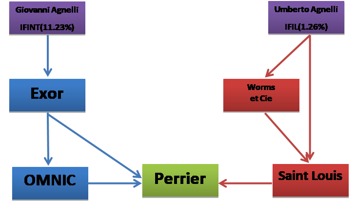 |                                                            |      |

#### Table 1

| **Mentzelopoulos Family** |        |        |             |           |
| ------------------------- | ------ | ------ | ----------- | --------- |
| Exor                      | 15.00% |        | **Control** | **Own**   |
| Perrier                   | 28.80% | 35.50% | 5.33%       | 4.32%     |
| Exor                      | 15.00% |        |             |           |
| OMNIC                     | 49.00% |        |             |           |
| Perrier                   | 6.70%  |        | 0.49%       | 0.49%     |
| **Total**                 |        |        | **5.82%**   | **4.81%** |

 

#### Table 2

| **Givovanni Agnelli (IFINT)** |             |             |             |            |
| ----------------------------- | ----------- | ----------- | ----------- | ---------- |
| Exor                          | 35.00%      |             | **Control** | **Own**    |
| Perrier                       | 28.80%      | 35.50%      | 12.43%      | 10.08%     |
| Exor                          | 35.00%      |             |             |            |
| OMNIC                         | 49.00%      |             |             |            |
| Perrier                       | 6.70%       |             | 1.15%       | 1.15%      |
| **Total**                     |             |             | **13.57%**  | **11.23%** |
|                               |             | **Control** | **Own**     |            |
|                               | **Agnelli** | **14.84%**  | **12.49%**  |            |

 

#### Table 3

| **Umberto Agnelli (IFIL)** |        |           |
| -------------------------- | ------ | --------- |
| Saint Louis                | 6.50%  |           |
| Perrier                    | 13.80% | 0.90%     |
| Worms et cie               | 7.40%  |           |
| Saint Louis                | 36.00% |           |
| Perrier                    | 13.80% | 0.37%     |
| **Total**                  |        | **1.26%** |

 

#### Table 4

| **Banque Societe Generale** |      |           |
| --------------------------- | ---- | --------- |
| OMNIC                       |      | 51%       |
| Perrier                     |      | 6.70%     |
| **Total**                   |      | **3.42%** |

 

| **Total  Stake (Control)** | **24.07%** |
| -------------------------- | ---------- |
| **Total  Stake (Own)**     | **20.72%** |

 

#### Table 5

| **Banque Indosuez** |        |        |             |           |
| ------------------- | ------ | ------ | ----------- | --------- |
| Exor                | 10%    |        | **Control** | **Own**   |
| Perrier             | 28.80% | 35.50% | 3.55%       | 2.88%     |
| Exor                | 10%    |        |             |           |
| OMNIC               | 49%    |        |             |           |
| Perrier             | 6.70%  |        | 0.33%       | 0.33%     |
| **Total**           |        |        | **3.88%**   | **3.21%** |

 

#### Table 6

| **Bank Credit Agricole** |        |        |             |             |            |
| ------------------------ | ------ | ------ | ----------- | ----------- | ---------- |
| Exor                     | 5%     |        | **Control** | **Control** | **Own**    |
| Perrier                  | 28.80% | 35.50% | 1.78%       |             | 1.44%      |
| Exor                     | 5%     |        |             |             |            |
| OMNIC                    | 49%    |        |             |             |            |
| Perrier                  | 6.70%  |        | 0.16%       | 1.94%       | 0.16%      |
| Perrier                  |        |        |             | 8.50%       | 8.50%      |
| **Total**                |        |        |             | **10.44%**  | **10.10%** |

| **Total  Stake (Own)**     | **13.31%** |
| -------------------------- | ---------- |
| **Total  Stake (Control)** | **14.32%** |

## Question 2: There are various parties involved in the battle for corporate control for Perrier. In your judgment, and based on the case facts, who are the insiders and who are the outsiders in the French corporate system?

From the case, we believe that Exor plays a pivotal role in the bid for the Perrier takeover. So, we define an insider in this case as anyone or any company that has a stake in Exor or an indirect or direct ownership in Perrier. However, we cannot analogically define an outsider. A company or a person, although an insider in the French Corporate System, may be an outsider in this case as we explain below.

### Insiders

**The Agnellis** are one of Europe’s most prominent and influential families. The Agnellis had been the largest foreign investor in France, controlling enterprises with estimated sales of FF44 billion. IFINT, a company run by Giovanni Agnelli, owned 35% in Exor and IFIL, run by Umberto Agnelli had a 1.26% indirect ownership in Perrier. 

**The Mentzelopoulos Family** owned 16% of Exor. The heir, Corrine, had married Gustave Leven’s nephew. Corrine had been friends with the Agnellis for two decades. Previously when she was director of Exor, she would not have sold any Exor shares to anyone but the Agnellis. In this case, we believe that the family was an insider. However, the Franco-Greek family was considered to be outside the corporate establishment in France. 

**Exor** owned Paris real estate, vineyards, Perrier, and more along with Societe Generale. The founder of Exor, Jacques Vincent was in the big leagues of the French business establishment, but was considered a corporate maverick that didn’t get on too well with business leaders in France.

**Credit Agricole** is one of Europe’s largest banks and owned 5% in Exor and 8.5% in Perrier. 

**Societe Generale** is another large bank in Europe that had a 3.42% indirect ownership in Perrier.

**The Leven family** owned 18% of Perrier. Although not directly involved in the bid process, it seems that they would have sold to the highest bidder. However, they had been known to vote differently and their final vote could have had a sizeable effect on the outcome of the bid. 

**Saint Louis** was owned by Worms et Cie., which was owned by IFIL. It was also directly controlled 6.5% by IFIL. 

### Outsiders

**Nestle** had ties with Indosuez, which owned 10% shares in Exor. It also had a 25% share of the French cosmetics firm L’Oreal. But this is where its French connections seem to end. Until 1989, the firm was almost entirely Swiss owned. Furthermore, local businesses were independent of corporate management, indicating that its French sales did not indicate a connection with Swiss managers.

**Lazard** **Freres** was an international investment bank that was considered to be particularly influential in France. It was privately held and owned by Michel David-Weill, who embodied the path to power in France. He had extensive networking, and a strong dose of political patronage. As he was ignored in the bid for Perrier, he joined Nestle in their bid for Perrier and helped them with the bid. Although in this case, we consider Lazard Freres to be an outsider, it is not really an outsider in the French Corporate System due its extensive business and political network. 

**BSN** was the fourth largest packaged food concern. It had strong market positions in dairy and mineral water, concentrated in France and Europe. The Agnellis helped BSN expand into Italy, and BSN helped the Agnellis diversify into food in France. In order to resist takeover, BSN teamed up with Nestle and Indosuez against the Agnellis. We consider BSN to be an outsider in this case because, were it not for the intentions of the Agnelli family to take over BSN, it would not have been a participant in the takeover process. However, it is definitely an insider in the French Corporate System. 

## Is the bid for Perrier too high? In undertaking the valuation, *assume* the following: 

- The valuation of Perrier takes place in December 1991.
- The base year is 1992 (take an average of the years 1990 and 1991 as the values for 92).
- Revenues are defined as sales plus other revenues.
- Perrier’s current all-in-cost of borrowing (in French Francs) is 12%, and Nestlé’s, 11%.
- Starting with the end of the calendar year 1992, i.e., year 1, Nestlé expects to obtain cost synergies by lowering Perrier’s non-depreciation expenses to 85% of revenues (from current levels).
- Net working capital is 12% of sales*.*
- Base-case sales for Perrier are expected to get back to a steady growth rate of 5.5% per year. Starting 1992, Nestlé expects revenue synergies to generate an annual additional gain of 2.5% in Perrier’s revenue growth rate, for the next ten years.
- Nestlé plans a one-time set-aside in 1992 of FF600 million to cover restructuring charges and expenses associated with the benzene scandal.
- *Exceptional income* equals *exceptional charges*, going forward.
- Nestlé expects that new capital expenditures will equal 2% of sales. New capital expenditure will be depreciated on an eight-year straight-line basis.
- New depreciation is based on eight-year, straight-line, on new capital expenditure. Old depreciation is assumed to be maintained at 1991 levels of FF718 million.
- The market risk premium for Nestlé’s investors is 7%, and Perrier’s marginal corporate tax rate is 42%.
- The terminal growth rate is 5%.
- If the bid is successful, Nestlé will sell Volvic to BSN for FF3.05 billion.

### Discounting

We begin to find a proper discount rate for the companies by solving for their cost of equity and cost of debt (given). We solve the cost of equity using the CAPM;

Cost of equity = Risk-Free Rate + Beta (Market Risk Premium)

According to the Exhibit 5, the long term government bond discount rate in France is 8% and 6% for Switzerland in December 1991. Risk premium is given, but not the betas.

Exhibit 5 gives us prices, and thereby returns, for France’s stock market, and Perrier and Nestle. We then find our betas by regressing each company’s daily returns on the overall French stock market’s returns. For the entire time period, we see that Perrier’s beta is 1.305, and Nestle’s is 0.518. Considering Perrier’s 1991 Benzene affair, we should expect equity raising costs should rise. But this is not the case, since its beta actually lowered to 0.65. How can we understand this? When we examine Chart 3.3, we see the market has essentially fallen asleep in the past year. Despite the affair, Perrier shares are calmer than the greater market. The difference in betas is considerable. We give more weight to more recent history in our valuation and so, we also consider its final year (1991) beta to calculate a borrowing cost.

To visually inspect the betas, or how much the share prices move given a 1 unit movement in the underlying market, see charts 3.1, 3.2 and 3.3.

Plugging in all the variables, we find Nestle’s cost of equity is 10%, while Perrier’s is 17%. In just 1991, Perrier’s cost of equity is oddly lower at 13%.

To calculate the Weighted Average Cost of Capital (WACC), we need debt to equity ratios for each company. Looking into their financial statements, we find Perrier’s long term debt is FF5,995,319 and its total shareholder equity is FF2,440,688. For Nestle, those numbers are FF5,995,319 and FF2,440,688, respectively.

Using assumed values from the case, we solve the following equation;

WACC = Cost of Debt (1-Tax Rate)*(Debt/Total Capital) + Cost of Equity (Equity/Total Capital)

Results show that Perrier’s WACC is 9.90%, while its 1991 WACC is 8.58%%. Nestle’s WACC comes in at a similar 7.73%. With these values, we can discount each company’s cash flows.

Will Perrier be able to take advantage of Nestle’s lower borrowing costs?

***Please refer to Excel sheets for calculations.***

### Sheet 1

| Month     | Year | French Stock Market | Return market | Volatility market | Perrier | Return Perrier | Volatility Perrier | Nestle | Return Nestle | Volatility Nestle |
| --------- | ---- | ------------------- | ------------- | ----------------- | ------- | -------------- | ------------------ | ------ | ------------- | ----------------- |
| January   | 1988 | 465                 |               |                   | 481     |                |                    | 3934   |               |                   |
| February  |      | 502                 | 0.0796        | 0.0063            | 604     | 0.2557         | 0.0654             | 4205   | 0.069         | 0.0047            |
| March     |      | 510                 | 0.0159        | 0.0003            | 552     | -0.0861        | 0.0074             | 4067   | -0.033        | 0.0011            |
| April     |      | 524                 | 0.0275        | 0.0008            | 675     | 0.2228         | 0.0497             | 4220   | 0.038         | 0.0014            |
| May       |      | 546                 | 0.0420        | 0.0018            | 812     | 0.2030         | 0.0412             | 4141   | -0.019        | 0.0004            |
| June      |      | 610                 | 0.1172        | 0.0137            | 912     | 0.1232         | 0.0152             | 4151   | 0.002         | 0.0000            |
| July      |      | 632                 | 0.0361        | 0.0013            | 882     | -0.0329        | 0.0011             | 4053   | -0.024        | 0.0006            |
| August    |      | 619                 | -0.0206       | 0.0004            | 933     | 0.0578         | 0.0033             | 4171   | 0.029         | 0.0008            |
| September |      | 636                 | 0.0275        | 0.0008            | 1206    | 0.2926         | 0.0856             | 4181   | 0.002         | 0.0000            |
| October   |      | 683                 | 0.0739        | 0.0055            | 1270    | 0.0531         | 0.0028             | 4314   | 0.032         | 0.0010            |
| November  |      | 698                 | 0.0220        | 0.0005            | 1296    | 0.0205         | 0.0004             | 5896   | 0.367         | 0.1345            |
| December  |      | 747                 | 0.0702        | 0.0049            | 1479    | 0.1412         | 0.0199             | 6597   | 0.119         | 0.0141            |
| January   | !989 | 800                 | 0.0710        | 0.0050            | 1735    | 0.1731         | 0.0300             | 6695   | 0.015         | 0.0002            |
| February  |      | 815                 | 0.0188        | 0.0004            | 1630    | -0.0605        | 0.0037             | 6306   | -0.058        | 0.0034            |
| March     |      | 811                 | -0.0049       | 0.0000            | 1695    | 0.0399         | 0.0016             | 6527   | 0.035         | 0.0012            |
| April     |      | 839                 | 0.0345        | 0.0012            | 1754    | 0.0348         | 0.0012             | 6676   | 0.023         | 0.0005            |
| May       |      | 847                 | 0.0095        | 0.0001            | 1659    | -0.0542        | 0.0029             | 6281   | -0.059        | 0.0035            |
| June      |      | 885                 | 0.0449        | 0.0020            | 1518    | -0.0850        | 0.0072             | 7340   | 0.169         | 0.0284            |
| July      |      | 891                 | 0.0068        | 0.0000            | 1643    | 0.0823         | 0.0068             | 8090   | 0.102         | 0.0104            |
| August    |      | 904                 | 0.0146        | 0.0002            | 1741    | 0.0596         | 0.0036             | 8085   | -0.001        | 0.0000            |
| September |      | 934                 | 0.0332        | 0.0011            | 1895    | 0.0885         | 0.0078             | 8375   | 0.036         | 0.0013            |
| October   |      | 902                 | -0.0343       | 0.0012            | 1976    | 0.0427         | 0.0018             | 8430   | 0.007         | 0.0000            |
| November  |      | 856                 | -0.0510       | 0.0026            | 1775    | -0.1017        | 0.0103             | 8430   | 0.000         | 0.0000            |
| December  |      | 910                 | 0.0631        | 0.0040            | 1875    | 0.0563         | 0.0032             | 8680   | 0.030         | 0.0009            |
| January   | 1990 | 900                 | -0.0110       | 0.0001            | 1718    | -0.0837        | 0.0070             | 8480   | -0.023        | 0.0005            |
| February  |      | 856                 | -0.0489       | 0.0024            | 1482    | -0.1374        | 0.0189             | 8570   | 0.011         | 0.0001            |
| March     |      | 872                 | 0.0187        | 0.0003            | 1555    | 0.0493         | 0.0024             | 8550   | -0.002        | 0.0000            |
| April     |      | 938                 | 0.0757        | 0.0057            | 1695    | 0.0900         | 0.0081             | 7975   | -0.067        | 0.0045            |
| May       |      | 950                 | 0.0128        | 0.0002            | 1699    | 0.0024         | 0.0000             | 8725   | 0.094         | 0.0088            |
| June      |      | 932                 | -0.0189       | 0.0004            | 1582    | -0.0689        | 0.0047             | 8375   | -0.040        | 0.0016            |
| July      |      | 900                 | -0.0343       | 0.0012            | 1483    | -0.0626        | 0.0039             | 8280   | -0.011        | 0.0001            |
| August    |      | 797                 | -0.1144       | 0.0131            | 1332    | -0.1018        | 0.0104             | 7500   | -0.094        | 0.0089            |
| September |      | 715                 | -0.1029       | 0.0106            | 1050    | -0.2117        | 0.0448             | 6640   | -0.115        | 0.0131            |
| October   |      | 727                 | 0.0168        | 0.0003            | 1095    | 0.0429         | 0.0018             | 7440   | 0.120         | 0.0145            |
| November  |      | 714                 | -0.0179       | 0.0003            | 1239    | 0.1315         | 0.0173             | 7000   | -0.059        | 0.0035            |
| December  |      | 719                 | 0.0070        | 0.0000            | 1060    | -0.1445        | 0.0209             | 6960   | -0.006        | 0.0000            |
| January   | 1991 | 695                 | -0.0334       | 0.0011            | 1222    | 0.1528         | 0.0234             | 7070   | 0.016         | 0.0002            |
| February  |      | 740                 | 0.0647        | 0.0042            | 1409    | 0.1530         | 0.0234             | 7680   | 0.086         | 0.0074            |
| March     |      | 823                 | 0.1122        | 0.0126            | 1498    | 0.0632         | 0.0040             | 8300   | 0.081         | 0.0065            |
| April     |      | 820                 | -0.0036       | 0.0000            | 1452    | -0.0307        | 0.0009             | 8390   | 0.011         | 0.0001            |
| May       |      | 841                 | 0.0256        | 0.0007            | 1490    | 0.0262         | 0.0007             | 8800   | 0.049         | 0.0024            |
| June      |      | 810                 | -0.0369       | 0.0014            | 1388    | -0.0685        | 0.0047             | 8400   | -0.045        | 0.0021            |
| July      |      | 810                 | 0.0000        | 0.0000            | 1336    | -0.0375        | 0.0014             | 8610   | 0.025         | 0.0006            |
| August    |      | 833                 | 0.0284        | 0.0008            | 1342    | 0.0045         | 0.0000             | 8420   | -0.022        | 0.0005            |
| September |      | 872                 | 0.0468        | 0.0022            | 1366    | 0.0179         | 0.0003             | 8000   | -0.050        | 0.0025            |
| October   |      | 862                 | -0.0115       | 0.0001            | 1300    | -0.0483        | 0.0023             | 8310   | 0.039         | 0.0015            |
| November  |      | 857                 | -0.0058       | 0.0000            | 1242    | -0.0446        | 0.0020             | 8150   | -0.019        | 0.0004            |
| December  |      | 810                 | -0.0548       | 0.0030            | 1221    | -0.0169        | 0.0003             | 8600   | 0.055         | 0.0030            |

### Sheet 2 

| **Perrier Regression (Total)** |                |                   |           |           |                   |              |                |                |
| ------------------------------ | -------------- | ----------------- | --------- | --------- | ----------------- | ------------ | -------------- | -------------- |
| **SUMMARY OUTPUT**             |                |                   |           |           |                   |              |                |                |
| *Regression  Statistics*       |                |                   |           |           |                   |              |                |                |
| Multiple R                     | 0.58           |                   |           |           |                   |              |                |                |
| R2                             | 0.33           |                   |           |           |                   |              |                |                |
| Adjusted R2                    | 0.32           |                   |           |           |                   |              |                |                |
| Standard Error                 | 0.09           |                   |           |           |                   |              |                |                |
| Observations                   | 47.00          |                   |           |           |                   |              |                |                |
|                                |                |                   |           |           |                   |              |                |                |
| ANOVA                          |                |                   |           |           |                   |              |                |                |
|                                | *df*           | *SS*              | *MS*      | *F*       | *Significance  F* |              |                |                |
| Regression                     | 1.00           | 0.18              | 0.18      | 22.54     | 0.00              |              |                |                |
| Residual                       | 45.00          | 0.36              | 0.01      |           |                   |              |                |                |
| Total                          | 46.00          | 0.55              |           |           |                   |              |                |                |
|                                |                |                   |           |           |                   |              |                |                |
|                                | *Coefficients* | *Standard  Error* | *t  Stat* | *P-value* | *Lower  95%*      | *Upper  95%* | *Lower  95.0%* | *Upper  95.0%* |
| Intercept                      | 0.01           | 0.01              | 0.63      | 0.53      | -0.02             | 0.04         | -0.02          | 0.04           |
| X Variable 1                   | **1.31**       | 0.27              | 4.75      | 0.00      | 0.75              | 1.86         | 0.75           | 1.86           |

### Sheet 3

| **Perrier Regression (1991)** |                |                   |           |           |                   |              |                |                |
| ----------------------------- | -------------- | ----------------- | --------- | --------- | ----------------- | ------------ | -------------- | -------------- |
| SUMMARY OUTPUT                |                |                   |           |           |                   |              |                |                |
| *Regression  Statistics*      |                |                   |           |           |                   |              |                |                |
| Multiple R                    | 0.41           |                   |           |           |                   |              |                |                |
| R2                            | 0.17           |                   |           |           |                   |              |                |                |
| Adjusted R2                   | 0.09           |                   |           |           |                   |              |                |                |
| Standard Error                | 0.07           |                   |           |           |                   |              |                |                |
| Observations                  | 12.00          |                   |           |           |                   |              |                |                |
|                               |                |                   |           |           |                   |              |                |                |
| ANOVA                         |                |                   |           |           |                   |              |                |                |
|                               | *df*           | *SS*              | *MS*      | *F*       | *Significance  F* |              |                |                |
| Regression                    | 1.00           | 0.01              | 0.01      | 2.06      | 0.18              |              |                |                |
| Residual                      | 10.00          | 0.05              | 0.01      |           |                   |              |                |                |
| Total                         | 11.00          | 0.06              |           |           |                   |              |                |                |
|                               |                |                   |           |           |                   |              |                |                |
|                               | *Coefficients* | *Standard  Error* | *t  Stat* | *P-value* | *Lower  95%*      | *Upper  95%* | *Lower  95.0%* | *Upper  95.0%* |
| Intercept                     | 0.01           | 0.02              | 0.34      | 0.74      | -0.04             | 0.05         | -0.04          | 0.05           |
| X Variable 1                  | **0.65**       | 0.45              | 1.44      | 0.18      | -0.36             | 1.66         | -0.36          | 1.66           |

### Sheet 4

| **Nestle Regression**    |                |                   |           |           |                   |              |                |                |
| ------------------------ | -------------- | ----------------- | --------- | --------- | ----------------- | ------------ | -------------- | -------------- |
| SUMMARY OUTPUT           |                |                   |           |           |                   |              |                |                |
| *Regression  Statistics* |                |                   |           |           |                   |              |                |                |
| Multiple R               | 0.32           |                   |           |           |                   |              |                |                |
| R2                       | 0.10           |                   |           |           |                   |              |                |                |
| Adjusted R2              | 0.08           |                   |           |           |                   |              |                |                |
| Standard Error           | 0.07           |                   |           |           |                   |              |                |                |
| Observations             | 47.00          |                   |           |           |                   |              |                |                |
|                          |                |                   |           |           |                   |              |                |                |
| ANOVA                    |                |                   |           |           |                   |              |                |                |
|                          | *df*           | *SS*              | *MS*      | *F*       | *Significance  F* |              |                |                |
| Regression               | 1.00           | 0.03              | 0.03      | 5.26      | 0.03              |              |                |                |
| Residual                 | 45.00          | 0.25              | 0.01      |           |                   |              |                |                |
| Total                    | 46.00          | 0.27              |           |           |                   |              |                |                |
|                          |                |                   |           |           |                   |              |                |                |
|                          | *Coefficients* | *Standard  Error* | *t  Stat* | *P-value* | *Lower  95%*      | *Upper  95%* | *Lower  95.0%* | *Upper  95.0%* |
| Intercept                | 0.01           | 0.01              | 1.14      | 0.26      | -0.01             | 0.04         | -0.01          | 0.04           |
| X Variable 1             | **0.52**       | 0.23              | 2.29      | 0.03      | 0.06              | 0.97         | 0.06           | 0.97           |

### Sheet 5 

| **Perrier**                                                  |                          |                             |
| ------------------------------------------------------------ | ------------------------ | --------------------------- |
| cost of equity = discount rate + beta(risk  premium)         |                          |                             |
| discount rate                                                | 8%                       |                             |
| Beta                                                         | **1.305204929**          |                             |
| risk premium                                                 | 7%                       |                             |
| cost of equity                                               | 17%                      |                             |
|                                                              |                          |                             |
| WACC = cost of  debt(1-tax)(debt/total) + cost of equity(equity/total) |                          |                             |
| cost of debt                                                 | 12%                      |                             |
| Tax                                                          | 42%                      |                             |
| debt to equity ratio                                         |                          |                             |
|                                                              | long term debt           | $                 5,995,319 |
|                                                              | total shareholder equity | $                 2,440,688 |
|                                                              | total                    | $                 8,436,007 |
| debt to total                                                | 0.71068208               |                             |
| equity to total                                              | 0.28931792               |                             |
| **WACC**                                                     | **9.90%**                |                             |
|                                                              |                          |                             |
|                                                              |                          |                             |
| **Perrier 1991**                                             |                          |                             |
| cost of equity = discount rate +  beta(risk premium)         |                          |                             |
| discount rate                                                | 8%                       |                             |
| Beta                                                         | **0.650323784**          |                             |
| risk premium                                                 | 7%                       |                             |
| cost of equity                                               | 13%                      |                             |
|                                                              |                          |                             |
| WACC = cost of debt(1-t)(debt/total)  + cost of equity(equity/total) |                          |                             |
| cost of debt                                                 | 12%                      |                             |
| Tax                                                          | 42%                      |                             |
| debt to equity ratio                                         |                          |                             |
|                                                              | long term debt           | $                 5,995,319 |
|                                                              | total shareholder equity | $                 2,440,688 |
|                                                              | total                    | $                 8,436,007 |
| debt to total                                                | 0.71068208               |                             |
| equity to total                                              | 0.28931792               |                             |
| **WACC**                                                     | **8.58%**                |                             |
|                                                              |                          |                             |

### Sheet 6 

| **Nestle**                                                   |                          |                   |
| ------------------------------------------------------------ | ------------------------ | ----------------- |
| cost of equity = discount rate +  beta(risk premium)         |                          |                   |
| discount rate                                                | 6%                       |                   |
| Beta                                                         | 0.518254024              |                   |
| risk premium                                                 | 7%                       |                   |
| cost of equity                                               | 10%                      |                   |
|                                                              |                          |                   |
| WACC = cost of debt(1-t)(debt/total)  + cost of equity(equity/total) |                          |                   |
| cost of debt                                                 | 12%                      |                   |
| tax                                                          | 42%                      | assumed           |
| debt to equity ratio                                         |                          |                   |
|                                                              | long term debt           | $       5,995,319 |
|                                                              | total shareholder equity | $       2,440,688 |
|                                                              | total                    | $       8,436,007 |
| debt to total                                                | 0.71068208               |                   |
| equity to total                                              | 0.28931792               |                   |
| **WACC**                                                     | **7.73%**                |                   |

## Suppose the two court decisions turn out in Nestlé’s favor. How will this affect the shareholdings of the Agnellis and their allies? Has Nestlé won the battle? Why or why not? What likely outcomes do you anticipate with respect to the EU antitrust case against Nestlé?

If the two court decisions turn out in Nestlé’s favor, the immediate result is that Saint Louis’ 13,8% stake in Perrier will be annulled. In terms of the Agnelli group’s shareholdings, since Saint Louis will lose its stake in Perrier, the IFIL will not have any indirect ownership in Perrier. Furthermore, the Agnelli’s shareholdings in Perrier will decrease from 12,49% to 11,23% (see Question 1, Chart 4.1).

Additionally, Exor’s failure to disclose its 35% stake in Perrier could lead to a loss of voting rights on the excess over original share they owned. Exor and Societe Generale together owned 35% of Perrier. Mathematically, that’s 35.5% - 28.8% = 6.7%, representing Exor’s loss of voting rights in Perrier.

But the ruling’s aftermath further complicates the picture, due to anticompetitive laws the EC had just adopted in 1990. The first law, aiming to curb monopolistic behavior, prevents the creation of a merger resulting in 40% market share. If Nestle gets Perrier, it would control 56% of French mineral water sales, and thereby violate this law (see Chart 4.2). Nestle had to sell. BSN in turn, afraid the Agnellis might challenge it in the French mineral water market, offered to buy Volvic for FF3.05 billion.

Volvic was an attractive target. Of all Perrier brands, Volvic sales growth easily ranks first, while its total sales volume is set to reach first next year (Chart 4.3). By mid-1994, Volvic will sell as much as all other Perrier brands combined. Compared to Perrier competitors, Volvic is growing exceedingly fast (Chart 4.4). In terms of sales volume, Volvic is set to reach first by 1994. Because such successful brand names are difficult to develop in the water business, BSN should be very pleased to capture Volvic.

Before continuing, we explain our handling of a discrepancy in the case numbers. As given in the case, the 1991 per capita intake of mineral water in France was 77 liters. 1991 census data shows that France’s population was about 57 million, bringing national consumption to 4,387 million liters (Chart 4.5). The same year Perrier sold 2,314 million liters, or 39% of the market share. From Exhibit 4a, our total France market registers at 4,851 million liters. We know however, that Nestle with Perrier and BSN together control 56% of the market, bringing the total market value to 5,916 million liters. Based on this fact, we disregard the 77*population figure.

We are told that if Nestle wins, it will control 56% of market share. After the deal, Nestle and BSN would together control 82% of French mineral water. Nestle agrees to carve Volvic out of its Perrier acquisition and sell it to BSN (Chart 4.2). This leaves Nestle with an 16% French market share through Vittel, 2% with Vittel-Hepar, and 14% thanks to the remaining Perrier brands, bringing its total holdings to 29%. 

BSN will hold Evian with 22% market share, Badoit with 5%, and its new Volvic for 13%. This brings BSN’s total holdings to 40%, leaving it on the edge of being overweight (Chart 4.2). But with growth forecasts, the Volvic purchase may necessitate a restructuring. Keeping one hand on Volvic, the other prime choice is Evian, resulting in total market share of 35% (Chart 4.6).

One last market share consideration is current growth rate (Chart 4.7). If 1991 growth extrapolates into 1994, Nestle will once again be standing on the edge of an antitrust case (Chart 4.8). With Perrier brands growing well, Nestle will reach 34% of market share. If the Perrier brand is expected to regain after its Benzene Affair, as said, Nestle should close in on 40% quicker than this forecast. A closer look at Perrier’s prospects would determine if Nestle should shed a few more small brands. Meanwhile, BSN, powered on by Volvic, will have reached 47%, and Evian will gain one percentage point to hit 23%. 

In order to avoid antitrust cases, Nestle will most likely not be able to pick up any additional brands, and BSN will surely be barred from growing in France via M&A (Chart 4.9). Furthermore, these companies will come to essentially dominate the market by 1994. With the entire water market projected to be taken by these three entities and with the exception of Evian buying small brands, no major M&A will happen in the future, since if any of them purchase each other, they will result in holdings above 40% market share. The courts can either allow an unprecedented level of intervention, or accept this inevitable freeze. But this doesn’t take into account the revenue laws.

Lastly, there is also the second revenue law to consider. The second antitrust law demands an investigation of any merger whose worldwide sales result in more than Ecu5 billion and whose EC-wide sales exceed Ecu250 million. We assume that the companies cannot cut production to lower their market share, since this would change supply and demand conditions, and thereby prices. Since two brands drawing from one water spring is an odd concept, we also assume that the brands themselves cannot be split apart (Chart 4.10).

Nestle earned in its 1991 income statement global sales of FF13.19 billion. According to IMF publication International Financial Statistics Yearbook 2003, that converts to Ecu1.8 billion, far below the legal global limit of Ecu5 billion. Even with all of Perrier sales, it comes nowhere close to the Ecu5 billion mark.

We interpret the Ecu250 million law to mean that a merger cannot result in a company’s water business that sells more than Ecu250 million, rather than the greater company’s. To obtain market share values, we used data from Exhibit 4a (Chart 4.11). Due to a lack of information that regulators would surely overcome, we also used one assumption – that Perrier’s total mineral water sales value, which represents 39% of France’s market share, also represents 39% of the market’s total value. Combining this total market value with the same market shares from Exhibit 4a, we similarly derive all other brand sales values. The results show that Nestle, with Perrier minus Volvic, will be reaping Ecu570.45 million, far exceeding the legal limit. BSN with Volvic will capture Ecu623.93 million. Going on our assumption, and without any more data, this would suggest the companies must be more than halved in size (Chart 4.12).

The total market value of France’s mineral water business is FF10,673.3 million or Ecu1,456.55 million. If legal authorities don’t want any company sales to surpass Ecu250 million, this indicates 5.8, or 6, companies are required to keep regulators at bay (Chart 4.13). Now without a doubt, it’s time for us to sharpen our knives and start cutting companies apart (Chart 4.14).

### Exhibit 4a

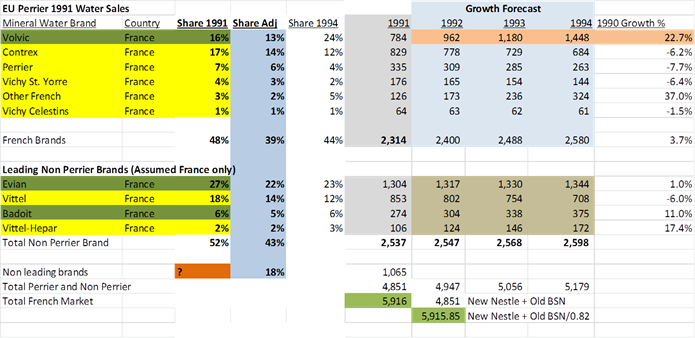

### Chart 4.1

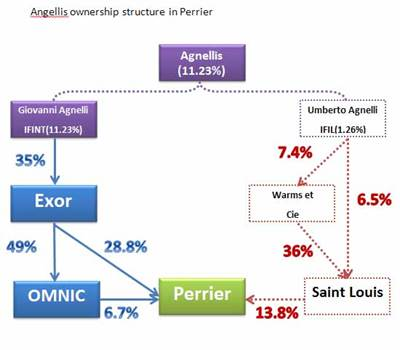

### Chart 4.2

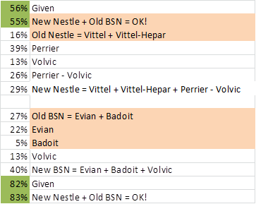

### Chart 4.3

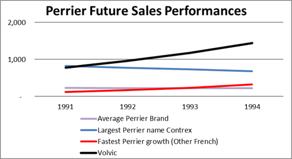

### Chart 4.4

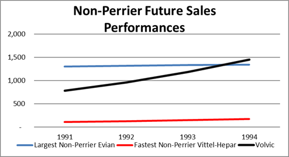

### Chart 4.5

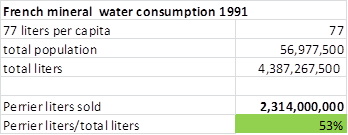

### Chart 4.6

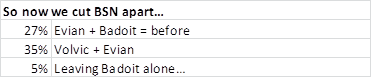 

### Chart 4.7

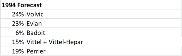

### Chart 4.8

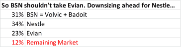

### Chart 4.9

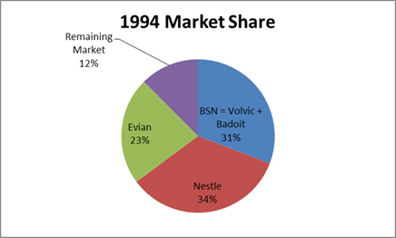

### Chart 4.10

### Chart 4.11

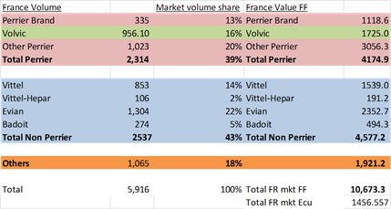

### Chart 4.12

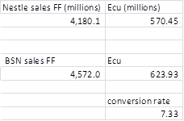

### Chart 4.13

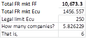

### Chart 4.14

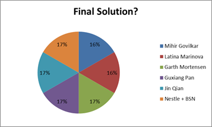

## What are some of the similarities and differences in the Anglo-American and French markets for corporate control (in particular, look at Exhibit 9 of the case)? 

Models of corporate control are different in the USA and in France as follows:

1.    There are differences in shareholder concentration. According to Ooghe and Vuyst, shareholders in Anglo-Saxon countries typically have low concentrations of ownership, whereas in France, a group of shareholders will hold a large percentage of publicly traded shares.

2.    The kind of shareholders is different as well. In the US, shares are normally held by financial institutions, while in France, it’s not necessarily financial institutions that have a large ownership. The former’s capital markets are typically more liquid with more listed companies. 

3.    The lower concentration of shareholders in Anglo-Saxon countries leaves more decision making control in the hands of directors. The opposite case can be said about France. With fewer listed companies, investors in France are more prone to holding onto their stocks, and exercise their voting rights to influence company performances. They normally hold onto these stocks for longer durations than in Anglo-Saxon countries.

Following Ooghe and Vuyst’s line of reasoning, we can say that the limited extent of information disclosure in France will lead to a less transparent ownership structure than that in Anglo-Saxon countries. Finally, because ownership is highly concentrated, fewer financial resources are available to companies.

If we believe that the takeover will be beneficial for the market（four main reasons: better allocation of resources, synergy gains, better management discipline, and more accurate market valuation）, then the function of takeover laws, although interpreted in different business context of the two countries corporate control, can be concluded as follows: maximize shareholder value by encouraging beneficial takeovers while minimizing the risks of misbehavior by the directors, the majority shareholders and the acquirers.  

The obstacles in achieving the objectives above might be as follows: 

1.    The management might have an incentive to go against the takeover due to the fear losing their jobs. 

2.    The major shareholders might accept a higher price while allowing the shares held by minority shareholders to be bought at a lower price.

3.    Third, the acquirer can construct coercive tender offers, with a front-end offer higher than the back-end, thereby putting pressure on shareholders to tender.

We believe the main similarities and differences regarding corporate control arise from the methods of handling the obstacles mentioned above. In the following section, we will probe into the similarities and differences of French and Anglo-American corporate control mechanisms by studying takeover laws in these two systems.

### Similarities

#### Requirement for disclosure

In the US, as clarified in Section 13(d) of The Williams Act (an amendment to the Securities Exchange Act of 1934), an acquirer obtains more than a specified percentage of shares, such acquisition will lead to a duty to disclose certain information, including: the offeror’s background and identity; the source of the offeror’s acquisition funds; the purpose of the acquisition, including any plans to liquidate the target company or make any other major change to its business; and the extent of the offeror’s holdings in the company. 

Similarly, in France as shown in No.2 of Exhibit 9, when thresholds of 5% 10% 20% are met, the acquirer is forced to make a disclosure to both the target and the Council of Stock Exchanges. Failing this, shares over the thresholds become non-voting in the bidder’s hands for a two-year period. Just as Franck de Vita argues “The concerned entities, their management and advisors are required to exercise particular care with respect to public disclosures.” 

#### Minority shareholders protection

In both the systems of takeover regulation, both countries require a fair treatment for all shareholders in the target. However, there is a tiny difference between the two systems. In the USA, the acquiring corporation must disclose the purpose of the acquisition, offer plans for future major changes in the target, and pay the same price for all tendered shares. This rule ensures that minority shareholders will be able to enjoy their fair share of the control premium paid by the acquirer. While in France, in from No.4 of Exhibit 9, we can see that there exists an exception that “a lower price may be paid under certain conditions to minority acceptors for dealings in controlling interest”. But neither the Williams Act nor any other legislation in France requires an offeror to buy all outstanding shares, which may mean that some stockholders involuntarily get stuck with shares in the new corporation. The acquirer can negotiate privately with the majority shareholder for control and decide not to buy out the minority, so the legal position of minority shareholders in the U.S. and France is broadly similar.

### Differences

#### Mandatory bid rule (No.1 in exhibit 9)

This rule requires that an acquiring corporation must make a bid for all the outstanding shares of a corporation, which is in contrast to the takeover law in the United States that has no requirement to buy unwanted shares. 

The United States has given substantial amount of freedom to both acquiring and target corporations: the acquiring corporation can make an offer for any number of shares, and the target board of directors may take defensive measures against the offer. The French system of takeover has instead put significant restrictions on both acquirer and target: the acquiring corporation must make a bid for all outstanding shares, and the target board of directors may not take any actions to frustrate the bid unless these actions are authorized by the shareholders. 

#### Framework of legislation and regulation for takeover law

In the United States, Delaware courts are the primary and most influential source of takeover law. While In France, takeover laws are regulated by the COB through a process of consultation, political compromise, and lobbying. (No. 3 of Exhibit 9)

#### Board neutrality

The French takeover law on bids addresses the question of whether directors are permitted to adopt defensive measures in response to a hostile tender offer. In the United States, the answer is that they may do so if they have reasonable grounds to believe the takeover is a threat and the measures are themselves reasonable. In sharp contrast, the French takeover directive provides that directors are held to a strict rule of neutrality, which can be proved by No.11 of Exhibit 9.

#### Shareholders’ approval on defense

The flexible American system allows directors to adopt defensive tactics without shareholder approval. However, from No. 6 of Exhibit 9, we see some defense “requires” shareholder approval with 2/3 of majority.

Overall, the French regulations on takeovers seem to fit quite closely with the purpose of the legislation: encouraging takeovers while protecting shareholders. The U.S. regime does not fare as well. It gives discretion to managers to institute defensive actions when such actions have been found to decrease shareholder value, and it does not require a mandatory bid for all outstanding shares, which allows for the possibility of abuse of minority shareholders. 