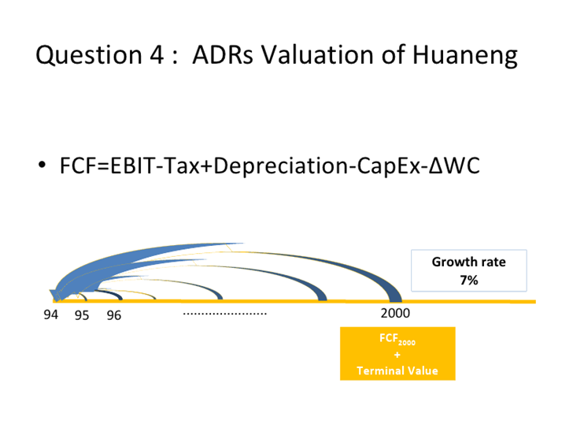
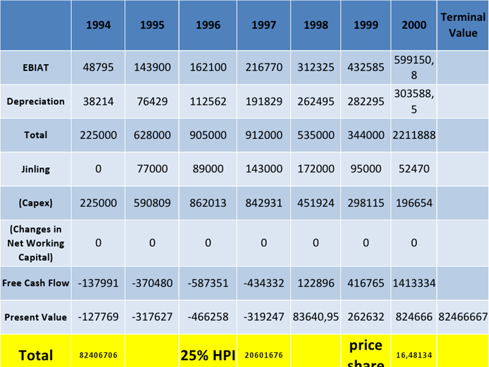

# HuaNeng power int’l

## You're considering purchasing HPI stock. Provide an analysis of:

### China as an investment destination

#### Foreign Economic Policies:

The economic growth rate reached 10.2% in 1995 and 9.7% in 1996. The Chinese economic system is on its way from a central planning system to a market oriented one.

#### Attracting Foreign Investment

The favorable policies mainly cover the Hi-tech industry, agriculture, forestry, telecommunication, energy, export-oriented sectors.

#### Promoting Foreign Trade

The Chinese government has been actively carrying out necessary steps to promote its foreign trade, including calling off import adjusting tax and export subsidy, cutting tariffs rates.

#### Financial Institutions

Foreign financial institutions may establish representative offices, branches, subsidiaries and joint ventures with favorable conditions in china.

#### Foreign Exchange Control

On December 1, 1996, China announced to accept Article 8 of the International Monetary Funds, that is, RMB can be freely converted under current account.

#### Security Markets

Initial Public Offering (IPO) in domestic market has 2 forms, one is in A shares, which is denominated in RMB and bought by domestic investors, the other is in B shares, which is denominated in foreign currencies for foreign investors.

#### Labor Market

The labor department of local government is responsible for the administration of foreigners' employment in China. Foreign employees who work in FIEs must pay individual income tax.

#### Political, Economic and Legal Climate

- Sole party political mechanism
- Rigid tax policy: 20% withholding tax
- Semi-floating exchange rate Policy: constant 8.6 Rmb to USD 1
- Courts would not enforce against the company/directors

#### Overview of power industry in the PRC

1. Underdevelopment of electricity industry was a main obstacle lagging GNP
growth: analysis of Exibit 4

2. Growing demand: 17,000 megawatts per year through year 2000, and
insufficient domestic sources call for foreign investment
3. Opportunities: Huaneng’s clients are those fastest growing provinces

### China as an investment destination

- Find the Right Partner:
- Huaneng’s network, plants, knowledge and experience in China’s electricity market

### HPI's strengths and weaknesses

1. Political support: enjoy favorable development conditions and assistance in tech, fund, and policy.
2. Superior equipment : 40% more reliable than domestic manufactured equipment
3. Plants network: 5 plants facing 23% of population namely 31% of GDP. Still five more under construction.
4. Cost and resource advantage: low labor cost and priority coal/oil supply backup

#### Weakness

1. Complicated ownership and due to its state-run background, executive force would be a problem
2. Geographical dispersion : 1,600 kilometers among five coastal provinces.
3. No guarantee for future allotments
4. Equipment risk: out of date, break downs
5. Low level of labor quality.
6. HPI low degree of modern operating mentality and corporate governance: even did not carry third-party liability insurance coverage for accidents on company property.

To sum up, the success determinant are :

1. understanding of China’s electricity market
2. Good relationship with all Chinese stake holders
3. Implement foreign investors’ own strategy while respecting Chinese business methods
4. Well chosen corporate pattern: capital issuance

| **Strengths of HPI**                                         | **Weaknesses of HPI**                                        |
| ------------------------------------------------------------ | ------------------------------------------------------------ |
| The leading independent power company  in PRC                | Lack of skilled operational personnel                        |
| HPI’s current management has a lot of  experience in power generation and plant management | HPI has no business interruption  insurance                  |
| HPI has a strong relationship with  HPIDC, one of the leading power developers in PRC | No third – party liability insurance  coverage               |
| It has a strong relationship with the  central and local governments in China | Transportation problems as  transportation comprises about 50% of the total cost of coal |
| Receives priority allotments of coal  and oil                | Uses foreign equipment and technologies  and, thus, has higher costs |
| HPI’s plants have a profitable  operating history            |                                                              |

## HPI wants to access financial markets. What are the options available to the firm? Provide pros and cons of available options in particular, deal with: Debt markets. Equity markets: In particular, what type of listing is suitable for Huaneng to pursue? i.e. domestically within China and internationally, listing in Hong Kong, London and the US. (In the US between different ADR levels) What are the benefits for a non-US firm that decides to list on a US exchange?

### Domestic Debt

#### Cons:

- Impossible! Only equity can provide enough fuel to expand 
- Huaneng is over reliant on debt
- Increase the risk of bankruptcy
- Government aims to tighten lending screws
- Inflation climbing causing upward interest rate pressure, which leads to increased cost of debt

#### Pros:

- Tax benefits
- Increase leverage

### Domestic equity

#### Pros:

- Local courts pay no heed to foreign court rulings, offering protection
- Familiar landscape, plenty of government guanxi

#### Cons:

- Shanghai and Shenzhen have relatively low liquidity and capitalization

### International debt

#### Cons:

- RMB recently depreciated by over 40%, raising international debt costs
- International banks may not accept risk

### International equity

#### Pros:

- Broader investor exposure may improve stock performance
- Diversification of risk 
- Lower required rate of return
- Better image in listing market

### International equity HK

#### Pros:

- Hong Kong has Mainland know-how
- Easy listing requirements
- Target the announcement of 20 new Mainland firms.
- Hang Seng China Enterprise Index to track Mainland companies

#### Cons:

- Ability to absorb large issue questionable
- Mixed welcome for Chinese companies
- Already many Mainland companies

### International equity - USA

#### Pros:

- Large size can better absorb HPI’s large offering
- US investors may double foreign holdings within 2 years
- Access to more international investors
- US utilities weak, making foreign utilities more attractive
- Only 2 years of audited earnings needed
- NASDAQ guarantees a market for stocks
- US and China have a tax treaty

#### Cons:

- Interest jump in 1994, harming market conditions. 
- Situation of IPOs ok for now, but later?

#### ADR Pros:

- Lower transaction costs
- Prices and dividends are in USD
- Greater liquidity and easier execution
- Tax treaty so no filing for refunds of withholding taxes needed

#### ADRs Level III chosen, BUT…

- Level II & III give low cost access to NYSE, NASDAQ and AMEX
- Level I & II demands only partial GAAP and bear reporting requirements
- Level III requires unaccustomed level of transparency , which 144A dodges
- 144A dodges this, but institutional investors may be unable, and unwilling, to absorb the large issue

## What is the right cost of capital for the various equity options? Measure and explain the cost of capital for each equity option

### CHINA

We used re = r0 + (r0 – rD)(D/E)(1-Tc) to obtain the levered cost of equity

- ro = 15%
- rD = 8%
- Tc = 30%, 33%, 40%

Therefore, the cost of equity is 21%,21% and 20%, respectively

WACC = Cost of Debt (1-Tax Rate)*(Debt/Total Capital) + Cost of Equity (Equity/Total Capital)

Since we have three different scenarios for the tax rate, the company’s WACC is 12.51%, 12.26%, and 11.68%, respectively.

### US

Cost of Equity = Risk-Free Rate + ß(Market Risk Premium)

RF = U.S. Government LT Bond Yield or 8.09%

RM-RF = S&P 500 Long – term market premium or 4.73%

ß = 0.52, which is the beta of the Electrical Power Generating Industry in US

Cost of equity = 10.55%

Cost of debt = HPI’s cost of debt in China + estimated premium

rD = 8% + 2% = 10%

Thus, WACC = 8.59%,8.42% and 8.03%, respectively (for the different tax rate scenarios)

### HK

Cost of Equity = Risk-Free Rate + ß(Market Risk Premium)

RF = Prime Rate in Hong Kong or 7.75%

RM-RF = 13.05% (Hong Kong Hang Seng Index Market Premium)

ß = 0.52 

Thus, cost of equity = 14.54%

rD = HPI’s cost of debt in China + estimated premium or rD = 8% + 1% = 9%

WACC = 9.98%, 9.83% and 9.49%, respectively

After calculating the WACC for the US, we also assume that the terminal growth rate will be stable at 7% for HPI, and the change in net working capital is 0.

Thus our valuation for ADRs is about $16.48 per share.

## What implementation strategy would you suggest? Present your recommendation on whether, how and why HPI should have proceeded with this issue. 

**We believe that HPI should proceed with the US issue.**

Our Justifications:

1. HPI presented an attractive investment opportunity to international investors.
2. According to the Cost of Equity (Ke) and the WACC that we have calculated, the US markets offer the lowest Ke and WACC.
3. HPI required $4.5 billion to finance their future expansion plans. However, their internal source of financing was enough.
4. Additional Advantages: 
   1. Bigger market size
   2. Improved valuation 
   3. More international exposure and visibility
5. Chinese ADRs offer diversification opportunities to US investors.

## Would you have recommended to buy stock in this company at all? Why?

We have a price of $16.48 per share based on Discounted Future Cash Flows. 

For the ADR issue, we consider a 15% discount on the calculated share price. 

We consider the discount to account for country risk and,

Unfamiliarity of US investors with the Chinese laws and companies in general. 

We believe that the ADR should be issued at $14.01.

## Given the current international investor environment (and not in 1994), what steps could HPI and the Chinese government take to make it easier for firms from China to raise capital internationally?

### Necessary steps Huaneng might do to attract global investors to increase its success in global capital market:

1. **Establish a sound financial system and reporting records.** Foreign investors will not build confidence for Huaneng until it presents a sound financial mechanism. 
2. **Maximize the utility of existing assets.** To maintain its financial stability, financially speaking, Huaneng should use properly its assets such as plants, equipment, network with government, thus making Huaneng more attractive to get more financial support from global capital market.

### Ways Huaneng might take to raise capital abroad: 

1. **Direct listing and indirect listing**. Directly list to foreign securities market by shares, or other derivative financial instruments, to the local stock exchange for listed transactions. 
2. Indirect listing overseas

### Actions government might take:

1. The country should ensure brokers operate well and remain competitive. They are the crucial element binding domestic companies to international markets. The government could push for joint ventures, easier access to labor and visas and offer tax preferential policies.
2. However, as domestic brokerages differentiate themselves in strength and experience; it is important for the government to promote the financing of domestic enterprises listed overseas. 

First, China's financial institutions, especially brokers, are still protected and not active in the international financial markets. Under global competition, the government should enact policies in favor of domestic brokerages and foreign securities firms to compete on an equal footing. While nurturing the domestic firms growth, they should also be urged to compete. 

Second, to encourage overseas investment banks and securities firms to participate in the issuance of B shares, H shares, N shares and S shares. Later, create conditions to promote the intervention of Chinese-funded brokerage owned brokerage competitiveness and business development capabilities.

Third, to allow foreign-owned brokerages in the Mainland to set up offices or branches in other forms, and the territory of China and foreign brokerages branches should be welcome to enjoy the same business treatment, which cultivates sustainable development.

