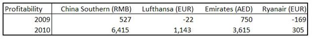
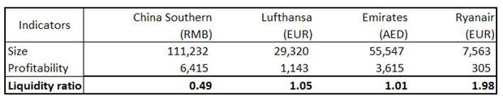
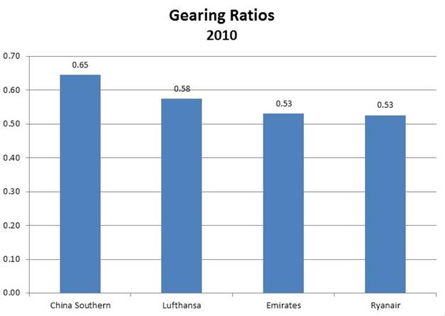

# Airline Industry Analysis

## To what extent do companies provide high quality disclosures and disclosures that go beyond the minimum requirements of IAS 1? 

As stated by Deloitte via their IAS Plus platform, “the objective of IAS 1 (2007) is to prescribe the basis for presentation of general purpose financial statements, to ensure comparability both with the entity's financial statements of previous periods and with the financial statements of other entities” (Deloitte Global Services Limited, 2011). Last revised in December 2003 by the International Accounting Standards Board (IASB), IAS 1 applies to all financial statements that are produced on the basis of International Financial Reporting Standards (IFRS). It provides broad, principle-based rules with reference to all presentational aspects that entities must consider in the production of their financial statements, ranging from the components that comprise a full set of financial statements to individual elements due for incorporation in the statements themselves.

It is important to note, nevertheless, that the provisions included under IAS 1 are intentionally broad and flexible in nature, denoting the minimum standards to which entities must abide when presenting their financial statements. However, as illustrated by the degree of criticism that the Financial Reporting Review Panel (FRRP) expressed when the IFRS were implemented in the UK, this wide scope results in considerable variation in the extent to which entities choose to go above and beyond, or to simply meet, IAS 1’s requirements in providing users of their financial statements with information that aids understanding and any economic decisions that they may pursue.

One section of the financial statements that is exposed to such variation is the disclosure of significant accounting policies that managers employ in the preparation of accounting information, particularly true since 2003, when enhanced IAS standards were implemented. These new standards relate in particular to disclosures on judgments made by management in applying accounting policies, as well as key sources of estimation uncertainty that may risk the occurrence of a material adjustment of assets and liabilities within the following financial year.

Following the release and full implementation of these enhanced standards for disclosure, this essay aims to analyse the extent to which entities choose to provide high or low quality disclosures of significant accounting policies and critical accounting estimates, going beyond, or simply meeting, the minimum requirements of IAS 1. With this in mind, analysis will focus individually on four public international airlines that have all employed IFRS: China Southern Airlines; Lufthansa; Emirates Airlines and Ryanair. In analysing the airlines’ annual reports for the financial year of 2009/10 in conjunction with relevant IAS 1 paragraphs, the analysis will serve to establish the degree to which such variation in disclosures actually exists in practice.

### China Southern Airlines

#### General features

*IAS Clauses referenced: 1.16 Statement of compliance with IFRS*

The first item of China Southern’s principal accounting policies section is the Statement of Compliance. This clearly states that the financial statements are prepared in accordance with IFRS and IAS, and that they comply with local Hong Kong disclosure requirements (China Southern Airlines Company Limited, 2010). Stating this compliance instantly allows users to expect disclosures to be of reasonable quality.

#### Identification of the financial statements

*IAS Clause referenced: 1.51 Identification of essential information: reporting entity name, whether the financial statements are of an individual entity or a group of entitities, date of reporting period end, presentation currency, level of rounding in statement presentation*

The annual report reveals with sufficient clarity that the consolidated financial statements relate to the company, its subsidiaries and the group’s interest in associates and jointly controlled entities as of 31st December 2010 (China Southern Airlines Company Limited, 2010), complying with IAS Clause 1.51. Information that satisfies the remainder of this clause is detailed throughout this section, another indicator of good disclosure.

#### Notes: Disclosure of accounting policies

*IAS Clauses referenced: 1.117 – 1.121 Disclosure of measurement basis (or bases) and other accounting policies relevant for comprehension of the financial statements*

China Southern satisfies the IAS Clauses 1.117 to 1.121’s requirements to a good degree. Not only does it state historical cost as its principal basis for measurement of assets and liabilities, but also states exceptions to this policy, such as derivative financial instruments and available-for-sale equity securities, measured at fair value (China Southern Airlines Company Limited, 2010). Another exception is non-current assets held for sale, stated at the lower of carrying amount and fair value less costs to sell. These disclosures effectively provide readers with information that is likely to be key in economic decision-making, as this ultimately contributes to the value of the company as a whole.

#### Notes: Sources of estimation uncertainty

*IAS Clauses referenced: 1.122 – 1.124 Disclosure of management judgements in applying the entity’s accounting policies; 1.125 – 1.127 and 1.131 Disclosure of management’s assumptions and other sources of estimation uncertainty (requiring subjective and complex judgments) that risk material adjustments of assets and liabilities within the next financial year; 1.129 Presentation of such assumptions in a manner comprehensible manner*

China Southern proceeds to clarify some key accounting concepts. For example, leased asset disclosures have merited considerable detail due to the technical distinction between operating and financing leases. Calculation methods of the amounts are first explained, finance leases being valued at the lower of fair value of the least asset and the minimum lease payments’ present value, while for operating leases, the company registers the amount paid to profit or loss in equal instalments over the entire leasing period. Land is cited as an example: “The cost of acquiring land held under an operating lease is amortised on a straight-line basis over the respective periods of lease terms which ranges from 30 to 70 years” (China Southern Airlines Company Limited, 2010, p. 62). This disclosure is clear, providing all key elements of the costing method used. Such quality presented throughout this section demonstrates a concerted effort to provide users with the information they require.

Another interesting disclosure is asset impairment, which is based on objective evidence available to the company in its day-to-day operations. One example is the impairment of investments in equity securities and other receivables, whereby China Southern appears to provide an exhaustive list of the events that could induce losses: significant debtor financial difficulty; breach of contract; increased probability of debtor bankruptcy or financial reorganisation; significant technological, market, economic or legal environment changes with adverse effects on the debtor; or a significant decline in an investment’s fair value below its cost (China Southern Airlines, 2010). While judgements on impairment are known as an area where management may exercise subjective opinions, it is fair to say that China Southern’s detailed disclosure reduce this probability, reassuring users of management’s credibility and reliability. 

Revenue recognition is an equally important section due to its impact on profits, and China Southern provides high quality descriptions of a range of related factors. It states that revenues are measured at fair value and recognised when the service is rendered, the Frequent Flyer programme, for example, being deferred as a liability until the awarded ‘miles’ are used (China Southern Airlines Company Limited, 2010). These disclosures effectively facilitate users’ understanding of the elements that combine to produce the company’s year-end revenue.

China Southern’s very clear explanation of depreciation methods is also worthy of mention. The company explains that PPE is depreciated using the straight-line method, assets’ useful lives are estimated regularly (estimates being based on the group’s historical experience of similar assets) and depreciation expenses are adjusted if changes occur. However, what further complements this is the explicit disclosure of the aforementioned useful lives: buildings at 30 to 35 years, owned and leased aircraft 15 to 20 years, jet engines 15 to 20 years, and so on (China Southern Airlines Company Limited, 2010). This distinction between depreciation lifetimes is of undoubted value to users in anticipating potential future costs.

Despite the overall quality of disclosures, it should be noted that some entries could have warranted greater detail. One such example is inventories, where the company details use of the average unit cost method complemented by explanation of inventory valuation methods: “Inventories held for disposal are carried at the lower of cost and net realisable value. Net realisable value is the estimated selling price in the ordinary course of business less the estimated costs of completion and the estimated costs necessary to make the sale” (China Southern Airlines Company Limited, 2010, p. 65). While explanation of the valuation method is clear, the disclosure could have been improved with elaboration on the process followed to reach the three estimations required in calculating net realisable value. 

The same is seen for goodwill, a section that is merely descriptive with no inclusion of quantitative data to support valuation.

#### Notes: Other disclosures

*1.138 Disclosure in the notes of stipulated information if not disclosed elsewhere*

A plethora of information meeting IAS Clause 1.138 is provided in the main accounting section and further detailed within the notes. Detailed descriptions of director remuneration are presented, and even non-material information such as recent changes in accounting policies continue to be presented though already implemented (China Southern Airlines Company Limited, 2010). While such disclosures are not essential, the very fact that they exist is another clear sign that the firm has no fear in making internal information public.

#### Overall presentation

*IAS Clauses referenced: 1.17 Presentation of relevant, reliable, comparable and understandable information; 1.112 Appropriate presentation of information expected to be found in the notes to the financial statements*

Overall, China Southern’s high quality disclosures outweigh those with room for improvement. The company not only effectively addresses IAS Clauses 1.122 - 1.127, but also Clause 1.17 in these sizable sections of the annual report, making disclosures less overwhelming through clear presentation of assumptions used, and leaving users feeling comfortable that management did a good job in working to keep them informed. The main risks faced by the company were also mentioned, and greater risks explained in more detail, as could be reasonably expected.

Regarding Clause 1.112, all appropriate information can generally be found in the notes. The most critical sections, depreciation and impairment of assets, are clearly described and disclosed, and clear information is complemented by detailed numerical data for other sections. Taking these factors into account, we classify China Southern Airlines as a company that provides high quality disclosures.

### Deutsche Lufthansa

#### General features

*Clause referenced: 1.16 Statement of compliance with IFRS*

Lufthansa begins its notes by strictly following the order of IAS clause references. It first confirms its compliance with  IFRS, as issued by the IASB, and with further specifically named EU commercial law provisions (Deutsche Lufthansa AG, 2010). This statement is encouraging for users expecting high quality disclosures.

#### Comparative information

*IAS Clause referenced: 1.41 Disclosure of any reclassification of comparative amounts (nature, amount of and reason for reclassification)*

Early on in its summary section, Lufthansa chooses to disclose reclassifcation of items to coordinate with new IAS amendments. For example, IAS 39 Financial Instruments: Recognition and Measurement caused the company to update recording of changes in market value of options used as hedges, and how they affect income (Deutsche Lufthansa AG, 2010). All changes were adjusted retrospectively as of 2010, with before and after net profit after tax figures provided to help readers assess the change’s magnitude. This very clear disclosure clearly goes beyond minimum IAS requirements.

Lufthansa then went on to list new amendments with no material change or of complete irrelevance to their financial statements (Deutsche Lufthansa AG, 2010). One could say that presenting such information could distract leaders from more important information (Iatridis, 2010). In this case, however, since they were explicitly stated as being irrelevant, one can take middle ground on this issue. Overall, IAS Clause 1.41 has been satisfied.

#### Identification of the financial statements

*Clause referenced: 1.51 Identification of essential information: reporting entity name, whether the financial statements are of an individual entity or a group of entitites, date of reporting period end, presentation currency, level of rounding in statement presentation*

Lufthansa clearly provides all requirements of IAS Clause 1.51, i.e. identification of essential information (the group’s name, date of reporting period, rounding techniques, etc). The company provides a generous and complex description of the group’s identity along with a list of significant subsidiaries, joint ventures, and associated companies to ease the burden (Deutsche Lufthansa AG, 2010).

Lufthansa tells of all exceptions to its ownership definition, such as how LSG Skychefs/GCC Ltd. is classified as fully consolidated despite 50% ownership, and why this is the case (Deutsche Lufthansa AG, 2010). It also goes beyond the requirements of Clause 1.51 with a table of assets, liabilities and income information in 2009 and 2010 for the various levels of ownership (Deutsche Lufthansa AG, 2010), providing users with extra (and perhaps unexpected) useful information.

#### Notes: Disclosure of accounting policies

*Clause referenced: 1.117 An entity shall disclose in the summary of significant accounting policies: IAS Clauses referenced: 1.117 – 1.121 Disclosure of measurement basis (or bases) and other accounting policies relevant for comprehension of the financial statements*

Lufthansa provides an introductory summary of accounting policies, valuation methods and estimates used as a basis of measurement, but more as a foreword to subsequent notes to the financial statements. The section can thus be considered complementary backdrop for Clause 1.117.

In most instances, the company adopts a historical cost approach, but otherwise duly notes and elucidates upon the alternative method, as permitted by IAS 1 guidelines (Deutsche Lufthansa AG, 2010). This successfully aids users’ comprehension of company valuation.

#### Notes: Sources of estimation uncertainty

*IAS Clauses referenced: 1.122 – 1.124 Disclosure of management judgements in applying the entity’s accounting policies; 1.125 – 1.127 and 1.131 Disclosure of management’s assumptions and other sources of estimation uncertainty (requiring subjective and complex judgments) that risk material adjustments of assets and liabilities within the next financial year; 1.129 Presentation of such assumptions in a manner comprehensible manner*

Lufthansa provides rich disclosure with regard to measurement bases used in preparing financial statements, and other relevant accounting policies used for items of material importance, greatly facilitating user comprehension.

Clarity is even found in one of the more complex areas of this section, currency translation. The arduous methods of valuing overseas assets, and gains and losses are well documented, while a table of important exchange rates used in preparing 2009 and 2010’s balance sheets and income statements even easing reader effort (Deutsche Lufthansa AG, 2010).

PPE is a fairly clear section: assets are valued at cost less straight-line depreciation, their useful lives are named per asset type, and exceptional items are described (Lufthansa, 2010). However, given the relative importance of PPE on the balance sheet (about one-ninth of all non-current assets), Lufthansa could have gone beyond requirements by increasing their transparency on the age and size of existing holdings. Nevertheless, disclosures provided remain satisfactory.

Unfortunately, Lufthansa’s high quality disclosures do not continue in the investment property section, the single sentence provided speaking for itself: “Investment property held exclusively for letting to companies outside the group is classified as investment property and recognised at amortised cost” (Deutsche Lufthansa AG, 2010, p.163). It would at least have been useful to know what kind of investment property the company leases!

Following sections do, however, return to previous quality levels. Description makes liabilities from unused flight documents and the value techniques employed easy to understand. The company states that the percentage of tickets unlikely to be used is estimated using past statistical data, but some actual historical figures would be appreciated. It can be assumed that such a request would not have been unrealistic, as the next section on bonus mile programs successfully reveals past performance figures.

#### Notes: Other disclosures

*1.138 Disclosure in the notes of stipulated information if not disclosed elsewhere*

In the notes to the consolidated income statement, Lufthansa provides tables showing 2009 and 2010 performance of various income statement entries (Deutsche Lufthansa AG, 2010). However, some tables, such as changes in inventory and work performed by entity and capitalised, don’t provide any explanations of the numbers. Such shortcomings are not consistent throughout this section though, as about a third of tables refer to notes later in the financial statements. This level of disclosure leaves some room for improvement.

#### Overall presentation

*IAS Clauses referenced: 1.17 Presentation of relevant, reliable, comparable and understandable information; 1.112 Appropriate presentation of information expected to be found in the notes to the financial statements*

The overall presentation of Lufthansa’s financial statements is straightforward, logical, and much appreciated. Immediately preceding the financial statements we find a clear flow of information about the company, the most important valuation changes in 2010 in response to IAS changes, general accounting assumptions, currency domination, and to our satisfaction the list goes on. All relevant IAS clauses were strictly adhered to, with some of them being occasionally surpassed, giving a set of good quality disclosures overall.

### Emirates Group

#### General features

*IAS Clauses referenced: 1.16 Statement of compliance with IFRS*

Compliance with IFRS and the International Financial Reporting Interpretations Committee (IFRIC) is clearly and directly stated at the beginning of Emirates’ summary of significant accounting policies (The Emirates Group, 2010). This explicit and unreserved statement of compliance gives users good reason to believe the company will provide good quality disclosures.

#### Identification of the financial statements

*IAS Clause referenced: 1.51 Identification of essential information: reporting entity name, whether the financial statements are of an individual entity or a group of entities, date of reporting period end, presentation currency, level of rounding in statement presentation*

Emirates Group states its annual report’s presentation of financial information for the year ended 31st March 2011, along with the name of the reporting group of entities in a clear and specific manner. The company states use of UAE Dirhams as the presentation currency, but the level of rounding in statements cannot be found - clearly a turn for the worse. Despite the sure fact that all users can easily see elsewhere that figures are expressed in AED millions, explicit disclosure of this would have been more in accordance with IAS Clause 1.51 requirements.

#### Notes: Disclosure of accounting policies

*IAS Clauses referenced: 1.117 – 1.121 Disclosure of measurement basis (or bases) and other accounting policies relevant for comprehension of the financial statements*

Emirates state that the preparation of statements is “under the historical cost convention” (The Emirates Group, 2010, p.54), with exceptions listed thereafter, some of which are recorded at fair value. The company does not go much further in explaining how fair value is reached, but as this is not a strict IAS 1 requirement, Emirates is not leaving gaps in its compliance. Explicit definitions would, nevertheless, have helped provide users with a better understanding of these policies.

#### Notes: Sources of judgement and estimation uncertainty

*IAS Clauses referenced: 1.122 – 1.124 Disclosure of management judgements in applying the entity’s accounting policies; 1.125 – 1.127 and 1.131 Disclosure of management’s assumptions and other sources of estimation uncertainty (requiring subjective and complex judgments) that risk material adjustments of assets and liabilities within the next financial year; 1.129 Presentation of such assumptions in a manner comprehensible manner*

Emirates’ critical accounting estimates and judgements and associated assumptions are clearly states as being assessed on an ongoing basis, based largely on historical experience and other factors that could cause actual useful lives and residual lives to differ from original estimates, such examples being technological advances and prospective utilisation of the assets concerned (The Emirates Group, 2010).

The clarity of Emirates’ disclosures continues in the revenue section, for example with the description of sales in advance: tickets or airway bills already sold but yet unused, recorded as “passenger and cargo sales in advance” (The Emirates Group, 2010, p.55), show what the company owes to its clients in the form of services in the short-term. Illustrating such information gives users have a clearer understanding of these sales’ impact on company revenues.

PPE is stated at cost less accumulated depreciation, the only exception being land, which uses a straight-line basis over its estimated useful life. Emirates complements this disclosure with presentation of the estimated useful life and residual value of new aircraft (15 years, 10%), used aircraft (8 years, 10%), aircraft engine and parts (5-15 years, 0 - 10%), and other PPE items. This is evidence of a high quality disclosure in an area of accounting that is of considerable importance to users’ assessment of future performance.

Emirates declares that via its review of PPE residual value and useful life, it has determined that no adjustments necessary (The Emirates Group, 2010). This statement is complemented by management’s admission that “subsequent changes in circumstances such as technological advances or prospective utilisation of the assets concerned could result in the actual useful lives or residual values differing from initial estimates.” (The Emirates Group, 2010, p.61), but without accompanying quantitative analysis, the section admittedly has limited value.

The usefulness of Emirates’ notes is greatly increased through the definition of specific items such as cash and cash equivalents, any “liquid fund with an original maturity of three months or less and bank overdraft” (The Emirates Group, 2010, p.60). Providing users with these definitions dramatically facilitates their understanding of core elements of the company’s financial statements, and therefore goes a long way in assuring Emirates’ compliance with IAS 1 requirements.

Foreign currency translation is the final section worthy of mention when considering sources of managerial judgement. Emirates states that monetary assets and liabilities denominated in foreign currency (including goodwill acquisitions) are translated into functional currency (AED) at the exchange rate ruling at the end of reporting period, with resultant foreign exchange gains and losses recognised in the consolidated income statement. In addition, the average exchange rate is used in translating income and cash flow statements into AED. As foreign currency plays a considerable role in a company that operates on an international scale, this information will be of particular interest to users of the financial statements; as a result, its clear, simple and subsequently high quality disclosure is of significant value.

#### Overall presentation

*IAS Clauses referenced: 1.17 Presentation of relevant, reliable, comparable and understandable information; 1.112 Appropriate presentation of information expected to be found in the notes to the financial statements*

As an international airline of the United Arab Emirates, Emirates has presented relatively high quality disclosures in its annual report. Despite some disclosures where definitions of certain accounting items were perhaps slightly unclear, the overall information that the company provides is relevant, reliable, comparable and understandable, and thus meets and surpasses the minimum requirement of IAS 1.

### Ryanair

#### General features

*IAS Clause referenced: 1.16 Statement of compliance with IFRS*

Ryanair’s Statement of Compliance is clear and concise, confirming preparation of its financial statements not only in accordance with IAS and IFRS as required by EU regulations, but also with IFRS as issued by the IASB as well as with UK Companies Acts (Ryanair Holdings plc, 2010, p.139). The statement’s straightforwardness removes any possibility that users of the accounting information may doubt Ryanair’s compliance, this is in itself acting as proof of a satisfactory disclosure.

#### Identification of the financial statements

*IAS Clause referenced: 1.51 Identification of essential information: reporting entity name, whether the financial statements are of an individual entity or a group of entitities, date of reporting period end, presentation currency, level of rounding in statement presentation*

In detailing its business activity, Ryanair provides the history of its operations since establishment in 1985, a disclosure that exceeds IAS 1’s simple requirement to state the entity name and any change in this since the prior accounting period (Ryanair Holdings plc, 2010, p.139). The consolidated statements are also clearly stated to include the statements of Ryanair Holdings plc and its subsidiaries (Ryanair Holdings plc, 2010, p.142).

A slight downfall is Ryanair’s simple description of the reporting period as “the 2010 fiscal year” (Ryanair Holdings plc, 2010, p.139). This is acceptable providing users are aware of when the fiscal year begins and ends, but it would have been preferable for Ryanair to explicitly state this to avoid confusion.

Nevertheless, Ryanair does go on to disclose that the financial statements “are presented in euro rounded to the nearest million, the euro being the functional currency of the parent entity and the majority of the group companies” (Ryanair Holdings plc, 2010, p.140), clear enough for any user to understand.

#### Notes: Disclosure of accounting policies

*IAS Clauses referenced: 1.117 – 1.121 Disclosure of measurement basis (or bases) and other accounting policies relevant for comprehension of the financial statements*

Ryanair’s disclosure of measurement bases clearly details all asset classes that differ from the historical cost basis otherwise used throughout the financial statements: “derivative financial instruments and available-for-sale securities which are stated at fair value, and share-based payments, which are based on fair value determined as at the grant date of the relevant share options. Any non-current assets classified as held for sale are stated at the lower of cost and fair value less costs to sell.” (Ryanair Holdings plc, 2010, p.140). This information is key in users’ economic decision-making, and Ryanair’s disclosure facilitates this well.

#### Notes: Sources of judgement and estimation uncertainty

*IAS Clauses referenced: 1.122 – 1.124 Disclosure of management judgements in applying the entity’s accounting policies; 1.125 – 1.127 and 1.131 Disclosure of management’s assumptions and other sources of estimation uncertainty (requiring subjective and complex judgments) that risk material adjustments of assets and liabilities within the next financial year; 1.129 Presentation of such assumptions in a manner comprehensible manner*

In detailing the basis of judgements, estimates and assumptions made by management when preparing their financial statements, Ryanair’s disclosures do not significantly enlighten the user: “estimates and associated assumptions are based on historical experience and various other factors believed to be reasonable under the circumstances ... Actual results could differ materially from these estimates” (Ryanair Holdings plc, 2010, p.140). Three distinct observations can be made here: the user cannot be assumed to have knowledge of management’s experience; the “various other factors” are not explained whatsoever; and the rather obvious statement of the potential for divergence from estimates provides no explanation of what would actually constitute a material divergence. It is clear that the quality of this disclosure, while meeting IAS 1 standards, could be drastically improved.

Ryanair goes on to elaborate on the three critical accounting policies that have required “management’s most difficult, subjective and complex judgements” (Ryanair Holdings plc, 2010, p.140): available-for-sale securities; long-lived assets; and heavy maintenance. It is reassuring that for such an important disclosure, the quality improves, explaining in quite considerable detail the measurement basis on initial recognition, the transfer of value to the income statement subsequent to de-recognition and factors denoting impairment, which is also recognised in the income statement. For example, the company identifies that on its “€4.3 billion of property, plant and equipment long-lived assets, virtually all of which consisted of aircraft”, no impairment had yet been recognised, and that an estimated 15% of the market value of its aircraft would be recoverable as a residual value (Ryanair Holdings plc, 2010, p.141). This is a very clear disclosure and particularly useful considering the importance of aircraft in Ryanair’s operations.

However, when considering IAS 1.129, which uses as example disclosures the sensitivity of assets and liabilities’ carrying amounts hold to management’s estimations and assumptions and the potential result of this sensitivity (IFRS Foundation, 2011), Ryanair fails to seize the opportunity to provide additional information. While it is stated that “the sensitivity of reported results to changes in conditions and assumptions are factors to be considered in reviewing the consolidated financial statements” (Ryanair Holdings plc, 2010, p.140), actual levels of sensitivity of assets and/or liabilities are not detailed, thus preventing users from being able to consider its impact as suggested.

Other disclosures of high quality include: foreign currency translation (date of transaction vs balance sheet date); explanation of the hedging purposes of derivative instruments and the recognition of these; statement of inventories at the lower of cost and net realisable value (and a definition of these terms); and many more (Ryanair Holdings plc, 2010, p.142-7).

Particular mention must be given to the PP&E disclosure, clearly confirming costs incurred (and their recognition) as well as depreciation using the straight-line method and the rates at which this is employed: “Plant and equipment 20-33.3%; Fixtures and fittings 20%; Motor vehicles 33.3%; Buildings 5%” (Ryanair Holdings plc, 2010, p.142). Though plant and equipment could have been further broken down for greater clarity, the entirety of this section is clear, comprehensive and most importantly informative from a user’s perspective.

Despite this, some disclosures do leave room for improvement, including: provisions made for potential payments upon maturity of aircraft leases; the capitalisation of landing rights; and assumptions made in the cost assessment of pensions (Ryanair Holdings plc, 2010, p.142-7). With aircraft leases and landing rights both fundamental components of Ryanair’s operations, it is arguable that these are some of the factors that users of the accounting information would be most interested in analysing, and one would therefore have expected more effort to ensure these sections met the high standards seen elsewhere.

#### Overall presentation

*IAS Clauses referenced: 1.17 Presentation of relevant, reliable, comparable and understandable information; 1.112 Appropriate presentation of information expected to be found in the notes to the financial statements*

In analysing the presentation of Ryanair’s disclosures as a whole, it is reasonable to say that information is “relevant, reliable, comparable and understandable” as required by IAS 1.17 (IFRS Foundation, 2011, p.13). Elaboration of all captions that one would expect to find within the financial statements’ notes is provided, albeit of varying quality, but in sufficiently comprehensible language to allow users of the accounting information to complete their analysis and pursue any subsequent economic decisions.

## How have the airlines performed?

China Southern, Lufthansa, Emirates and Ryanair have all successfully met minimum IAS 1 requirements in disclosing relevant accounting policies and estimates as stipulated. With considerable attention given to managerial judgements and the basis of preparation of the financial statements (examples of particular quality including asset impairment, depreciation and PPE), the companies’ disclosures are of considerable use, particularly those that provide numerical data to complement their detailed descriptions. However, despite surpassing minimum IAS requirements, all four airlines display sections where disclosures could be of higher quality, an opportunity to provide information of even greater value to users of the financial statements.

## What are the motives for providing rich and poor accounting disclosures and how may subjectivity in managers’ judgements and disclosures influence reported accounting numbers?

Managers of listed entities have long been required to present the financial performance and position of their entity to the public at the end of each accounting period. This information, collectively known as the entity’s financial statements, is employed by a wide range of users in economic decisions specific to their own circumstances: existing shareholders that want to ensure that managers are employing their capital in a way that maximises their wealth; potential future investors that want to assess the entity’s ability to provide them with a certain level of returns were they to invest; lenders that want to verify the entity’s continued capacity to meet their financial obligations or indeed their capacity to meet additional ones if new funds were issued; and so the list continues.

The importance of this information to its users cannot be underestimated. It is for this reason that the IASB, which succeeded by the International Accounting Standards Committee in 2001, has released and continues to release principle-based rules that provide a broad framework in which managers must present financial data and accompanying notes. An example of the IASB’s continued efforts can, for example, be seen in Lufhansa’s 2010 financial statements, where a change in IAS Clause 39 caused the company to revalue its options used as hedged (Lufthansa, 2010, p. 156). In addition, IFRS 3 caused changes to China Southern’s business combinations, while Emirates listed more than ten amendments in its 2010 financial statements that would likely impact operational results (China Southern Airlines Company Limited, 2010; The Emirates Group, 2010). These continuous revisions are cause for improvement of companies’ disclosures, but it must be remembered that the very breadth of the IAS and IFRS frameworks still leaves managers with a considerable amount of flexibility: managers must decide themselves on the quality of the disclosures that they are to make to users of the entity’s financial statements.

Given this broad framework, several questions arise: what incentives exist for managers to comply with these standards, and provide disclosures of high quality that go beyond basic requirements? Or indeed, what incentives exist that, in the minds of managers, justify simply providing the bare minimum, or even below? These questions will be examined with the aid of current academic research on the subject, with additional reference to the 2010 financial statements of China Southern Airlines, Deutsche Lufthansa, Emirates Group and Ryanair in order to attempt to identify potential evidence of where such motives have played a role in their respective chosen disclosures.

Before analysing the potential motivations for managers to hold in relation to the presentation of accounting information, it is important to establish what actually constitutes a high quality accounting disclosure and thus to what managers should aspire. According to Iatridis (2010, p.88), accounting information should be “relevant... reliable, free from material error and presented faithfully.” It should be “comparable, consistent and understandable in the way it is presented... [and] material in the sense that its potential misstatement or omission might influence significantly the decision-making of users”. For example, in detailing management’s judgements, China Southern (2010) states that the directors consider the liquidity and funding sufficient to cover short-term obligations and capital expenditure requirements, providing the basis for the company to continue as a going concern and reassurance to all current (and future) stakeholders. This statement makes it more understandable why a company makes the going concern assumption.

It is also important to make reference to the distinction between conditional and unconditional conservatism, two methods available to employ when providing disclosures that are closely linked to the quality of the same. Making reference to Basu’s research (2005), Iatridis (2010, p.89) states that “high quality disclosers would apply conditional conservatism, which relates to disclosures of difficult-to-verify accounting information, and restrict unconditional conservatism, which is news-independent and relates to opportunistic managerial endeavours”.

This detailed set of criteria is not only applicable to accounting information as a whole, but is also directly relevant to disclosures made in the notes to the financial statements. In these notes, “empty statements” (i.e. obvious pieces of information that add no real value to the disclosures made) should be kept to a minimum, (Iatridis, 2010, p.89). One such example can be seen in Emirates’ taxation section: “Taxation is provided for as and when the liability arises except where management is of the opinion that exemption from such taxation will ultimately be granted by the relevant authorities in the countries concerned” (Emirates Group, 2010, p.56). Such a statement is of no use to financial statement users, leaving them none the wiser as to when the company will be exempt from certain taxes or when they will indeed have to be registered as a liability. 

Disclosures should instead focus on the critical assumptions and estimates made by management in presenting financial information, as well as factors that could materially impact the financial position and performance of the entity in that period and in the future, examples being loan agreements and earnings levels (Conover, Miller & Szakmary, 2008, cited in Iatridis, 2010; Iatridis, 2010). Such informativeness was displayed throughout the financial statements of the four airlines analysed, China Southern producing this particular example, evidence of a key assumption adopted by the company’s management: “Under the equity method, the investment is initially recorded at cost, adjusted for any excess of the Group’s share of the acquisition-date fair values of the investee’s identifiable net assets over the cost of the investment” (China Southern Airlines Company Limited, 2010, p.58).

Another good example can be found in Emirates Group’s disclosures: “A rolling 12 month historical trend forms the basis of the calculations. Adjustments to the fair value of miles are also made for miles not expected to be redeemed by members and the extent to which the demand for an award cannot be met the dates requested” (Emirates Group, 2010, p.610). Again, management has clearly disclosed a judgement made in the context of their operational activities that is likely to impact reported financial performance.

These aforementioned disclosures should also, where possible, be complemented by numerical data to further facilitate user comprehension (Iatridis, 2010), a perfect example of this being found in China Southern’s description of deferred expenditure: “Lump sum housing benefits payable to employees of the Group are deferred and amortised on a straight-line basis over a period of 10 years, which represents the benefit vesting period of the employees.” (China Southern Airlines Company Limited, 2010, p. 62). This is a high quality statement, providing valuation and amortisation methods, complete with numerical data to further facilitate comprehension of the methods employed.

Admittedly, the series of criteria that have been mentioned here can be met without having to go far beyond the minimum requirements of international accounting standards. So why would managers decide to intentionally provide more information than they need? But on the other hand, why would managers not feel the desire to aid the users of their information as much as they could?

Such flexibility in accounting frameworks opens the door not only to interpretation, but also to manipulation: managers may choose to practice what Fields, Lys and Vincent (2001) named earnings management - the exercising of managers’ discretion over accounting numbers - and users may consequently be confronted with information that is neither as accurate nor as reliable as one may otherwise have hoped.

In their review of research undertaken during the 1990s and the process managers follow in choosing the accounting policies to employ, Fields, Lys and Vincent (2001) established that such choices are founded in three principal market imperfections: agency costs; information asymmetries; and externalities. Each of these imperfections is considered in detail below.

Agency costs are based on the concept of agency theory, which assumes the existence of conflicts of interest between the shareholders of a company (the principal) and the same company’s managers (the agent). It is held that to a certain extent, shareholders are prepared to forego some of their earnings in order to implement various internal measures that serve to monitor and limit managers’ opportunistic behaviour, aligning managers’ interests with their own and subsequently maximising their wealth.

One can often identify agency costs when considering managers’ desire to meet requirements imposed by debt covenants or indeed to inflate company performance (and subsequently their own income): in other words, agency costs centre around the contractual arrangements that a company holds (Fields, Lys & Vincent, 2001; Lambert, 2001, cited in Iatridis, 2010). For instance, in focusing on debt covenants, the study of 1990s research found “a significant amount of data” suggesting that managers who face possible “debt covenant default... respond with income-increasing accounting changes”, such as the switch to LIFO for stock valuation (Fields, Lys & Vincent, 2001, p.275; Sweeney, 1994, cited in Fields, Lys & Vincent, 2001, p.273). This is confirmed by Persons (1995, cited in Iatridis, 2010), who states that highly leveraged firms may employ opportunistic behaviour to avoid violation of debt covenants, or potential financial distress and/or bankruptcy.

Academic literature has also given considerable attention to the ways in which managers can manipulate earnings in order to boost their own bonuses. While “the standard argument has been that managers choose current discretionary accruals to maximize both this period’s bonus and the expected value of next period’s bonus” (Healy, 1985, cited in Fields, Lys & Vincent, 2001, p.267), later research claims that this may not always be the case. Gaver, Gaver and Austin (1995, cited in Fields, Lys & Vincent, 2001), for example, showed that when earnings before discretionary accruals fall below the minimum requirements for bonus pay, managers instead choose to employ accruals that increase income. Partly complementing this, Holthausen, Larcker and Sloan (1995, cited in Fields, Lys & Vincent, 2001) found no evidence that management will deflate earnings when below the minimum amount necessary to earn bonuses.

Ryanair’s annual report gives proof of the type of remuneration policy that could encourage such behaviour:

 “The  Company’s policy  on  senior  executive  remuneration  is to  reward  its  executives  competitively, having regard to the comparative marketplace in Ireland and the United Kingdom, in order to ensure that they are properly motivated to perform in the best interests of the shareholders” (Ryanair Holdings plc, 2010, p.11). Bonuses are an element of remuneration that companies are not required to disclose, leaving more room for managerial opportunistic behaviour.

It is worth noting here that a similar level of disclosure, with little additional explanation of bonus attribution, was also seen in the statements of the three other airlines. With the four companies having all experienced significant losses in 2009, one must beware of the potential for managers to manipulate to a greater extent. In a year where the airline industry was not only struggling with high oil prices and a weak global economy but was also hit by a volcano crisis in Iceland and a blizzard in the eastern US, managers, already facing a significant fall in revenues, may have been incited to lower their earnings results even further, knowing that there was no chance of attaining internal targets or analyst forecasts for that year. This process, known as a big bath, helps ensure the following year’s targets are met. We suspect that 2009 was one such case. Of course, whether or not managers have taken advantage of this cannot be identified through the financial statements. However, when accompanied by a general description of remuneration as a whole, the disclosures are nevertheless at a satisfactory level, suggesting positive efforts to prevent earnings manipulation.

It is interesting to note that Fields, Lys and Vincent (2001) uncover many studies that point to a change in incentives subsequent to a change in management. While CEOs are found to spend less on R&D in their final years, presumably since the long run payout won’t be realised by the time they leave office (Dechow & Sloan, 1991, cited in Fields, Lys & Vincent, 2001), once new management arrives, decreased earnings will be reported in their first year and increased the next, the idea being to enhance the new CEO’s reputation. This is further confirmed by Iatridis’ finding that “firms that experience a change in management … tend to report high quality disclosures” (2010, p.88).

As can be seen, a great number of studies suggest that managers will adjust accounting policies in order to benefit their own interests. However, it must be noted that Fields, Lys and Vincent (2001) find little evidence that such adjustments actually result in higher payouts. Moreover, it is not entirely clear whether management interests are served at the cost of shareholders, or indeed if shareholders are also able to gain some benefit.

The second market imperfection that Field, Lys and Vincent (2001) identify is that of information asymmetries. Based to a certain extent on agency theory, information asymmetries exist when there are “better informed managers and less informed investors”, conditions that allow managers to influence asset prices (Fields, Lys & Vincent, 2001, p.257), typically for their own benefit. 

In this context, management may choose to act in one of two ways. The first is to adopt the use of accounting policies that “can impart information to less well-informed parties about the timing, magnitude, and risk of future cash flows” (Fields, Lys & Vincent, 2001, p.262), namely through the provision of higher quality disclosures. When considering the airlines under analysis, China Southern was found to be a good example of a company having chosen this option, providing extremely clear information on management earnings and asset pricing methods, subsequently leaving users with little need to deduce any missing information themselves. 

The other option managers may instead choose is to employ accounting policies that increase financial statement performance, whether via earnings management or the provision of low quality disclosures. Not only may this serve to increase their own reputation or annual bonuses, but academics note that these actions may also help meet analyst forecasts and thus avoid negative stock price reactions (Healy, Hutton & Palepu, 1999; Lang & Lundholm, 1996; Levitt, 1998, cited in Iatridis, 2010). When compared to China Southern, for example, Ryanair fits more into the second category. The company provides limited information on management earnings, choosing to lump their pay into one annual total, while the company’s disclosure on asset pricing methods is equally limited at times, conditions that give management more room for manipulation and potential abuse of the information asymmetries that exist.

Beaver and Ryan (2005, cited in Cano-Rodríguez, 2009) go on to show that managers, in choosing to take advantage of these information asymmetries, are more likely to employ unconditional conservatism in anticipation of future bad news. Spathis, Doumpos, and Zopounidis (2002, cited by Iatridis, 2010) also note that firms with low levels of profitability may follow the same trend, hoping that fewer disclosures will help to avoid both scrutiny from investors or other stakeholders and attention from political parties. While the airlines that have been analysed provide high quality disclosures following high levels of profitability, these motivations are nevertheless worthy of consideration when analysing the financial statements of other companies.

**Figure 1: Annual net income less tax results**

**Source: In-house production based on data from China Southern Airlines Company Limited (2010), Deutsche Lufthansa Group (2010), Emirates Group (2010), and Ryanair Holdings plc (2010).**

A surprising observation when considering low quality disclosures is that such disclosures are not limited to poorly performing companies: several academics have shown that firms currently experiencing growth or with potential for future growth opportunities provide lower quality disclosures than their counterparts that are not at this stage in the economic cycle (Piotroski, 2003; Leuz, 2004, cited in Iatridis, 2010). Such findings are evidenced by the airlines analysed in this essay. As Figure 1 shows, China Southern and Emirates, for example, who appear to be growing at a considerable pace, have not been found to produce as high quality disclosures as Lufthansa, who, although experiencing growth, is not growing as quickly. 

The final market imperfection identified materialises through externalities, which are relevant when the company holds “third-party contractual and non-contractual relations” with bodies or individuals such as government tax collectors, regulators, suppliers, competitors and union negotiators (Fields, Lys & Vincent, 2001, p.257). Again noting the underlying value of agency theory, managers may find it in their interest to either provide an accurate or inaccurate picture to these entities. One such means of doing this would be the use of an accounting policy that minimises a company’s top- or bottom-line performance, contributing to lower taxes, helping the company through tough union negotiations, prolonging the adoption of new harsh regulations, or indeed buying more time from a supplier asking to be paid (Fields, Lys & Vincent, 2001). Coppens and Peek (2005, cited in Iatridis, 2010) also cite the reduced risk of litigation that could be the source of encouragement for this unconditional conservatism.

Managers looking to minimise their tax expenses may choose to use the variance in taxes from one year to the next to their advantage, shifting “net income from the higher to the lower taxed periods by means of current accruals” (Guenther, 1994, cited in Fields, Lys & Vincent, 2001, p.282). Those at the helm of a multinational company may even transfer earnings from a country with high taxes to one with lower rates (Guenther, 1994, cited in Fields, Lys & Vincent, 2001).

The three market imperfections that Fields, Lys and Vincent (2001) define and that this essay further elaborates on are instrumental in understanding managers’ motives for implementing earnings management techniques or for providing low quality disclosures, whether for the pursuit of their own interests or to intentionally deprive the users of financial statements from accounting information that they may otherwise have expected to access. However, it must be noted that these imperfections and the findings of other academics that support their assumptions do display several limitations. Fields, Lys and Vincent (2001) importantly point out that managers behaving in such a way can only be rewarded when it is believed that financial statement users don’t have the sophistication, or perhaps even the interest, to unravel the effects of these actions. Moreover, while most literature focuses on managers’ incentives independently, it should not be ignored that these interests may indeed be multiple and even conflicting, in which case managers’ actions may evolve in such a way that, in their mind, is not optimal for reaping the benefits. In considering this multiplicity factor, it is possible that, to a certain extent, “managers’ actions are not only anticipated, but also desirable from shareholders’ perspective. For example, the same accounting choices that maximise managers’ compensation may also decrease bond covenant violations or increase asset valuations” (Fields, Lys & Vincent, 2001, p.290), ultimately proving that the impact of managers’ subjectivity in exercising their judgements on their company’s financial statements may not always prove to be a bad thing.

Moving away from earnings management, unconditional conservatism and low quality disclosures, analysis leads to the motives managers may hold that serve to justify the provision of high quality disclosures, shown by literature as proof of the application of conditional conservatism in presenting a company’s financial performance (Cano-Rodríguez, 2009; Basu, 2005, cited in Iatridis, 2010). Despite the considerable number of incentives to which managers may succomb in deciding to disclose poorly, it should not be forgotten that companies can and do still choose to provide the users of their financial statements with information that surpasses basic IAS 1 requirements, in turn aiding users’ economic decision-making processes. 

Considering this concept from a broad perspective, academic research has established links between high quality disclosures and several key factors. For example, “firms that display high quality accounting disclosures generally exhibit higher size, profitability and liquidity measures (Iatridis, 2010, p.88). 

**Figure 2: Key disclosure quality indicators (millions)**

**Source: In-house production based on data from China Southern Airlines Company Limited (2010), Deutsche Lufthansa Group (2010), Emirates Group (2010), and Ryanair Holdings plc (2010).**

In applying this to the four airlines under analysis, as Figure 2 shows, the companies’ lack of fear of disclosing accounting policies and estimates can be attributed to their being large, profitable, and liquid (except for China Southern, which shows a lower ability to cover current obligations with current assets). Their preference to disclose high quality information shows the users of their financial statements that their performance was effectively strong, something which in turn also sends good signals to the capital markets. One such example is Ryanair’s explanation of its share-based payments, which are made:

“in respect of services received from certain of its employees… The fair value of the [share] options granted is determined using a binomial lattice option-pricing model, which takes into account the exercise price of the option, the current share price, the risk-free interest rate, the expected volatility of the Ryanair Holdings plc share price over the life of the option and other relevant factors” (Ryanair Holdings plc, 2010, p.146).

Description of the pricing model provides key information for users, and the fact that the company is issuing shares to employees is in itself proof of a company experiencing growth that it expects to continue the future, a promising sign for those who may be analysing the statements for potential investment opportunities.

Interestingly, quality is also enhanced when a company’s financial statements are audited by a Big-4 auditor i.e. Pricewaterhouse Coopers, Deloitte, KPMG or Ernst & Young (Cano-Rodríguez, 2009). The four airlines under study are all incentivised to provide high quality disclosure, as  they are all audited by a Big-4 auditor: China Southern and Ryanair by KPMG, Lufthansa by Ernst & Young, and Emirates by Pricewaterhouse Coopers. This is something that serves to further qualify the aforementioned recognition of the companies’ high quality disclosures.

Aside from these factors, many others relate more directly to a company’s operating activities and the benefits that managers hope to take advantage of that can explain the choice to disclose at high quality. Francis and Wang (2008, cited in Iatridis, 2010) show, for example, that firms will produce higher quality disclosures if they operate in countries (such as the United Kingdom and France) where mechanisms that serve to protect investors’ interests play a greater role in the development of the accounting profession. Lang and Lunholm (1998, cited in Iatridis, 2010) also find that firms will generally provide high quality disclosures if they have performed well in that accounting period. Ambler and Neely (2007, cited in Iatridis, 2010), meanwhile, show that disclosing at high quality also allows the company to reap further benefits in years to come, whether contributing to financial performance or improving the tradeability of a company’s publicly listed shares. This finding may be particularly relevant in the case of China Southern, a company with less liquidity than the others under study that may have chosen to disclose well to improve its financial position in the future.

Motivations for high quality disclosures also centre around current and future debt obligations and requirements. Numerous academics show that companies with higher need for capital injection (whether via equity or debt markets) are more inclined to provide higher quality disclosures, which in turn can help reduce their cost of capital and improve the terms they obtain for future financing needs (Iatridis, 2010; Bushman & Smith, 2001; Errunza & Miller, 2003; Gietzmann & Trombetta, 2001, cited in Iatridis, 2010). Those companies that are already highly leveraged are also more inclined to disclose to a higher level, hoping that this supplementary information will serve to impress their lenders (Frankel & Roychowdhury, 2006, cited in Iatridis, 2010).

**Figure 3: Gearing Ratios**
**Source: In-house production based on data from China Southern Airlines Company Limited (2010), Deutsche Lufthansa Group (2010), Emirates Group (2010), and Ryanair Holdings plc (2010).**

When considering the four airlines’ capital and financing requirements for their operations, it appears they all use more debt than capital. This reliance on debt serves as an incentive to provide high disclosure, attracting lenders and thereby helping to maintain their debt loads. As seen in Figure 3, the companies have also achieved strong enough results not to have to worry about breaching their debt covenants, something that further removes the incentive to hide financial information.

## A look back at the motivations

This essay has studied the motives that managers of public listed companies may hold when considering whether to provide rich or poor accounting disclosures, as well as the potential impact of managers’ subjectivity on the judgements and disclosures they respectively employ and detail. Within the framework of considering agency theory, information asymmetries and externalities as the three main market imperfections that lead to the very existence of a choice for managers to make, the study of academic literature and four airline companies has clearly demonstrated the existence of a plethora of motives for unconditional conservatism in accounting methods and subsequently low quality disclosures.

Analysis has also shown, nevertheless, that as many incentives exist for managers to disclose high quality information. Whether this be because of a continuously profitable period for a large, liquid company audited by a Big-4 auditor, or because a company is looking to attract further investment or financing, companies often choose to disclose above and beyond the requirements of international accounting standards, proof that managers’ subjectivity doesn’t always need to play a dominant role in ensuring the presentation of a set of reliable, relevant and comparable financial statements.

Applying these motives to China Southern, Deutsche Lufthansa, Emirates and Ryanair, it has been seen that while the companies display some potential influence of motives for low quality disclosure, they have proved themselves to be advocates of high quality accounting disclosures. The companies are all large with billions of euros of assets on their balance sheets as at the end of 2010, but are also undergoing a period of sharp rebound from 2009, something which may serve in part to explain the companies’ desire for clarity and disclosures that go beyond minimum requirements to adequately reassure all of their stakeholders.

The motives for rich and poor accounting disclosures vary considerably both when analysed from a broad perspective and when considered with a more narrow focus on particular industries. Users of financial statements should bear in mind, however, Field, Lys and Vincent’s (2001) affirmation that motives may be multiple and conflicting, and as a result, drawing conclusions on potential motives and their impact on a company’s financial performance and position should be done vigilantly.

## Bibliography

Cano-Rodríguez, M., 2010. Big Auditors, Private Firms and Accounting Conservatism: Spanish Evidence. *European Accounting Review*, 19(1), pp.131-59.

China Southern Airlines Company Limited, 2010. *Annual Report 2010*. [online] Available at: <http://www.csair.com/data/cn/investor/other/2011/20110412annulreport.pdf> [Accessed 22 September 2011].

Deloitte Global Services Limited, 2011. *IAS Plus: IAS 1, Presentation of Financial Statements.* [online] Available at: <http://www.iasplus.com/standard/ias01.htm> [Accessed 22 September 2011].

Deutsche Lufthansa AG, 2010. *Annual Report 2010*. [online] Available at: <http://investor-relations.lufthansa.com/fileadmin/downloads/en/financial-reports/annual-reports/LH-AR-2010-e.pdf> [Accessed 22 September 2011].

Fields, T. D., Lys, T. Z. & Vincent, L., 2001. Empirical research on accounting choice. *Journal of Accounting and Economics*, 31, pp.255-307.

Iatridis, G. E., 2011. Accounting disclosures, accounting quality and conditional and unconditional conservatism. *International Review of Financial Analysis*, 20, pp.88-102

IFRS Foundation, 2011. *International Accounting Standard 1: Presentation of Financial Statements*. London: IFRS Foundation

Ryanair Holdings plc, 2010. *Annual Report & Financial Statements 2010*. [online] Available at: <http://www.ryanair.com/doc/investor/2010/Annual_report_2010_web.pdf> [Accessed 22 September 2011].

The Emirates Group, 2010. *Annual Report 2009 - 2010*. [online] Available at: <http://www.theemiratesgroup.com/english/facts-figures/archive/2009-2010.aspx> [Accessed 22 September 2011].