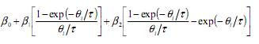
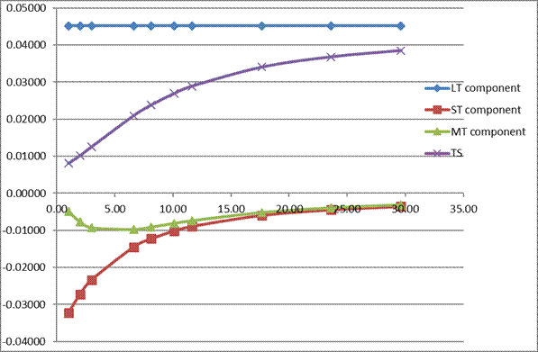
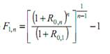
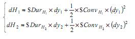
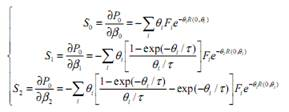
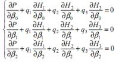

# Fixed Income Assignment

## Question 1.1

In order to plot the zero-coupon yield curve using the Nelson-Siegel mode, we must first derive our dirty prices, which are clean prices (given) plus accrued interest. We determine our next coupon payment dates, and construct a time (theta) table which shows how much non-discrete time is left until the bonds mature. With these new theta values, we can calculate our zero-coupon rates using the Nelson-Siegel equation.

The next step requires a small leap. We must set initial values for our Tau and Betas, which if not somewhat accurate, send our results astray. We construct the Nelson-Siegel model using approximate values (2<Tau<4, 0.05 for B0, 0.05 for B1, 0.05 for B2), and thereby creating our zero-coupon table. To calculate our theoretical prices, we use equation: 

We can now find the error of our estimated Nelson-Siegel model by subtracting our actual (dirty) prices from our estimated (theoretical) prices. We square these errors and sum them for sum squared error. Next, using the solver tool, we minimize this sum squared error by changing our theta, B0, B1 and B2, giving us the equation for our line of best fit. For our purposes, we can look at this is the term structure.

Visually, we can see a scatter plot with the data points composed of our actual prices, and the line of best fit passing through their center. Below is a graph of our B0, B1 and B2, respectively showing the long-, short- and medium-term components, which in the Nelson-Siegel model are segregated with addition signs:

Our equation’s values are tau = 2.73173 B0= 0.04519, B1= -0.03848 and B2= -0.03396, which produce the following curves, where Term Structure (TS) are the sum of all three components.

## Question 1.2

The Pure Expectations Theory postulates that forward rates are simply future expectations of short term rates. Thus, looking at the graph of the Term Structure, for example, the market expects the short term rate of 1.2% at year 2, so we expect the short term rate to rise. We used the equation 

From the Term Structure, we can understand that the market expects future spot interest rates to rise.

The Biased Expectations Theory attaches a risk premium to the rate that is derived from the Pure Expectations Theory. Therefore, instead of forward rates merely being predicted simply as the future short term rates, they are now assumed to also be partially explained by liquidity premia. These premia increase with the maturity at a decreasing rate. In our work, it can be seen that the market expects the rates to increase over the maturity periods under consideration. From the Term Structure, we can see that the slope is decreasing gradually.

## Question 1.3

We assume in this problem that our Nelson-Siegel Model gives us a fair price line. Based on the difference between our Nelsen-Siegel Model and actual (dirty) prices, we obtain the Error Values given in the table immediately below. Given these values, we can say that overall, the bonds are relatively fairly priced. However, the least fairly-priced bond is Bond 3 where Price Gap is € 0.13 compared to just € 0.01 for Bond 1. When purchasing large quantities of bond 2, this price gap could render considerable profit. 

| Actual price | Theoretical price | Price Gap (TP-AP) |
| ------------ | ----------------- | ----------------- |
| 116.85       | 116.86            | 0.0136763         |
| 112.08       | 112.00            | -0.08049662       |
| 106.47       | 106.60            | 0.13243359        |
| 141.46       | 141.41            | -0.052813662      |

## Question 2.1

The portfolio above is vulnerable to small parallel shifts in the yield curve. We can lower this exposure with a hedging instrument, and test its P/L if interest rates change first by 0.1% and then 2%.

We use a single hedging instrument to protect our portfolio from small shifts in the yield curve. To do this, we first calculate each bond’s yield to maturity using our dirty prices and cash flow maturities (which are our thetas). The entire portfolio’s price is the sum of all these (dirty) cash flows. Take note, these are not the yields calculated using our Nelson-Siegel Model, which are used in question 2.3.

When yields increase, our portfolio value falls. We partially counteract this by using a single hedging instrument. The decision of how many hedging instruments we should buy to neutralize the interest rate risk in our portfolio is based on the following equation: 

Given our values, we need to pay 153.69 euros to short 1,254 positions in hedging instrument 2. Our hedged portfolio loses a relative value of 0.037% when the yield increases by 0.1%. When the yield increases a larger 2%, our portfolio loses a relative 0.8%. This indicates that a duration hedge only protects a portfolio from a small change in the yield, bringing us to examine the value of convexity.

## Question 2.2

We can improve our hedging strategy by upgrading from a duration measure to a convexity measure. A second-order Taylor expansion provides the mathematical foundation for duration-convexity hedging. Two hedging instruments are combined to create a portfolio that is less sensitive to a large parallel shift, determined using the equation:

Our results show that we should buy 3,814 units of hedging instrument 1 and 2. With these added into our portfolio, if there’s a smaller 0.1% change in the yield, we lose a relative 0.9% of value. If there’s a larger 2% change in the yield, our portfolio loses a relative 0.3%. This is much better performance than under our duration hedging strategy. Notably, our relative value drops further under a small change than under a large change.

## Question 2.3

We can use the hedging instruments above to form a portfolio that is insensitive to non-parallel shifts in the yield curve. If our B0 changes by 2%, B1 changes by 0.5% and B2 by 0.1%, the P/L of our portfolio changes depending on our hedged and unhedged positions. Determining those changes are outlined in the following. We first calculate our sensitivities to the beta parameters of our bond portfolio and our hedging instruments, using the formula:

Followed by the next equation:

We set each equation equal to zero in order to build a portfolio that is neutral to changes in the beta parameters. Given our portfolio of 10 bonds, each unit we long, we need to short 2.57 units of the first hedge, 3.58 of the second and 2.63 of the third, each with their own associated price.

Adding in the yield to maturity changes, our new betas are B0= 0.06519, B1= - 0.03348 and B2= -0. 0.03296, which give us a new term structure. The prices of our hedges change with these new betas, but not their respective positions. Because yields have increased, the price of our unhedged portfolio drops 18.18%. However, this is somewhat counterbalanced by our hedged positions, which reduces the loss to only 0.1%.

We can conclude that the Nelson Siegel hedging strategy worked fairly well when non-parallel shifts occur.

## Question 3: Identify the main sources of out-performance that are available to an active fixed-income portfolio manager who anticipates an increase (decrease) in interest rates.  

Active fixed-income portfolio managers work under the assumption that market isn’t totally efficient and that investment as well as arbitrage opportunities exist, which yield on average a higher return than the cost incurred to implement them. So as to identify these opportunities, portfolio managers put forward relative advantages to their competitors like information advantage, technical or judgmental skills. Their objective is to have their portfolios outperform their benchmark index. 

If a portfolio manager predicts that interest rates will fall, he would be able to gain the most by buying bonds or futures contracts with the longest possible duration. Depending on whether he focuses on relative versus absolute gain, he would either have to lengthen the modified or the dollar duration, respectively. In order to maximize the absolute gain, he should buy long – term bonds with high coupon rates.  If he wants to maximize the relative gain, on the other hand, he should buy long – term bonds that offer low coupon payments. Long – term bonds change the most in value for a given change in interest rates. Since lower interest rates increase the price of the bond, he would be able to receive the maximum price increase by holding bonds of longer maturities. Similarly, a bond with low coupon payments is considered to be more volatile because a larger proportion of its cash flows is expected to be received further into the future. Thus, the price increase following a decline in the interest rate would be magnified in bonds that have low coupon payments. 

If the portfolio manager expects that interest rates will increase, on the other hand, he should shorten the duration of your portfolio by buying securities that have a short term to maturity and high coupon payments. Some alternative ways of shortening the duration of his portfolio include selling bonds or futures contracts, and holding any short – term investments until maturity and rolling over at higher rates (this is known as a rollover strategy). With the former strategy, he can reinvest the intermediary cash flows that he receives at the now higher rate, thus leading to a greater annual rate of return. With the latter strategy, on the other hand, he could buy a short – term maturity bond and sell it when it matures. By reinvesting some of the proceeds from the sale, he could buy another longer – term bond that would have a higher rate of return due to the increase in the interest rate, thus leading to an even higher annual rate of return than before. 

The yield curve does not always move in parallel shifts. There could be slope and curvature movements or a combination of level, slope and curvature movements. In such a case, an active portfolio manager would adopt other strategies, for example bullet, barbell and butterfly. 

### Bullet strategy: A portfolio constructed by focusing on investments with a particular maturity on the yield curve 

•If portfolio manager anticipates an increase in interest rates- the yield to maturity will increase. He should short a long term maturity bond because its duration is high. As a result, this bonds price will decrease greatly as a result of the increase in interest rates. The portfolio manager then buys the bond at a lower price to close his position and make a profit 

•If portfolio manager anticipates a decrease in interest rates- the yield to maturity will decrease. He should buy a long term maturity bond because its duration is high. As a result, this bonds price will increase greatly as a result of the decrease in interest rates. The portfolio manager then sells the bond at a higher price to close his position and make a profit 

### Butterfly strategy: 

A butterfly strategy is a generally neutral trading strategy that offers limited risk and limited rewards. It is a combination of a barbell (the wing) and a bullet (the body).  

#### Scenario 1: parallel shifts occur in yield curve. 

The components of the strategy have different weights and form a cash and $duration neutral transaction. So if small shifts affect the yield curve, the investment would be interest rate neutral, the net returns are very small. If large shifts are expected, the butterfly strategy would generate a positive gain whatever the value of the YTM. With a large volatility of the YTM, the gain is more substantial. 

#### Scenario 2: non-parallel shifts occur in yield curve 

If we expect a steepening of the yield curve, we should adopt a fifty-fifty weighting butterfly strategy. 

When the changes of the short wing and body and that of the body and the long wing are equal, this strategy generates a close to zero total return since the butterfly is structured to have the same $duration in each wing. This strategy avoids losses compared to cash-neutral, regression-weighting and maturity-weighting approaches. 

When the changes of the short wing and the body and that of the body and the long wing are different, the fifty-fifty butterfly could generate a large positive return. 

If we expect a flattening of the yield curve, we should adopt a cash-neutral butterfly strategy which would generate a positive return since the major part of the $duration is in the long wing. 