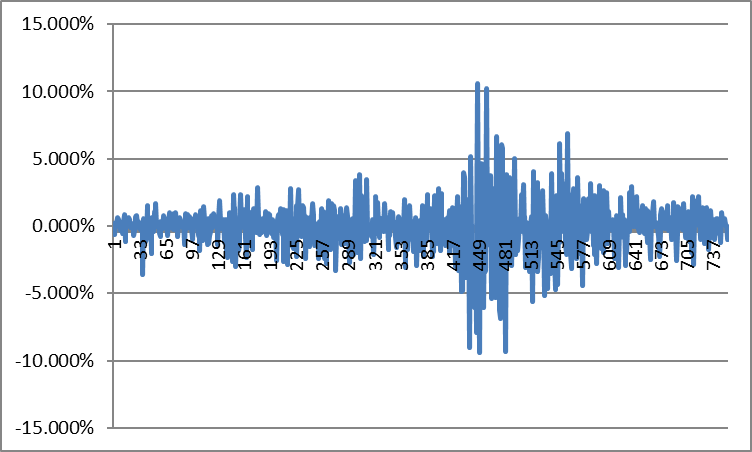

# Quantitative Methods in Finance

## 1.1

To produce the covariance and correlation matrices of the returns of the S&P500 stocks, we must first prepare the data. The Prices5 dataset contains stocks that were not included in the S&P500 throughout our entire time period, and which must not included in our computations.

To fix for this, we search the flags matrix for stocks that existed for all 756 days, which are represented as ones in the matrix. We sum the columns and extract only those entries which sum to 756 in both our Prices5 and Capitalization matrices. This filters our dataset for only those stocks that existed throughout the entire time period.

```equation
I = sum(FLAGS);
IR = find(I==756);
Y = PRICES5(:,IR);
C = CAPITALIZATION(:,IR);
```

Outfitted with a proper matrix, we now compute our returns based on our new prices matrix Y.

```equation
LogPrices = log(Y);
LogRet = diff(LogPrices);
```

Only the covariance and correlation computations remain, which can each be executed with the following respective lines of code.

```equation
cov1 = cov(LogRet);
corr1 = corr(LogRet);
```

A sample of our covariance table, ranging from 1,1 to 3,3.

0.00448167497750908       **0.000444427505499178** 	0.000387206146982184

0.000444427505499178 	0.000552106788837364 	0.000371159090903285

0.000387206146982184 	0.000371159090903285 	0.000560059024837824

In the covariance matrix, the diagonal defines each stock’s variance. The bolded matrix entry 2x2 shows that the price of Stock A and B move in the same direction. Lastly, the matrix is symmetric since the covariance between Stock A and B is the same between Stock B and A.

A sample of our correlation table, ranging from 1,1 to 3,3.

1                       				**0.282533017078454**         	0.244402230251860

0.282533017078454         1                       					0.667469858524888

0.244402230251860         0.667469858524888         	1

Interpreting this table, we see that there is perfect positive correlation of stock A to stock A, which conforms to the theory of correlation. The bolded matrix entry 2x2 shows that the return of Stock A and B move in the same direction, with only partial dependence and not in perfect lockstep. In fact, the low value of 0.28 suggests a very minor relationship between the stocks’ movements.

## 1.2

Building an equally weighted matrix in Excel requires the returns matrix. For every day n in the returns matrix, we sum all stock returns, giving us a new column. Dividing each entry in this column by 405 (the amount of our stocks), producing a column of our index returns, as seen below.


We can see that index returns exhibited high volatility in the latter half of our time period. 

Building a capitalization weighted index requires capitalization and returns matrices. We first calculate the summated capitalization for all stocks each day. We now create a second matrix, whose entries are populated using the original values, each divided by their daily summations. We now create a third matrix whose entries are the products of the first and second matrices’ elements. The daily sum of this third matrix’s rows gives us a final column defining the capitalization weighted index returns, as shown below.



We see that this closely resembles the previous index graph.

## 1.3

We can select three stocks from our collection to describe the performance of our two indices. Through multiple regression, our equally weighted index can be defined as:

```equation
IndexEW = B0 + B1(StockA) + B2(StockB) + B3(StockC) + e
```

When we regress these stock returns on this index we obtain the results;

```equation
IndexEW = -0.0006 + 0.0285(StockA) + 0.4057(StockB) + 0.3494(StockC) + e
```

According to these coefficients, Stock B contributes most to the index’s performance. For every unit increase in Stock A returns, the total index returns climb 0.0285 units, holding all other terms constant. The same can be said of the remaining two stocks. Additionally, when the returns of Stock A, B and C are zero, the index returns register at -0.0006, which is our y-intercept. 

Examining our adjusted R squared of 0.63, the equally weighted model  can serve as a rough approximation of future returns. 


Plotting our residuals gives interesting results. There is significant heteroskedasticity towards the end of our period, which coincides with the outbreak of the financial crisis. The ability of our predicted model to explain returns is especially poor during this period.

The capitalization weighted index can be explained by the similar multiple regression equation;

```equation
IndexCW = B0 + B1(StockA) + B2(StockB) + B3(StockC) + e
```

When we regress the stock returns on the equally weighted index we obtain the equation;

```equation
IndexEW = -0.0014 + 0.0362(StockA) + 0.7231(StockB) + 0.6593(StockC) + e
```

This means that with every unit increase in Stock A returns, the total index returns climb 0.0362 units, holding all other terms constant. The same can be said of the remaining two stocks. Additionally, when the returns of Stock A, B and C are zero, the index returns register at -0.0014, which is our y-intercept.  Again, stock B contributes the most to our index returns.

Examining our adjusted R squared of 0.68, the capitalization equally weighted model can serve as a rough approximation of future returns. Its forecastability is slightly better than our equally weighted index. Plotting our residuals renders similar results to those of the equally weighted index.

## 2.1

In order to compute principal components (PCs) using the data from assignment 1, we take full advantage of Matlab’s functionality. We can obtain the coefficient matrix, principle component matrix and eigenvalues using the following code.

```matlab
[Coeff_Matrix, PC_Matrix, Eigenvalues]=princomp(X_bar);
```

Our Coeff_Matrix contains the coefficients of our principal components, a sample of which is seen below:

0.0450602371720218       0.00984210676423761      -0.00916163200433849

0.0361839544361909       -0.0335957433838394      0.00295953989976525

0.0354427011106558       -0.0303284720237628      0.00124247413893126 

## 2.2

We compute the eigenvector (v) and eigenvalues (d) using our covariance matrix with the following code:

```matlab
[v d] = eig(cov1); 
```

We also obtained our eigenvalues in the princomp command in 2.1. It provided an easy to implement 405x1 matrix in which eigenvalues are in descending order.

These eigenvalues are the variance, which when divided by total sum variance describe the PCs’ explanatory power. The first 53 PCs explain 80% of the index’s total variance. To describe all variance, 405 eigenvalues are required. 

| PC   | Eigenvalues | Explanatory Power | Cumulative Explanatory Power |
| ---- | ----------- | ----------------- | ---------------------------- |
| 1    | 0.2140      | 44.17%            | **44.2%**                    |
| 2    | 0.0241      | 4.98%             | **49.2%**                    |
| 3    | 0.0159      | 3.27%             | **52.4%**                    |
| 4    | 0.0115      | 2.38%             | **54.8%**                    |
|      | …           | …                 | **…**                        |
| 51   | 0.0012      | 0.26%             | **79.5%**                    |
| 52   | 0.0012      | 0.25%             | **79.8%**                    |
| 53   | 0.0012      | 0.25%             | **80.0%**                    |

The graph below plots the explanatory power or each PC, and their cumulative explanatory power.


## 2.3

Using MATLAB, we can easily use these PCs to represent returns as linear combinations of PCs. PCs are obtained using equation:

Given PC = r*v we can obtain r=PC*v’ 

This can be computed in MATLAB with the following lines of code:

```equation
vinv = inv(v)
CoefRegression = PC_Matrix*vinv
```

In the resultant matrix, each column of the full matrix contains its PCs. These columns are in descending order in terms of component variance. The first three rows and columns of the new matrix are as follows:

0.000573955750936085         0.0282900224182280           -0.0275850209412604

-0.132047832599791            0.000504968179980897         0.0153090178488471

0.0689449231947435           -0.0263317359114775           0.00258936907309876