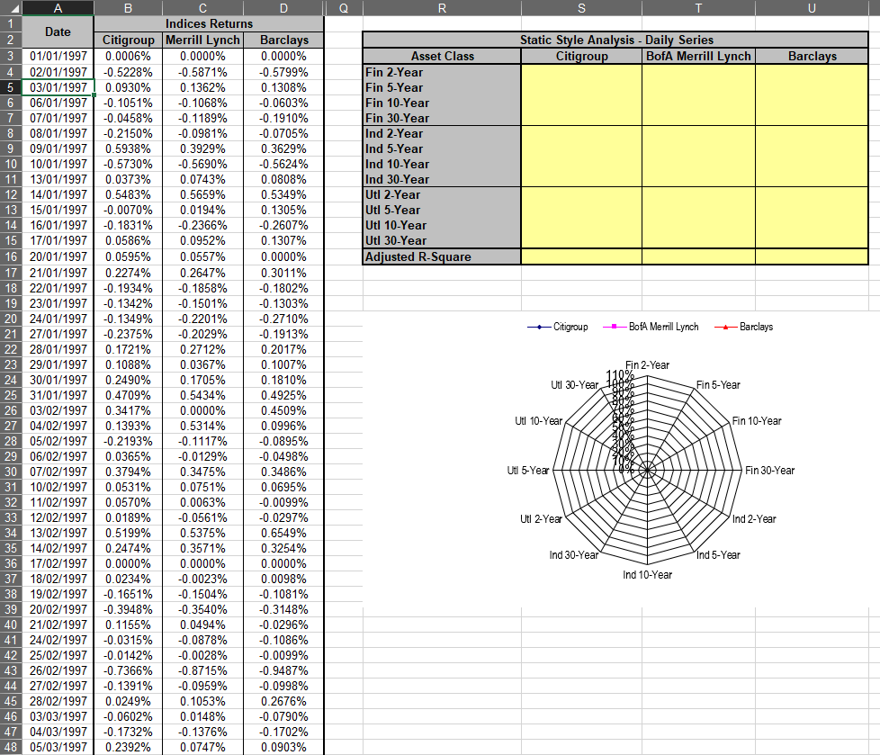

# Quantitative Methods in Finance

## Static Style Analysis

In order to compute our PCs using the data from assignment 1, we must first demean the LogReturns matrix (with NaN replaced by zeros). To do so, we use the MATLAB code;

```matlab
X_bar = LogRetZeros-repmat(mean(LogRetZeros),size(LogRetZeros,1),1);
```

Thanks to the ease at which MATLAB can perform PCA, we can compute the principle components using the single line of code;

```matlab
[Coeff_Matrix, PC_Matrix, Eigenvalues]=princomp(X_bar);
```

This returns 702 eigenvalues, or principle components, which describe variance. We sum the eigenvalues and divide each principle component by the sum to obtain their explanatory power. The first 61 principle components collectively explain 80.12% of the stock returns variation, with the first component explaining a significant 38.38%. 

Using these Principal Components represent returns as linear combinations of Principal Components

The first PC (and all others) is a linear combination of the original factors (demeaned). The coefficients of this linear combination is given by the corresponding eigenvector.

Slides 34-48 explain the process. You are supposed to build a model using several principal components as many as necessary to explain 80% of the variance. If you use all PCs the representation is perfect (in sample).

These principal components approximate factors but are true factors only in the case of strict factor models with uniform variance of the residuals or in the limit of infinite T and N 

