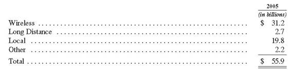
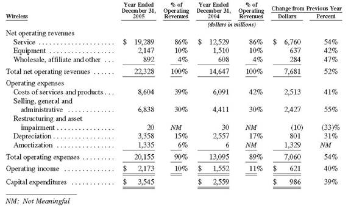
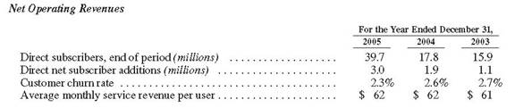
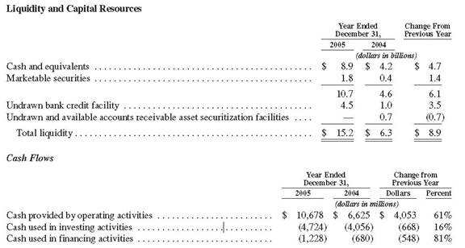
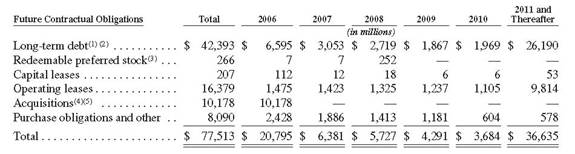
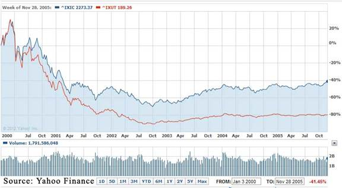
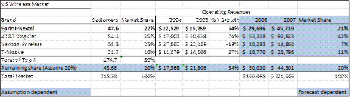

# Financial Analysis of International Groups

## Write a report for senior managers on how they could improve the company’s financial performance and achieve the primary business goals, such as profit and shareholders’ wealth maximization.

Early in its Managers Discussion and Analysis report, the company points eagerly to the strong 8% yoy revenue growth it achieved in 2005. This helped change the sign on its EPS from negative in 2004 to positive $0.5 in 2005. Furthermore, wireless subscribers jumped 17% as it pushed its access coverage to 90% of the population. 

Let’s look at the balance sheet that’s supporting all this growth. Total assets stand at a tall $103 billion, with shareholder equity at $52. Its cash and marketable securities are at $10.7, while gross debt is at a taller $25.7. The latter number has room to grow, thanks to a new $2 billion credit line the company just gained.

Now we break those assets apart. As can be seen in **Figure 1**, most of the company’s assets are tied up in the Wireless division. The Local division will be spun-off into its own private company this coming year, and so will not be a concern for the remainder of this analysis. This leaves the new Sprint-Nextel company overwhelming cantered around Wireless services.

**Figure 1: Breakdown of Assets**

Wireless stood as the central motive of Sprint’s acquisition of Nextel. Indeed, that same year Sprint acquired a series of local brands to access more metropolitan areas. 

Nextel offered more than just market share. Nextel came with a unique worldwide walkie-talkie feature for its subscribers. This shouldn’t be considered lightly, as in a market offering such a homogeneous commodity as telecommunications, the slightest diversification offers strong potential. 

Sprint has invested heavily in its CDMA network (a competitor to the more popular and versatile GSM standard). The CDMA network is a specialization that few telecom companies use, given the high cost of entry, meaning that if things go awry, the company won’t be able to easily liquidate its holdings. For that reason, it must ensure the network’s success.

Given the significance of its wireless assets, we should take a closer look at **Figure 2** to tell how the segment is operating.

**Figure 2: Wireless Segment’s Operating Performance**

Look at how the net operating revenues managed to jump 52% yoy. Impressive performance! Right below, we see that expenses managed to outpace that growth, resulting in a lower operating income growth of 40%. As said in the CEO’s letter to shareholders, the company expects strong synergy to lift those revenues and cut those expenses over the next few years. 

The elementary numbers look healthy, but telecom is an industry like no other, and comes with its own set of industry measurements, displayed in **Figure 3**. 

**Figure 3: Wireless Performance Measurements**

Line 2 shows the post-acquisition incremental gain in subscribers really took off this year. The churn rate, which shows how many customers leave for a competitor, continued to decline. According to The Fall of Telecom (page 57), churn rates strongly depend on service quality and marketing. During the year, Sprint unveiled a new logo and marketing campaign costing an additional $500 million (p. F-13), and redoubled customer service and business support. These efforts are clearly paying off.

As previously said, telecom is a homogenous product which forces companies to compete on a price basis, which bodes falling long term profits. To achieve the country’s highest average monthly service revenue per user (and an increasing one despite a long term industry decline) is, therefore, a remarkable achievement. Service quality, marketing, and differentiation are the company’s true strength (page 63).

Such performance would not be so attractive if underneath it all, the financing platform were found to be weak. Our final step is to examine its short-term financial standings, displayed below in **Figure 4**. 

**Figure 4: Short-term Financing**

At every step down this financial statement, we grow more confident. **What about becoming a target?** On one hand, cash used for investing and financing suggest returns in the future, but they are quite high and may need to be lowered if cash coming in from operating activities slows down this coming year. 

Sprint’s long-term obligations, **Figure 5**, reveal an overall steady decline.

**Figure 5: Long-term Obligations**

Sure, the numbers are declining, but the total is not. Worrying? Maybe not. These obligations make the company a less attractive target during these troubled times of M&A. But defensive measures should be put second to financial health, which is the next subject.

## Analyze the sources of finance and the capital structure of the company. Comment on the short and long – term financial strategy of the company.

In order to analyze the capital structure of Sprint Nextel, we looked at the composition of the company’s capital, which consists of debt and equity. In general, a good proportion of equity capital relative to debt capital means that the company is of financial fitness. If a company has an extremely high level of debt, for instance, this implies that it has financed much of its growth with debt. Due to the cost of borrowing, this can potentially lead to more volatile earnings and even financial distress. We used several different debt ratios in order to analyze Sprint Nextel’s short and long – term financial strategy. In order to gain a better understanding of the company’s use of debt and equity, we also compared its ratios to the ones of its principal competitors (as stated in Sprint Nextel’s 2005 annual report).

| Sprint Nextel            |                                                              |                                    |
| ------------------------ | ------------------------------------------------------------ | ---------------------------------- |
| Ratio                    | Formula                                                      | 2005 (in millions)                 |
| Debt ratio               | Total debt/total assets                                      | $50,396/$102,580 or 0.49           |
| Debt – to – equity ratio | Total liabilities/total  shareholders’ equity                | $50,396/$51,937 or 0.97            |
| Capitalization ratio     | Long – term debt/(long –  term debt + total shareholders’ equity) | $32,319/($32,319+$51,937)  or 0.38 |
| Debt to capital ratio    | Total liabilities/(total  liabilities + total shareholders’ equity) | $50,396/($50,396+$51,937)  or 0.49 |

| Sprint Nextel vs. Major  Competitors |               |            |                   |                  |
| ------------------------------------ | ------------- | ---------- | ----------------- | ---------------- |
| Ratio                                | Sprint Nextel | T - Mobile | Cingular Wireless | Verizon Wireless |
| Debt ratio                           | 0.49          | 0.40       | 0.27              | 0.60             |
| Debt – to – equity                   | 0.97          | 0.39       | 0.72              | 2.56             |
| Capitalization                       | 0.38          | 0.24       | 0.32              | 0.45             |
| Debt to capital                      | 0.49          | 0.28       | 0.42              | 0.72             |

Note: the ratios for the other companies are calculated in the same way as the ones of Sprint Nextel; the necessary information is obtained from their respective 2005 annual reports.

As it can be seen from the first table, Sprint Nextel’s debt ratio of 0.49 and its debt – to – equity ratio of 0.97 seem relatively modest. The company’s debt – to – equity ratio gives a more dramatic perspective on its leverage position than its debt ratio. The debt – to – equity ratio is 0.97, meaning that creditors own as much money in the company as shareholders do. Given that Sprint Nextel is a large and well – established company (with good credit credentials), the amount of debt it has does not seem to be high. Sprint Nextel is operating in a highly competitive industry (see question e) and thus it needs capital to constantly improve its services and expand its operations. Even when we compare the D/E ratio of our company to the D/E ratio of its major competitors, we can see that it is not too high (with the exception of T – Mobile).

Sprint Nextel’s capitalization ratio is 0.38 whereas its debt to capital ratio is 0.49. Since the latter includes total liabilities (current and long – term), we can conclude that the company’s debt consists mostly of long – term liabilities. Again, these two ratios do not seem high relative to the ones of its competitors. 

Sprint Nextel had a total shareholders’ equity of $51,937 million in 2005 and only $13,521 million in 2004. It had a net income of $1,785 million in 2005 and a net loss of $1,012 million in 2004. The company’s total debt, on the other hand, increased from $27,553 million in 2004 to $50,396 million in 2005 (nearly doubled). Since Sprint Nextel made several acquisitions during 2005, the huge increase in net income, shareholders’ equity, and debt is to a large extent because of them. In addition to acquiring the debt of the target companies, Nextel’s financial position improved as it used the equity method of accounting for these investments (discussed in part d) and reported huge increases in profits because of its holdings in these companies. This could have effectively improved its credit rating position. Thus, it could be stated that the company’s short – term financing came largely because of the merger whereas, in the long term, Sprint Nextel finances itself primarily with debt, as evidenced by the huge proportion of long – term liabilities relative to short – term liabilities on its balance sheet ($36,346 million vs. $14,050 million)

## Write a report detailing the factors contributing to the selection of the dividend policy of the company. Make recommendations on the decision-making process and the range of influences considered.  

From the Sprint Nextel 2005 Annual Report, we have that the company paid a dividend of $0.025 per share on the common stock, Series 1, the common stock, Series 2, and the non-voting common stock in the third and fourth quarters 2005. The non-voting common stock was issued in the Sprint-Nextel merger in August 2005. The company paid a dividend of $0.125 per share on the common stock, Series 1 in the first two quarters of 2005 and in each of the quarters of 2004 and a dividend of $0.125 per share on the common stock, Series 2 in the first two quarters of 2005 and in each of the last three quarters of 2004. The common stock, Series 2 was issued at the time of the recombination of the PCS common stock and the FON common stock in April 2004.

Sprint-Nextel paid cash dividends of $525 million in 2005 compared with $670 million in 2004. According to the 2005 Annual report, the decrease in cash dividends paid was due to a decrease in the dividend rate in the third quarter 2005 to 2.5 cents per share from 12.5 cents per share in prior quarters. This was partially offset by an increase in the number of shares of common stock outstanding in 2005, primarily as a result of the Nextel merger, compared to 2004.

The 2005 Annual Reports states that the expected Capital Requirements in 2006 include the dividend payments as declared by the board of directors, that the company plans to continue following the spin-off of Embarq after the merger. 

From the information provided in the Annual Report, we understand that Sprint had a consistent dividend policy and had retained it in the first two quarters of 2005 as well, before the merger. However, with an increase in the number of shares of common stock outstanding, the dividend per share was reduced after the merger. Another reason for the reduction of dividend per share could be the cash requirements of the newly formed company in attaining the synergies that they expect from this merger. Furthermore, the Annual Report states that Sprint-Nextel plans to pay out dividends as declared by the board in 2006 as well and thus ensure that the dividend policy is adhered to. The Annual Report does not provide any information regarding the exact dividend policy of the company. The reduction in dividend following the merger would most probably be accepted by the investors as a necessary post-merger step to account for the costs and issuance of new shares, and would not impact the stock-price. However, since the company has a history of paying dividends, it should ensure that dividends are paid out in the future and send a positive signal to its shareholders. A further reduction in dividend would have a negative impact on the stock-price as it sends a negative signal to the shareholders. It implies that the company does not forecast good earnings in the future and thus intends to retain some of its earnings now rather than distribute them. 

## Investigate the capital investment process of the company. Consider areas for improvement.

As of December 31, 2005, the most important capital investments for the company were its investments in Nextel Partners and Virgin Mobile USA, LLC. The investments were accounted for using the equity method and were reflected as investments on the firm’s balance sheet. The company initially owned 30% of Nextel’s outstanding common stock. In 2005, it recorded an increase of $137 million in its equity due to earnings associated with its ownership in Nextel. The purchase of the remaining 70% of Nextel would be completed by the beginning of 2006 due to customary regulatory approvals. As of December 31, 2005, Sprint Nextel also owned 49% of Virgin Mobile USA. By the end of the year, the former received about $200 million from Virgin Mobile in the form of a loan repayment of $20 million and a return of capital of $180 million. Sprint Nextel gained approximately $2.8 billion of potential income tax benefits due to net operating loss carry forwards and capital loss carry forwards in its acquisitions.

The equity method allows Sprint Nextel to show a more accurate income balance by showing the investment income from all its sources. A major advantage of using this method is that it enables the company to hide unfavorable numbers from investors. For instance, Sprint Nextel had a net loss of $1,012 million and a loss in comprehensive income of $1,007 in the end of 2004. The net income and comprehensive income for 2005 (after the investments), on the other hand, were $1,785 and $1,775, respectively. By adding the gains from its investments, Sprint Nextel was able to show much higher numbers, which can encourage investors to keep investing in the firm and see as having a higher value.

While the company was able to improve the appearance of its financial statements because of these capital investments, it needs to carefully consider the long – run and whether or not it will be able to integrate these businesses with its own (and thus, realize the anticipated benefits of these acquisitions). For instance, Sprint Nextel will need to make investments in order to integrate the business practices, operations, wireless technologies, and support functions of these acquisitions with its own. As a simple example, the CDMA and iDEN technologies of our company and Nextel, respectively, operate on different technology platforms. While there might be interruptions in Sprint Nextel’s business and financial performance (as well as greater operating expenses) in the short – run, integrating these companies with its own is something that Sprint Nextel has to pay a lot of attention to if it wants to stay profitable and competitive in the long – run.

## Comment on the risk exposure and the risk – return profile of the company. Analyze the implications and provide recommendations in your report.

### Risk related to Sprint Nextel’s business and operations

Sprint Nextel is operating in an industry that is characterized by high technological innovation, regulatory changes, intense competition, and increasing merger and acquisition activities. Due to the technological innovation that is constantly taking place, the lines that had previously existed between wireless providers and internet service providers are now extremely blurred. While cable companies now offer internet and phone services, wireless providers have began to provide high – speed internet as well. Moreover, the services offered by most companies are extremely similar to each other (if not identical) and, as a result, many companies have started to compete on price. Small companies offering services that are almost free are entering the market (i.e. low – cost providers). Since these companies offer services at an extremely low price, they have started to put a downward pressure on the profitability of bigger companies like Sprint Nextel. Given the intense technological innovation, commoditization of services and entrance of smaller players, companies have begun to invest more heavily in R&D and they have started to consolidate with each other (thus increasing their scale efficiencies).

In order to keep up with the changes that are taking place in the telecommunications industry and remain competitive, Sprint Nextel would have to continually invest in improving the wireless subscriber service and enhancing the quality and features of its services (i.e. more costs for R&D). It would have to try to attract and retain its customers by differentiating itself more heavily and by expanding the capacity and coverage of its networks. The company would also have to begin attracting customers from competitors. Since the higher market penetration means that customers purchasing wireless services today have lower credit ratings than they did years ago, Sprint Nextel would face a higher credit risk that could possibly lead to higher bad debt expenses. The need to invest in new networks and improvements could also make it difficult for Sprint Nextel to raise additional capital. A huge increase in leverage could lower the company’s credit rating and increase its borrowing costs. Overall, the competition and technological innovation taking place in the industry could negatively affect the company’s revenue per user, operating costs as well as ability to attract new customers, ultimately leading to lower revenues, profits and growth.

The two – way walkie – talkie service that is available on Sprint Nextel’s iDEN network is one of the main differentiating features of the company. Thus, one of the things that the company can do is try to focus on this particular service and increase its perceived quality in the eyes of customers. By successfully differentiating itself through this service, Sprint Nextel would be able to keep its revenue per user and thus remain profitable relative to competito

### Market Risk

Sprint Nextel is exposed to various types of market risk in the normal course of business, including the impact of unfavorable interest rate changes, foreign currency exchange rate fluctuations, and changes in equity prices. These risks, along with the company – specific risks above, affect Sprint Nextel’s cost of capital. 

### Interest Rate Risk

The company’s exposure to changes in interest rates is primarily on its short – term borrowings and on its planned new fixed rate long – term financings. As of December 31, 2005, about 80% of Sprint Nextel’s total debt portfolio consisted of fixed – rate indebtedness. While changes in interest rates affect the fair value of this debt, they do not affect the company’s earnings or cash flows (i.e. interest expense is unaffected). The impact of a change in interest rates affecting the company’s floating – rate debt, on the other hand, would lead to changes in the amount of interest expenses paid annually. In managing its interest expenses, Sprint Nextel enters into interest rate swap agreements to achieve a targeted mix of fixed and variable rate debt. Under these agreements which are designated as fair value hedges, the company receives fixed rate amounts in exchange for floating rate interest payments (resulting in a net increase or decrease in interest expense) and, thus, effectively converts its fixed – rate debt to a floating – rate debt. 

### Foreign Currency Risk and Equity Risk

Sprint Nextel is exposed to a foreign currency risk primarily through the operations of its international subsidiaries and its equity investments in foreign companies. Since the functional currency of its foreign operations is the local currency, Sprint Nextel has to translate the income statement, balance sheet and other financial statements of its foreign operations into U.S. dollars. In order to deal with the risk of foreign currency – denominated transactions, Sprint Nextel enters into foreign exchange forward contracts. 

Lastly, Sprint Nextel invests in foreign public and private companies and, thus, it is exposed to significant fluctuations in the market value of these investments. It is able to mitigate this risk by entering into a series of options contracts.

Overall, Sprint Nextel is not exposed to any risks that its competitors are not exposed to. While the industry in which the company operates is extremely risky, Sprint Nextel is in a good financial position as it has managed to stay profitable. Through the acquisition of Nextel, Sprint Nextel’s net income rapidly increased in 2005 relative to 2004 ($1,775 million vs. $1,007 million) and its total shareholders’ equity went up from $13,521 in 2004 to $51,937 in 2005. When we look at the market risks, on the other hand, we see that they are similar for almost every company operating abroad. Sprint Nextel is able to manage even these risks successfully.

## Investigate the debtor, creditor and working capital management policy of the company. Recommend action.

As of December 31, 2005, the company had working capital of $5.0 billion compared to $3.1 billion as of December 31, 2004. In addition to cash, cash equivalents and current marketable securities, a significant portion of the company’s working capital consists of accounts receivable, handset inventory, prepaid expenses, deferred tax assets and other current assets, net of accounts payable, accrued expenses and the current portion of long-term debt and capital lease obligations. The increase in working capital is primarily due to the approximately $2.6 billion of working capital acquired as a result of the Nextel merger. 

In December 2005, we see that the company terminated two accounts receivable asset securitization facilities that provided us with up to $1.2 billion of additional liquidity. Neither facility had an outstanding balance when it was terminated, and both were scheduled to expire during 2006.

Bad debt expense as a percentage of net revenues was 1% in 2005, 2004, and 2003. The reserve for bad debt expense as a percentage of outstanding accounts receivable was 8% in 2005 and 9% in both 2004 and 2003.

The indentures and financing agreements of certain of our subsidiaries contain provisions limiting cash dividend payments on subsidiary common stock held by us. As a result, $432 million of those subsidiaries’ $2.7 billion total retained earnings were restricted as of December 31, 2005. The flow of cash in the form of advances from the subsidiaries to us is generally not restricted.

**Debtor/accounts receivable:** We see that the accounts receivable were 3107 in 2004 and 4807 in 2005, representing a growth rate of 54.72%. The amount receivable in 2004 represents 3107/14647=21% of total sales and 4807/22328=21.6% of total sales. 

Given that accounts receivable was 3107 while it was 4807 in 2005, we can simply calculate the average debtor was 3957. 

The company established an allowance for doubtful accounts receivable sufficient to cover probable and reasonably estimable losses. Because of the number of accounts that they have, it is not practical to review the collectability of each account individually when they determine the amount of their allowance for doubtful accounts each period. Their estimate of the allowance for doubtful accounts considers a number of factors, including collection experience, current economic trends, estimates of forecasted write-offs, aging of the accounts receivable portfolios, industry norms, regulatory decisions, and other factors. 

The company, however, offer us a kind of sensitivity analysis with respect to the related segment, saying that if their allowance for doubtful accounts estimate at December 31, 2005 were to change by ten percent, it would represent a change in bad debt expense of $20 million for the Wireless segment and $6 million each for the Long Distance and Local segments. From that, we can see that the change of the estimate of the allowance for doubtful accounts will have the most impact on the Wireless segment, representing 3.3 times as much as the Long Distance and Local segments.

In addition, management believes the allowance amounts recorded, in each instance, represents its best estimate of future outcomes, but the actual outcomes could differ from the estimate selected, and the impact that changes in actual performance versus these amounts recorded would have on the accounts receivable reported on the balance sheet and the results reported in the statements of operations could be material to our financial condition.

**Creditor/Accounts payable**: The accounts payable of the company were 3827 and 2672 in 2005 and 2004 respectively, representing an increase about 43% due to the acquisition taking place in 2005. We can see that the accounts payable consist of trade, accrued interconnection costs, construction obligations and others. The trade is the most important part of the accounts payable, representing over 67% of the total accounts payable.

Since after the merger and acquisition, the company has an additional 1.2 billion liquidity, which allows us to reduce their liquidity risk, however, at the same time, the company may invest part of its additional liquidity into the risk-free assets in order not to be influenced by the fluctuation of the interest rate.

At the same time, this amount of liquidity may also allow us to increase our operating activities if necessary, or to increase our financing activities as well.

## Evaluate the business strategies of the company.

On August 12, 2005, a subsidiary of Sprint merged with Nextel. The merger with Nextel accrues a number of potential strategic and financial benefits to Sprint, including:

the combination of extensive network and spectrum assets, which would enable Sprint to offer consumers, businesses and government agencies a wide array of broadband wireless and integrated communications services; 

the combination of Nextel’s strength in business and government wireless services with Sprint’s position in consumer wireless and data services, including services supported by its global IP network, which would enable it to serve a broader customer base; 

the size and scale of the combined company, which is comparable to that of Sprint’s two largest competitors, is expected to enable more operating efficiencies than either company could achieve on its own; and, 

the ability to position itself strategically in the fastest growing areas of the communications industry. 

As per the CEO’s letter in the 2005 Annual Report, Sprint Nextel enters the marketplace with established leadership positions in the markets for fast-growing wireless data and walkie-talkie services, a strong base of key wireless assets that include excellent spectrum holdings and a global Internet backbone that provides enhanced wireline services and supports its wireless services. With the operational efficiencies that will come from being one company and the capital that will be saved by focusing on just one next-generation high-speed wireless network, Sprint Nextel will have the strength, scale and resources to give strong competition to the industry’s largest players and newest entrants. The CEO believes that the two companies understand the key to competitive success in this industry, which is to offer customers a choice of truly differentiated services. Driven by customers’ needs, Sprint-Nextel plans to create a seamless experience of personalized communications, information and entertainment; converging the speed of computers and the reach of television into the mobile third screen. 

Sprint-Nextel plans to aggressively move forward on a series of initiatives to renegotiate vendor and service provider contracts, streamline its sales force and distribution channels and cross-sell more products and services to existing customers. Furthermore, central to the company’s strategy of focusing on wireless and broadband opportunities, Sprint-Nextel will spin off its local telecommunications operations into an independent company, which will operate under a new brand– EMBARQ, in 2006. 

To gain momentum in the workplace and the marketplace, Sprint-Nextel launched a new logo and renovated 1600 of its store overnight and also increased the brand visibility through its advertising campaign. The company also launched various innovative services and tied-up with different companies that service unique market segments. And, it also plans to exploit opportunities that lie with the cable customers by tying up with four of the nation’s largest cable companies. 

The management lists the following three strategies:

“Our strategy for the Wireless segment is to utilize state-of-the-art technology to provide differentiated wireless services and applications in order to acquire and retain high-quality wireless subscribers.” 

“On our iDEN network, we continue to develop features and services that are designed to meet the needs of business and government customers, with a particular focus on services that build upon our walkie-talkie features. To offer customers all of the benefits of PowerVision and our walkie-talkie features, we expect to introduce a dual-mode handset designed to operate on both our CDMA and iDEN network platforms.”

“In order to maintain market share in an increasingly competitive long distance communications environment, our Long Distance segment focuses on expanding its presence in the data communications markets by utilizing our principal strategic assets: our high-capacity national fiber-optic network, our Tier 1 IP network, our base of 9 business and residential customers, our established national brand and offerings available from our other operating entities.”

Considering the strategies proposed by the management and their evaluation, the newly formed company, Sprint-Nextel seems poised to give strong competition and create a solid foundation for itself in the industry that will be difficult to upset.

## Analyse the acquisition motives, process, planning and integration. Make recommendations for improvement should any future acquisitions / mergers be contemplated.

In terms of timing, the environment for an acquisition was ripe. The NASDAQ Index’ performance in 2005 was steadily gaining lost ground (**Figure X**), suggesting the telecom sector should soon follow. Generally, when markets are on the upswing, M&A activity flourishes. Both observations suggest that telecom activity would soon pick up.

**Figure X: NASDAQ Index (IXIC) and its Telecom Component (IXUT)**

The industry was becoming increasingly convinced that following a deregulation in the mid-90s which incentivized economies of scale, M&A was the surest way to increase performance. Combining network and spectrum assets, and Sprint’s household expertise with Nextel’s business and government expertise, offered the merged entity a strategic position and size.

The execution was friendly and swift. Sprint acquired Nextel by merging it with one of its subsidiaries. In total, the price tag stood at $37.8 billion, with Sprint paying $969 million up front in cash. Using a 1.3:1 exchange ratio, Sprint traded 1.452 billion voting and non-voting shares for Nextel’s remaining outstanding stock. The associated goodwill stands at $15,549 million. Sprint’s three other acquisitions cost a total of $1,400 million.

In the domestic industry, there are another 3 strong national wireless providers: Cingular Wireless, Verizon Wireless and T-Mobile. In 2004, Cingular acquired AT&T Wireless to become the industry’s largest provider in terms of subscribers, according to each company’s annual report. If we assume the top 4 account for 80% of market share and forecast 2005 yoy revenue growth into the future, it looks like AT&T stands to gain relatively the most in terms of economies of scale, with Sprint-Nextel next in line (**Figure Y**). In terms of customer market share, Sprint-Nextel is by no means the largest, yet its revenue growth makes it a serious contender. It must work to improve its customer market share and continue to exploit its operating revenue advantage.

**Figure Y: Wireless Customer Market Share and Revenue Forecast**

With other contenders around, Sprint may have been motivated to make a pre-emptive acquisition. In the spirit of the times, Sprint executed a flurry of acquisitions, picking up, in addition to Nextel, a series of regional service providers. But it clearly still has a long way to go before overtaking AT&T.

The follow-up is both good and bad. Looking at the bright side, it has thus far bared fruit in the form of strong synergies. Within the last 5 months of 2004, Sprint-Nextel achieved some of the total $14,500 million of expected synergies. But still, things do stand in the way of enjoying the full benefits. Results depend on the ease of integrating the two networks, business operations, back-office functions, and other infrastructure. 

But looking at the bad side, the company attributes increased revenue to a larger subscriber base gained via the acquisition. However, the average service revenue per user remained flat. According to their annual reports, competitors have been outsourcing their tower operations in an effort to cut costs and raise their margins. Sprint-Nextel made no mention of this strategy in its annual report. Here onwards, management needs to keep up with industry cost cutting techniques. If it does not, the company could lose any advantage tied to its abnormally competitive revenue, previously shown in **Figure Y**

Research and development should be especially emphasized this coming year. The company is in the process of merging its two networks together, but has not yet developed a handset capable of operating on both technical standards. The merger’s success depends on this accomplishment, and should have been implemented much sooner in the process. If things go poorly, as previously mentioned, the CDMA network equipment could not easily be liquidated in the event of failure.

What about at the helms? The merger resulted in a significant management shakeup. Strangely, the majority (ten out of 15) of the executive officers come from Nextel, despite it being the acquired company. The top positions of Chairman, COO, COO, CIO, Chief Technology Officer and Chief Network Officer are all taken by Nextel. Moreover, of the remaining positions left for Sprint, several go to outsiders. If this was to be a merger of equals as said, we can make conjectures that this lop-sidedness may imbue Sprint’s management with negative feelings over the merger and foster bad management culture.

## Analyse the investment ratios of the company. Write a report for the shareholders on the overall financial performance of the company. 

| **Investment  Ratios**      |                                                              |
| --------------------------- | ------------------------------------------------------------ |
| Dividend  payout ratio      | Dividends  announced for the year  x 100   Earnings for the year available for  dividends |
| Dividend  yield ratio       | Dividend per share x  100       Market value per share       |
| Earnings  per share         | Earnings available to  ordinary shareholders       Number of ordinary shares in issue |
| Price/earnings  ratio (P/E) | Market value per share   Earnings per share                  |

Using the Investment Ratios from the above table, and the figures from the Sprint-Nextel 2005 Annual Report, we get the following results:

| *(in millions, except per share amounts)*           | **2005**          | **2004**         |
| --------------------------------------------------- | ----------------- | ---------------- |
| Income Available to Common Shareholders             | $    1,778.00     | $ -1,028.00      |
| **Total diluted earnings (loss) per common share**  | **$        0.87** | **$      -0.71** |
| Diluted weighted average common shares  outstanding | 2054              | 1443             |
| Dividends Paid                                      | $      525.00     | $     670.00     |
| Dividend per share                                  | $        0.30     | $       0.50     |
| **Dividend Payout Ratio**                           | **34.48%**        | **-70.42%**      |
| Closing Prices                                      | $       23.36     | $      24.85     |
| **P/E Ratio**                                       | **26.85**         | **-35.00**       |
| **Dividend Yield**                                  | **1.28%**         | **2.01%**        |

*(Closing prices as of 30/12/2005 and 31/12/2004 were retrieved from Yahoo Finance.)*

Looking at the investment ratios, we can see that the EPS has gone up from 2004 to 2005. Since the merger took place in August 2005, the post-merger EPS is positive and the merger seems to have had a positive impact on the EPS. This is good news for the shareholders for the company. A positive EPS represents efficiency in operations and the company becomes more attractive to investors. 

However, when we look at the Dividend Payout Ratio and the P/E Ratio for 2004, these figures are negative and these negative figures do not provide a clear picture. In 2005, on the other hand, the Dividend Payout Ratio, the P/E Ratio and the Dividend Yield are positive. Although, the Dividend Yield has decreased from 2004 to 2005, from 2.01% to 1.28%, it is still positive and the company management justifies that by saying that the dividend per share was reduced in the last two quarters of 2005 to offset the increase in the number of common shares outstanding. As explained in Question C, this reduction could also be due to the fact that the newly formed company would need cash to account for the costs in attaining the expected synergies from the merger. 

The Dividend Payout ratio is neither high nor low at 34.48% in 2005 and the company should at the least maintain this ratio going forward. The Dividend Yield has decreased in 2005 to 1.28%, but the investors will not happily accept a reduction in the Dividend Payout Ratio next year, nor should the Dividend Yield reduce further. Since the merger intends to achieve synergies, a reduction in the Dividend Payout Ratio or the Dividend Yield would send a negative signal to the market about the company’s future prospects. The management will need to avoid this at all costs. Such negative signals can have drastic implications for the company’s stock and reputation in the market. It could lose its competitive advantage if investors and then customers start doubting the management’s ability to run the company. Finally, the management needs to ensure that the EPS goes up in the following period as it is expected to occur due to the merger. A decrease could be disastrous for the company.

## In what ways could the company take steps to ensure greater efficiency of the stock market pricing of its shares?

In order to improve the efficiency of the stock market and make the stock pricing fair, the company can take several step

### Company’s disclosure to the investors

If a person can make huge gains by using commonly available information, the financial market is said to be inefficient. Thus, the degree of efficiency and the degree of gains from the use of commonly available information are inversely related. Under the conditions of perfect competition, such gains are not possible at all because the prices in such a market already reflect fully all the relevant and available information and nobody can know anything which is not already known.

As we all know, the insider trading is not fair since the information is not flowing perfectly from the company to its all investors, some company’s directors may have more accurate information prior to most of its investors. Thus, in order to make the stock pricing more efficient and fair, the company can try it best to disclosure its complete information to the public.

### Reduction in cost

Managers do not always have the same interests as the investors; the reduction in agency cost may also improve the market efficiency and the fair pricing. When the mangers have the same goals and interests as the investors, the market will probably much more efficient. 

### Alignment  of the policies and practices with investors’ and analysts’ expectations

When investors are going through the financial statement of the target company, they hope that the company’s perspective will correspond to their financial analysis. Therefore, the estimated value of the company will be as close as possible to the fair price. To do that, the company may adjust their financial structure and other related items in order to correspond to the market expectation. In my opinion, this will be the most direct way to improve the market efficiency and fair pricing.

### Improvement of the insurance efficiency

Insurance efficiency refers to the degree of hedging against future contin­gencies. The greater the possibility of hedging and reducing risk, the higher will be the efficiency of the market. Therefore, the company is supposed to allow the investors to hedge against their stock in the point view of improving the fair price and market efficiency.

### Company’s stability

The company’s stability is quite important not only to the company itself, but also to all its investors and the stock market. When we are talking about the company’s stability, we are talking about the company’s stability of its development, of its dividend policy, and of its management. As we all know, the more volatile the stock price is, the less fair and efficient it will be. Thus, a stable structure, policy, and management of the company is very important to make the stock price fair and efficient.

