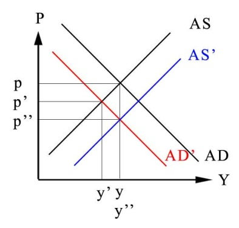
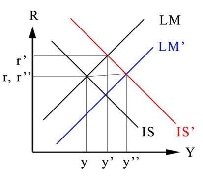
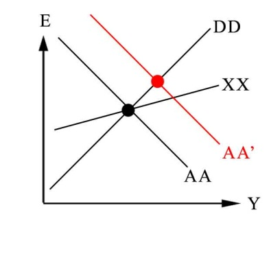

# International Economics

## Assignment 

### In an open economy with floating exchange rates, suppose there is a permanent fall in private aggregate demand for a country's output (a downward shift of the entire aggregate demand schedule). What is the effect on output? What government policy response would you recommend?

If private demand falls, pushing AD to AD’, then the level out output reduces to y’, and prices fall to p’. Now we have lower output and lower prices. This also means that the currency should appreciate to foreign currencies. The government could do a fiscal expansion, which should shift the AS curve to the right and devalue the currency. This can restore output to its original level. 

### In an open economy with floating exchange rates, if a government initially has a balanced budget but then cuts taxes, it is running a deficit that it must somehow finance. Suppose people think the government will finance its deficit by printing extra money it now needs to cover its expenditures. Would you still expect the tax cut to cause a currency appreciation?

If taxes fall, the IS curve will shift to the right. Interest rates are now higher, with the end result of a currency appreciation. If the government were to print money, causing inflation, shifting the LM curve down, interest rates would fall, and the currency would devalue. 

### In an open economy with fixed exchange rates, explain using the* *XX* *curve why a devaluation improves the current account.*

An increase in the MS shifts AA to AA’ and devalues the currency, increasing CA above XX (from the black to the red dot).

### Venezuela has a fixed exchange rate. How does fiscal expansion affect the current account under a fixed exchange rate?

If there is a fiscal expansion, output rises, raising demand for real monetary assets. This would push interest rates up, and the value of domestic currency would increase. To keep the equilibrium fixed, the CB would buy foreign assets, increasing the current account.

### Explain why temporary and permanent fiscal expansions do not have different effects under fixed exchange rates, as they do under floating.

A fiscal expansion would push AD up, raising output and leading to more demand for real money assets. This would force interest rates up, along with the value of the domestic currency. However, in order to keep exchange rates fixed, the CB would buy foreign assets, increasing the money supply, and thereby dropping interest rates.

### Under fixed exchange rates and perfect capital mobility, there is no such thing as a pure fiscal policy" (i.e. a fiscal policy not accompanied by monetary policy). Explain.

If you use fiscal policy to push up demand for goods and services, but without monetary policy, it will lead to higher interest rates, which will push demand back down.