# Options, Futures and Derivatives

## Fairfield Sentry Fund returns

### Fairfield Sentry Fund returns

To find the performance of $100 invested in the S&P500 at the beginning of 1991, we begin by calculating capital gains, which gives us index return. We then convert our annual dividend yield to a monthly yield by dividing by 12. Lastly, we multiply our original $100 investment by both our index returns and our monthly dividend yield, rendering the results of the S&P500 reinvestment strategy, as shown in **Figure 1**.

To find the performance of the 3-month treasury bills with monthly rebalancing, we multiply our $100 investment by 1+the annualized interest rate and divide by 12. We then replicate this on a monthly basis, with the results shown in **Figure 1**.

The performance of the Fairfield Sentry (FS) fund is extremely attractive, given the strong performance, and moreover, low volatility. You get the performance of the S&P500 and the smoothness of the risk free investment.

As shown in **Figure 2**, summary statistics for the three investment’s returns reveal that the FS fund performed the overall best. Its positive skew, high kurtosis, low standard deviation and high mean are all indicators of this. Together they confirm the idea that the FS fund has the best of both worlds. A sample of our spreadsheet work is attached at the end, as **Sheet 1**.

### The 1-period strategy

The FS Fund claimed to be using a split-strike conversion strategy, which calls for a long equity position combined with a long put and a short call, the latter being used to finance the long put. This strategy can be replicated using Excel. 

To calculate the cost of setting up the position on December 1990 for a 1-month maturity we use our Black-Scholes formula. To price the short call value on day 1, we set the call strike price to 350, take given values for the S&P500 (330.22), interest rate, dividend yield (divided by 100), the VIX closing (divided by 100), and set time equal to 1 month (1/12). We replicate this for the long put, setting put strike price to 310.

The total cost of the strategy on that day is SP500 + long put value – short call value, rendering $323.3. Therefore, our position is 1,000/cost, or 3.04. The total P/L under the split-strike strategy= P/L(S&P500)+P/L(short call)+P/L(long put)+dividend paid.

We then build a P/L diagram showing the return of the strategy with the terminal index value and an initial investment of $1,000. An x-axis range from price $300 to $380 is used. From those values, we subtract from each the S&P500 value of 330.22; add dividend, then multiply the sum by our position of 3.04.

The short call P/L is determined as the position times -max of either x-axis value minus the call value of 350 and 0, and then add on the initial call value of 3.509. We then replicate this for the put, but not inversing the max, and subtracting from our put of 350 the value of our x-axis. Lastly, we add together the resultant options values to the difference between our x-axis and the S&P500 times the position, as previously done. 

P/L of selling short call option: -Max (ST – K; 0)*number of call option, where ST is the index value at time T and K=350. P/L of buying long put option: Max (K – ST; 0)*number of put option, where ST is the index value at time T and K=310. We then plot all our values, obtaining **Figure 3**. A sample of our spreadsheet work is attached at the end, as **Sheet 2**.

### Calculating the returns over the period December 1990 to October 2008

Both options are assumed to be European and have a one-month maturity. Selling short call options means that we will get money and reinvest part of it to buy the same amount of put options. Since the OTM call price will typically exceed the OTM put option price, the proceeds are invested for one month at the risk-free rate. At the end of each month, we are supposed to settle the option positions in cash and see whether there will be a loss under the strategy. When we suffer a loss, it will be financed in the first place from the risk-free investment of the net option premiums. If that is not enough, we can sell enough shares of the index to compensate the loss, which will definitely decrease our position in the S&P500. Following are the details of our replicated split-strike strategy.

Period: from December to October 2008 Price of call and put: based on the Black & Scholes formula, so the proceeds are simply the difference between the call and put price, which will be invested in the S&P 500. Strike price of call option: assumed to be 5% above the initial spot price of the index at the beginning of each year. Strike price of put option: assumed to be 5% below the initial spot price of the index at the beginning of each year. Risk-free assets: three-month TB is assumed to be used as the risk-free rate for any maturity, in our case the maturity is one month. Dividend yield: is the percentage of the S&P 500 paid by the companies, and the dividend that we will have at the end of each month will be also reinvested in S&P 500 for the next month. 

P/L of selling short call option: -Max (ST – K; 0)*number of call option, where ST is the index value at time T and K=1.05*ST-1. P/L of buying long put option: Max (K – ST; 0)*number of put option, where ST is the index value at time T and K=0.95*ST-1. In our case, the positions in call, put and S&P 500 are the same according to the split-strike strategy. 

```equation
Dividend gained = proceeds * (1 + dividend yield / 12)
```

The S&P500 positions will be rebalanced at the beginning of each month since we need to figure out whether we need to sell some shares of the index to finance the loss under the option strategy. In fact, all available monies are invested in the S&P 500 at the start of the second month such as gains under the option strategy, the capital gains from the investment in 3 month TB and the dividend paid to us. The results of the replicated strategy with VIX are found in **Figure 4**. A sample of our spreadsheet work is attached at the end, as **Sheet 3**.

### Robustness checks

A change in the collar width

The collar width is the difference between the strike prices of the call and the put options. A change in the collar width should lead to a change in returns. The closer the put option’s strike price is to the call option’s strike price (i.e. the smaller the collar width is), the greater the premium paid to acquire the put option would be. As a result, returns made from selling the call option at the strike price of K2 would decrease. As an example, if we assume that the spot price is $50, a call option is sold at $55 and a put option is purchased at $45, the premium paid to purchase this put option will be higher than the premium paid to purchase a put option at $40. 

Thus, if the collar width decreases, the return realized from the premiums received and paid would be lower. This, in turn, means that less money would be invested at the risk-free interest rate and the overall return would be lower. When we look at our example, if the strike price on the put is 3% below the initial spot price instead of 5% below the initial price in 03/12/1990 (i.e. the collar width decreases), the price to acquire the put increases from 3.43 to 5.38. 

The investment in the TB thus decreases from 0.26 to -0.33. If the collar width increases, on the other hand, the return realized from the premiums received and paid would be higher, meaning that more money would be invested at the risk–free interest rate and thus the overall return would be higher (i.e. the amount paid for the put option will be lower and so a greater proportion of the call option’s premium can be invested). These results, however, depend on the assumption that both calls remain out–of–the money. Lastly, it is important to note that, when the collar width is greater, the returns would be higher but the volatility of returns would also be higher (i.e. we are exposed to a greater potential maximum loss). **Figure 6** reveals the sensitivity of our fund’s performance to the chosen collar width. As can be seen, tightening the collar has a much more significant impact than loosening it.

The existence of a volatility skew

A critical assumption of the Black–Scholes model is that the volatility is constant, something that is not always true when we look at the situation in the real market. If there is an existence of a volatility skew, this would mean that the implied volatility for higher strike prices would be lower. Following the risk and return correlation, if we have high strike prices, the implied volatility would be lower and thus the returns would also be lower. Conversely, if we have low strike prices, the implied volatility would be higher and thus the returns would also be higher. 

As seen in **Figure 7**, increasing the underlying VIX volatility by 10% will decrease our return by 8.76%, **Figure 8** shows that the risk-return relationship is clearly non-linear. More so, an increase in volatility has a larger impact than a decrease in volatility, in absolute terms.

### Conclusion

The FS Fund had lower deviation than the T-Bills and a higher return than the S&P500. If we consider the efficient frontier, these figures are not consistent with it. From the efficient frontier, we can see that the FS Fund moved up the (mean) return frontier, climbing above the S&P500 market line, and moved towards the risk free asset to the left (standard deviation). The most alarming feature is that the FS Fund skew is significantly more positive than either the S&P500 or TB, while achieving the significantly high kurtosis of S&P500, as seen in **Figure 2**.

Furthermore, as seen in **Figure 5**, the number of days with positive returns is suspiciously high for the FS Fund. Given that the fund showed negative returns in only 17 of the total 214 months (or approx.19 years), the results are suspect. Continuing in this direction, we see the FS Fund managed to outperform the S&P500 208 months out of the total 214, despite the Asian Financial Crisis, and the Internet and the Housing Bubbles. The figures then seem highly improbable.

Harry Markopolos, the Analyst who was instrumental in uncovering this Ponzi scheme, checked with the largest equity derivatives firms in Chicago, and Madoff’s fund did not have a trading relationship nor had he traded even once with any of them. His amount of trades was – 0. Also, given his strategy, Harry Markopolos found out that Madoff would have had to buy more options than they existed on the Chicago Board Options Exchange. 

In the news articles that we read, there has been a reference regarding the fee structure that Madoff had. He had no management fees and he said that he only made money out of the commissions he received for carrying out the trades. A typical hedge fund charges 1% of assets annually, plus 20% of profits. So, on a $6 billion fund generating annual returns of about 15%, Madoff was losing out on approximately $240 million a year. Leaving so much money on the table was very suspicious and should have raised red flags with the SEC.

Another, common reference is the fact that for such a huge company and amount of transactions, Madoff Investment Securities’ auditors were Friehling & Horowitz, a 3 person team which consisted of one lone CPA with a small 13′ by 18′ office in New York. Industry insiders felt that this was hardly adequate to handle the transactions of a firm that accounted for a huge majority of NYSE and NASDAQ volume.

**Figure 1**

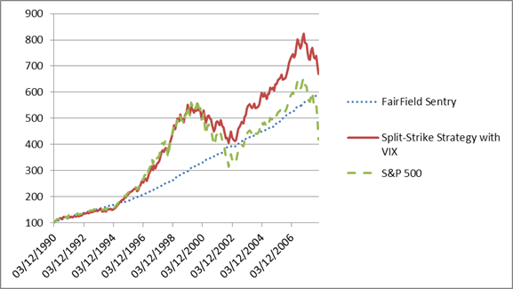

**Figure 2**

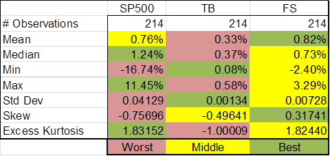

**Figure 3**

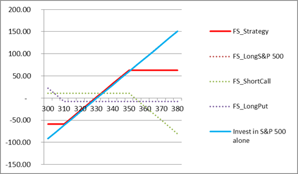

**Figure 4**

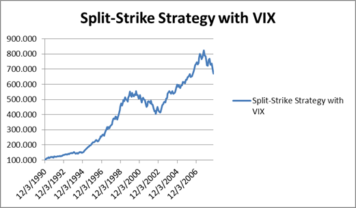

**Figure 5**

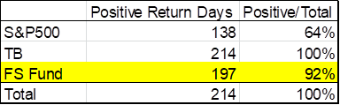

**Figure 6**

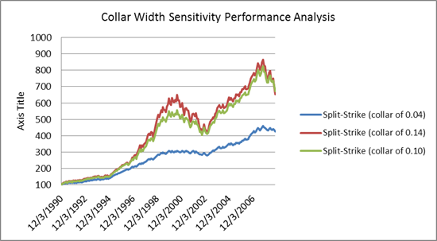

**Figure 7**

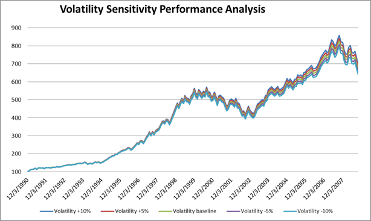

**Figure 8**

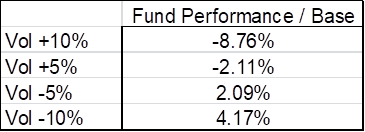

**Sheet 1**

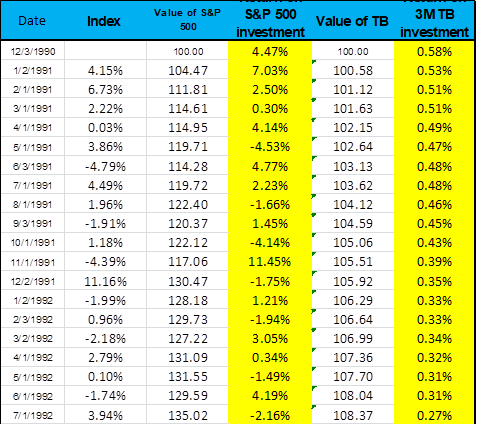

**Sheet 2**

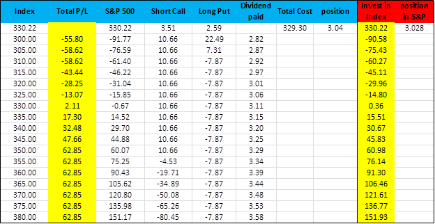

**Sheet 3**

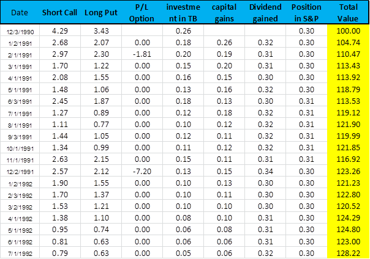